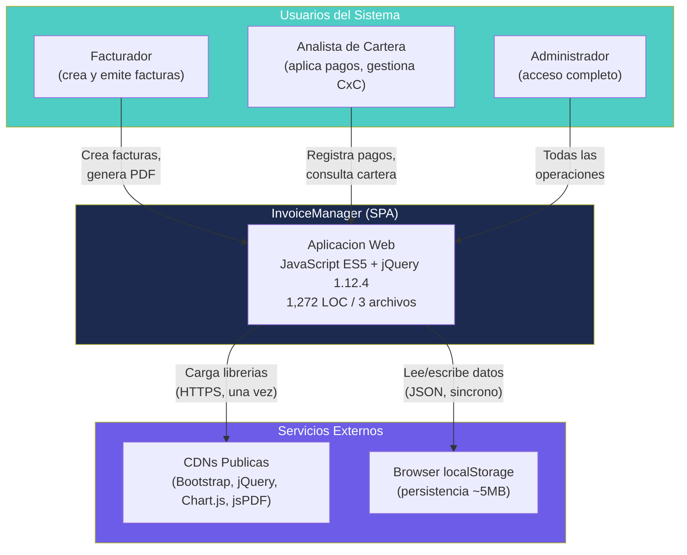
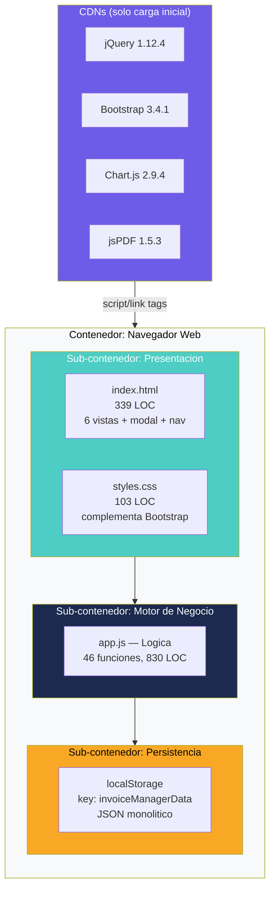
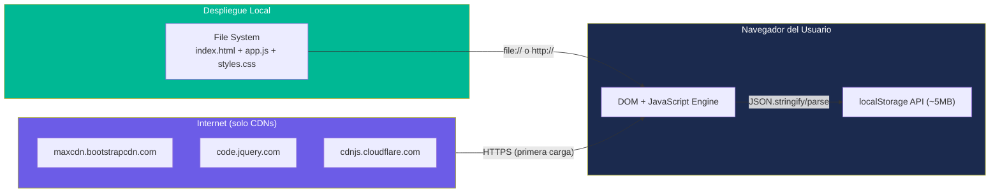

# Diagramas de Arquitectura — InvoiceManager

## Diagrama de Contexto del Sistema (C4 Level 1)

El sistema InvoiceManager opera como una isla aislada: no tiene integraciones con sistemas externos, APIs, ni bases de datos remotas. Su único contexto externo son las CDNs de librerías y el navegador del usuario.

Este diagrama muestra que InvoiceManager es un sistema completamente autónomo sin dependencias de backend. Los datos residen exclusivamente en el navegador del usuario (localStorage), y las CDNs solo proveen las librerías estáticas en la carga inicial.

## Diagrama de Contenedores (C4 Level 2)

Dado que la aplicación es un monolito cliente-side, el "contenedor" único es el navegador. Internamente se pueden identificar sub-contenedores lógicos:

Este diagrama revela la naturaleza monolítica: un solo archivo (`app.js`) contiene TODA la lógica, y un solo key de localStorage contiene TODOS los datos. No hay separación física entre componentes.

## Diagrama de Despliegue

**Observaciones del despliegue:**
- Sin servidores propios — cero costo de infraestructura
- Sin HTTPS propio — depende del contexto donde se sirva
- Sin versionamiento de archivos en producción
- Sin rollback strategy (no hay versiones anteriores accesibles)

## Hallazgos Clave

- La aplicación es un **island system** — cero integraciones externas
- Todo el sistema reside en **3 archivos servidos estáticamente**
- La persistencia es **exclusivamente local** (browser localStorage, ~5MB límite)
- Las CDNs son un **single point of failure**: sin internet, la app no carga
- No hay **separación de concerns** a nivel de despliegue — todo es un blob

## Referencias

- [Visión del Sistema](../../architecture/system-overview.md)
- [Componentes](../../architecture/components.md)
- [Dependencias](../../architecture/dependencies.md)
- [Production Readiness](../../analysis/production-readiness.md)
