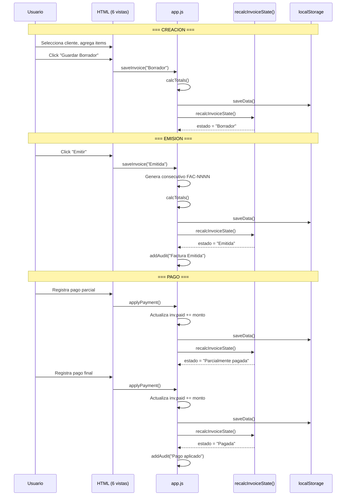
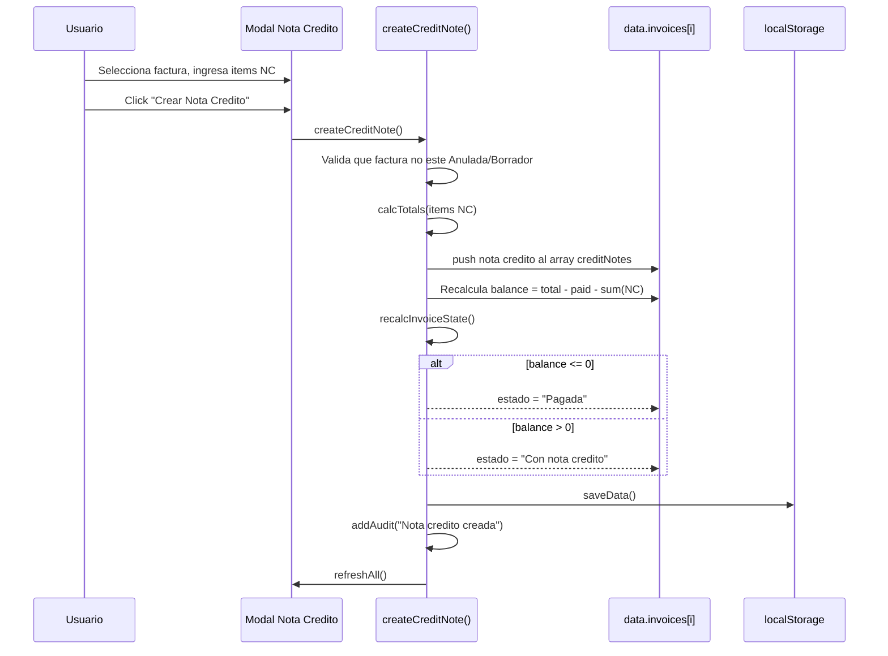
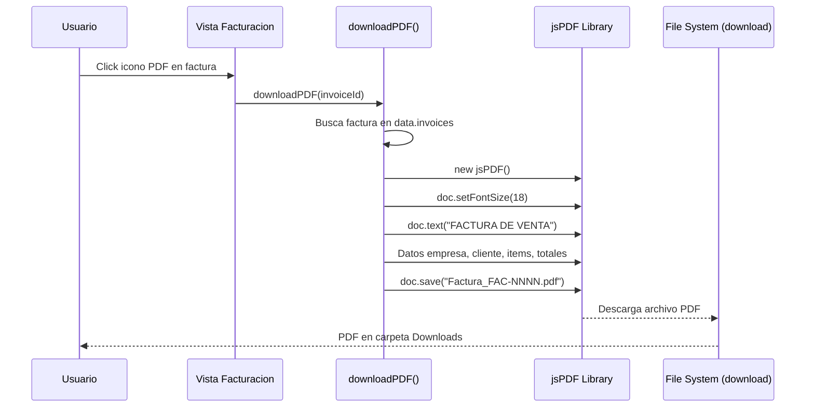
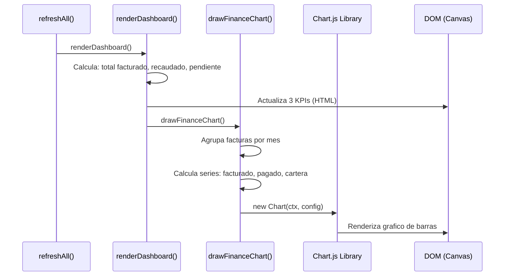
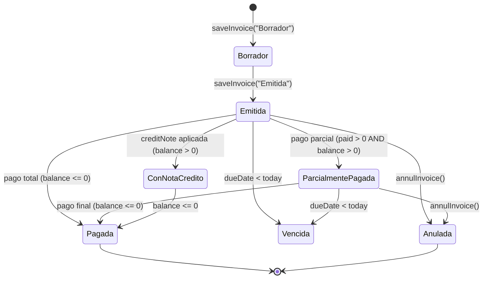

# Diagramas de Comportamiento — InvoiceManager

## Secuencia 1: Ciclo de Vida Completo de una Factura

Este diagrama muestra el flujo principal del sistema: desde la creación de una factura hasta su cierre por pago completo.

## Secuencia 2: Nota Crédito con Recálculo de Balance

## Secuencia 3: Generación de PDF de Factura

## Secuencia 4: Dashboard con Gráfico Financiero

## Máquina de Estados de Factura

Este diagrama de estados se reconstruye desde la lógica de `recalcInvoiceState()` (`app.js:315-355`). La función no implementa transiciones explícitas sino que RECALCULA el estado en cada `refreshAll()` basándose en el balance y la fecha.

## Hallazgos Clave

- **Flujo principal simple:** Crear → Emitir → Pagar (3 pasos)
- **State machine implícita:** El estado se recalcula, no se transiciona explícitamente
- **Sin operaciones asíncronas:** Todo es síncrono (localStorage es sync API)
- **Sin error recovery:** Si localStorage falla, no hay catch ni retry
- **Refresh-All:** Cada operación re-renderiza TODA la UI (ineficiente pero correcto)

## Referencias

- [Workflows](../../behavior/workflows.md)
- [Decision Logic](../../behavior/decision-logic.md)
- [System Overview](../../architecture/system-overview.md)
- [Error Handling](../../behavior/error-handling.md)
