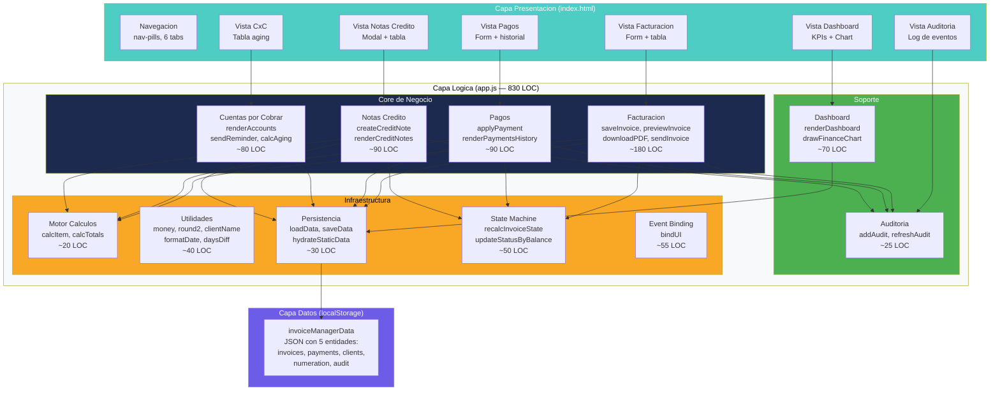
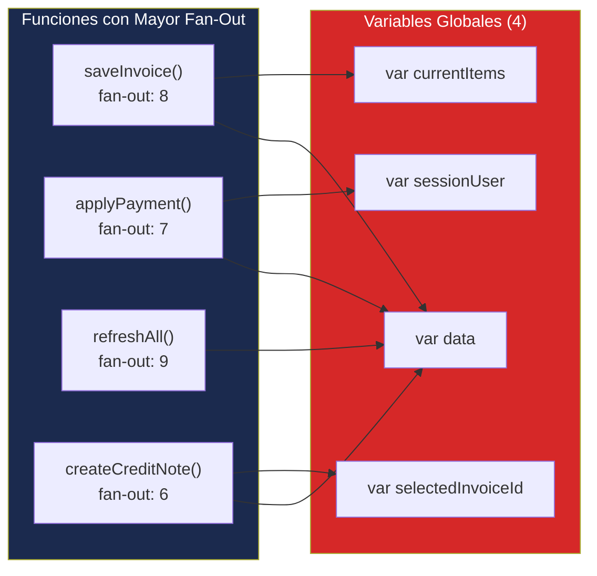
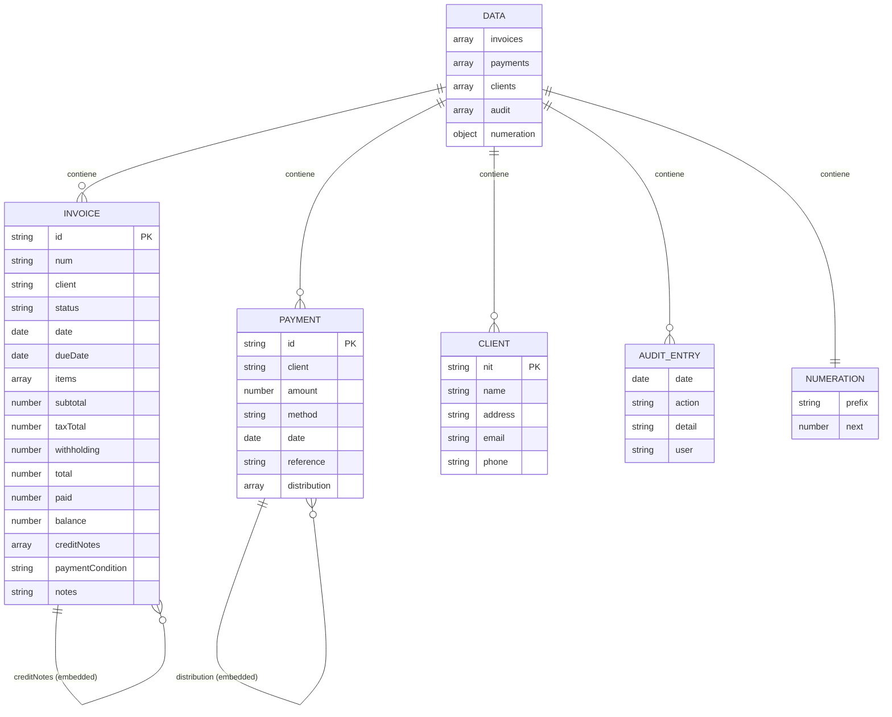

# Diagramas Estructurales — InvoiceManager

## Diagrama de Componentes (C4 Level 3)

Dado que toda la lógica reside en un solo archivo (`app.js`), los "componentes" son agrupaciones funcionales implícitas detectadas por análisis del código.

## Grafo de Dependencias entre Componentes Funcionales

Este diagrama muestra el problema central: **4 variables globales** son el nexo de acoplamiento entre TODAS las funciones del sistema. Cualquier cambio en la estructura de `data` afecta potencialmente a las 46 funciones.

## Estructura del Modelo de Datos (localStorage Schema)

## Métricas de Acoplamiento

| Componente | Fan-In | Fan-Out | Instability (I) | Clasificación |
|---|---|---|---|---|
| `saveInvoice()` | 1 (UI) | 8 | 0.89 | Altamente inestable |
| `applyPayment()` | 1 (UI) | 7 | 0.88 | Altamente inestable |
| `refreshAll()` | 12 (callers) | 9 | 0.43 | Balance medio |
| `saveData()` | 8 (callers) | 1 (localStorage) | 0.11 | Estable |
| `calcTotals()` | 4 (callers) | 0 (puro) | 0.00 | Máxima estabilidad |
| `money()` / `round2()` | 6 (callers) | 0 (puro) | 0.00 | Máxima estabilidad |

**Observación:** Las funciones más estables (I=0) son las puras (utilidades, cálculos). Las más inestables son las orquestadoras de negocio que dependen de todo (globales, DOM, localStorage).

## Hallazgos Clave

- **Zero abstraction:** No hay interfaces, clases ni módulos — solo funciones globales
- **Acoplamiento por globales:** 4 variables compartidas crean dependencias invisibles
- **Fan-out crítico:** `saveInvoice()` y `applyPayment()` dependen de 7-8 funciones cada una
- **Funciones puras aisladas:** `calcItem`, `calcTotals`, `money`, `round2` — candidatas ideales para extraer primero
- **Sin inversión de dependencias:** Las funciones de negocio llaman directamente a localStorage y DOM

## Referencias

- [Componentes](../../architecture/components.md)
- [Dependencias](../../architecture/dependencies.md)
- [Patrones](../../architecture/patterns.md)
- [Complexity Analysis](../../analysis/complexity-analysis.md)
