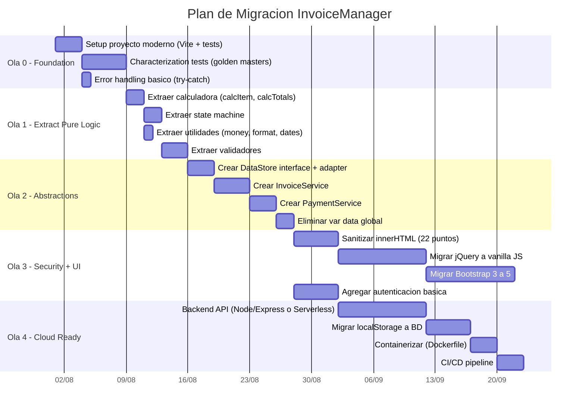
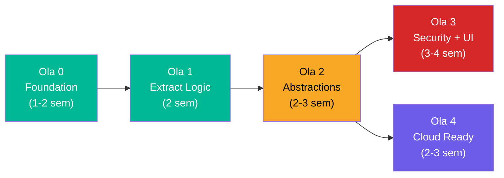

# Orden de Migración por Componentes — InvoiceManager

## Estrategia de Migración Recomendada

Dado el tamaño compacto (1,272 LOC) pero la alta deuda técnica, la estrategia recomendada es **Rebuild incremental** (Strangler Fig simplificado): construir la nueva versión módulo por módulo, reemplazando funcionalidad del monolito original hasta que el archivo `app.js` quede vacío.

## Olas de Migración

## Detalle por Ola

### Ola 0: Foundation (Semana 1-2)

**Objetivo:** Establecer la infraestructura para refactoring seguro.

| Componente | Acción | Prerequisito | Riesgo | Esfuerzo |
|---|---|---|---|---|
| Build System | `npm init` + Vite + Vitest | Ninguno | Bajo | 3h |
| Characterization Tests | Tests de `calcItem`, `calcTotals`, `recalcInvoiceState` como golden masters | Build system | Bajo | 1 semana |
| Error Recovery | `try/catch` en `loadData()` + fallback a datos vacíos | Ninguno | Bajo | 1h |
| CDN Security | Agregar `integrity` (SRI) a todos los `<script>` | Ninguno | Bajo | 1h |

**Criterio de Done:** Tests pasan con 100% de los escenarios actuales documentados. JSON corrupto no crashea la app.

### Ola 1: Extract Pure Logic (Semana 3-4)

**Objetivo:** Separar lógica pura (testeable sin DOM) del monolito.

| Componente | Destino | LOC | Legacy Level | Técnica Feathers |
|---|---|---|---|---|
| `calcItem()`, `calcTotals()` | `src/domain/calculator.js` | ~20 | A — Testable | Move Function to Module |
| `recalcInvoiceState()` | `src/domain/invoice-state.js` | ~40 | B — Seam-Rich | Extract Class |
| `money()`, `round2()`, `formatDate()`, `daysDiff()` | `src/utils/format.js` | ~30 | A — Testable | Move Function to Module |
| 22 validaciones dispersas | `src/domain/validators.js` | ~50 | B — Seam-Rich | Consolidate Conditional |

**Criterio de Done:** `app.js` reduce ~140 LOC. Tests de Ola 0 siguen pasando. Nuevos tests unitarios para módulos extraídos.

### Ola 2: Introduce Abstractions (Semana 5-7)

**Objetivo:** Inversión de dependencias — eliminar acoplamiento a globales.

| Componente | Patrón Target | Acoplamiento Actual | Técnica |
|---|---|---|---|
| `DataStore` interface | Repository Pattern | `var data` accedido 14+ veces | Extract Interface |
| `LocalStorageAdapter` | Adapter | `JSON.parse(localStorage...)` directo | Wrap with Adapter |
| `InvoiceService` | Service Layer | `saveInvoice()` con 8 dependencias | Extract Class |
| `PaymentService` | Service Layer | `applyPayment()` con 7 dependencias | Extract Class |
| Eliminar `var data` | Dependency Injection | 4 globales compartidas | Parameterize Constructor |

**Criterio de Done:** `var data` eliminado. Services reciben `store` por parámetro. Lógica de negocio testeable sin DOM ni localStorage.

### Ola 3: Security + UI Modernization (Semana 8-11)

**Objetivo:** Eliminar vulnerabilidades y modernizar stack de presentación.

| Componente | Acción | Impacto | Riesgo |
|---|---|---|---|
| XSS (22 puntos) | Reemplazar `innerHTML` con `textContent` + template engine | Elimina vector principal de ataque | Medio |
| jQuery 1.12.4 | Migrar a vanilla JS (o Vue/React si se justifica) | Elimina dependencia EOL de 100% | Alto |
| Bootstrap 3.4.1 | Migrar a Bootstrap 5 o Tailwind CSS | Layout moderno, responsive | Alto |
| ES5 → ES6+ | `let/const`, arrow functions, modules, destructuring | Código moderno y legible | Bajo |
| Auth básica | Login form + JWT o session (requiere backend) | Protege datos financieros | Alto |

**Criterio de Done:** 0 `innerHTML` con input no sanitizado. 0 referencias a jQuery. Bootstrap 5 funcional. Login obligatorio.

### Ola 4: Cloud Ready (Semana 12-14)

**Objetivo:** Habilitar operación en cloud con persistencia real.

| Componente | Target | Justificación |
|---|---|---|
| Backend API | Node.js/Express o AWS Lambda | Persistencia real, auth, multi-usuario |
| Base de datos | PostgreSQL managed (RDS/CloudSQL) o MongoDB Atlas | Reemplazar localStorage (~5MB limit) |
| Dockerfile | Multi-stage build (node:alpine) | Containerización para cualquier cloud |
| CI/CD | GitHub Actions o AWS CodePipeline | Deploy automatizado con tests |
| Monitoring | Structured logging + health checks | Observabilidad básica |

**Criterio de Done:** App containerizada, con BD managed, CI/CD green, health check respondiendo.

## Dependencias entre Olas

**Nota:** Ola 3 y Ola 4 pueden ejecutarse en paralelo (equipos separados) una vez que Ola 2 está completa.

## Aplicabilidad de Herramientas de Transformación

| Herramienta | Aplicabilidad | Razón |
|---|---|---|
| **AWS Transformation Hub** | ❌ No aplica | No es .NET ni Java |
| **GitHub Copilot** | ✅ Alta | Asistencia en rewrite ES5→ES6+, tests |
| **Codemod (jscodeshift)** | ✅ Media | Transformaciones mecánicas jQuery→vanilla |
| **ESLint --fix** | ✅ Alta | Auto-fix de styling, unused vars |
| **Prettier** | ✅ Alta | Formateo consistente post-migración |
| **Q Developer** | ⚠️ Parcial | No hay proyecto existente que transformar — es rewrite |

## Riesgos de Migración

| Riesgo | Probabilidad | Impacto | Mitigación |
|---|---|---|---|
| Regresión funcional por falta de tests | Alta | Alto | Ola 0 crea characterization tests PRIMERO |
| jQuery removal rompe funcionalidad oculta | Media | Alto | Migrar gradualmente función por función |
| localStorage → BD pierde datos existentes | Media | Alto | Script de migración de datos como primer paso de Ola 4 |
| Scope creep al modernizar UI | Alta | Medio | Mantener scope estricto: misma funcionalidad, nuevo stack |
| Un solo developer = bus factor 1 | Media | Alto | Documentar decisiones, pair programming |

## Referencias

- [Plan de Remediación](../technical-debt/remediation-plan.md)
- [Production Readiness](../analysis/production-readiness.md)
- [Dependency Analysis](../analysis/dependency-analysis.md)
- [Tech Debt Summary](../technical-debt/summary.md)
- [Test Specifications](test-specifications.md)
