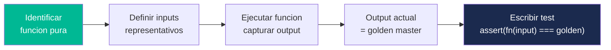
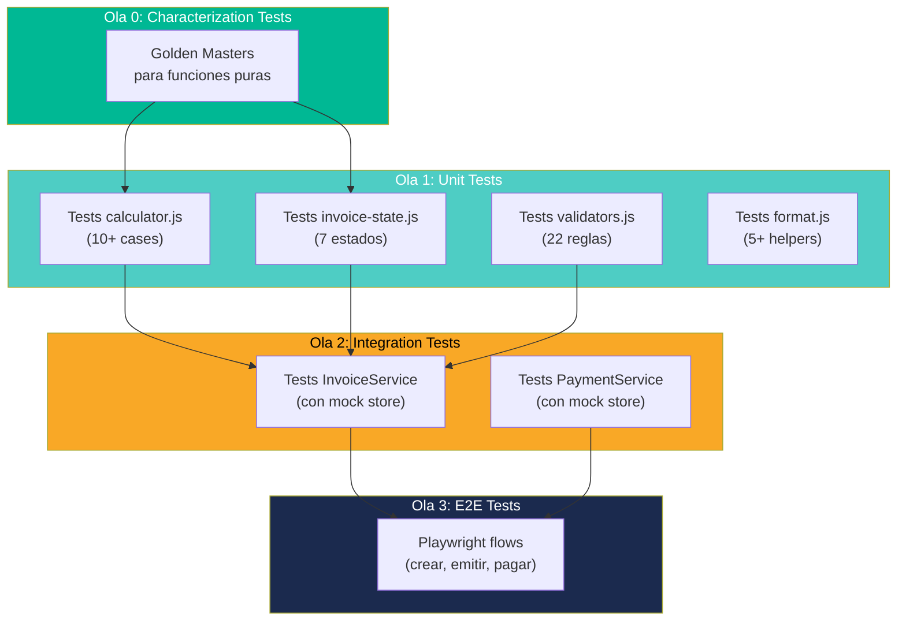

# Especificaciones de Tests — InvoiceManager

## Estado Actual de Tests

| Métrica | Valor | Evidencia |
|---|---|---|
| Tests existentes | 0 | Sin carpeta `tests/`, sin framework de testing — `_cloc-report.txt` |
| Cobertura | 0% | Sin herramienta de coverage |
| Framework de testing | Ninguno | Sin `package.json`, sin Jest/Mocha/Vitest |
| Mocking | N/A | Sin dependencias mockeables (todo es síncrono) |

## Estrategia de Testing para Migración

### Fase 1: Characterization Tests (Golden Masters)

Antes de cualquier refactoring, pinear el comportamiento actual con tests que documenten qué hace el código HOY — no qué debería hacer.

### Fase 2: Unit Tests (Post-Extract)

Una vez extraídos los módulos puros (Ola 1), escribir tests unitarios exhaustivos.

### Fase 3: Integration Tests (Post-Abstraction)

Una vez introducidas las abstracciones (Ola 2), testear servicios con store mockeado.

## Characterization Tests Prioritarios (Ola 0)

### CT-01: Motor de Cálculos

| Test | Input | Expected Output | Fuente |
|---|---|---|---|
| `calcItem` — item simple | `{desc:"A", qty:2, price:100, tax:19}` | `{subtotal:200, taxAmount:38, total:238}` | `app.js:100-106` |
| `calcItem` — qty cero | `{desc:"B", qty:0, price:50, tax:19}` | `{subtotal:0, taxAmount:0, total:0}` | `app.js:100-106` |
| `calcTotals` — sin retención | `items=[{sub:200,tax:38}], withholding=0` | `{subtotal:200, taxTotal:38, withholding:0, total:238}` | `app.js:108-115` |
| `calcTotals` — con retención 2.5% | `items=[{sub:1000,tax:190}], withholding=2.5` | `{subtotal:1000, taxTotal:190, withholding:25, total:1165}` | `app.js:108-115` |

### CT-02: State Machine

| Test | Condiciones | Expected State | Fuente |
|---|---|---|---|
| Factura borrador | `status="Borrador"` | `"Borrador"` | `app.js:315-320` |
| Factura anulada | `status="Anulada"` | `"Anulada"` | `app.js:321-322` |
| Pagada completamente | `balance <= 0` | `"Pagada"` | `app.js:323-325` |
| Con nota crédito | `creditNotes.length > 0 && balance > 0` | `"Con nota crédito"` | `app.js:326-328` |
| Parcialmente pagada | `paid > 0 && balance > 0 && !vencida` | `"Parcialmente pagada"` | `app.js:329-332` |
| Vencida | `dueDate < today && status !== "Borrador"` | `"Vencida"` | `app.js:333-337` |
| Emitida (default) | Ninguna condición especial | `"Emitida"` | `app.js:338-339` |

### CT-03: Utilidades

| Test | Input | Expected Output | Fuente |
|---|---|---|---|
| `money(1234567.89)` | `1234567.89` | `"$1.234.567,89"` (formato CO) | `app.js:88-90` |
| `money(0)` | `0` | `"$0,00"` | `app.js:88-90` |
| `round2(3.456)` | `3.456` | `3.46` | `app.js:92` |
| `daysDiff(2026-01-01, 2026-01-31)` | Dos fechas | `30` | `app.js:94-96` |
| `clientName("900123456")` | NIT existente | Nombre del cliente | `app.js:98` |

### CT-04: Validaciones de Factura (saveInvoice)

| Test | Condición | Expected Behavior | Fuente |
|---|---|---|---|
| Sin cliente seleccionado | `client = ""` | Return false + alert | `app.js:150-152` |
| Sin fecha | `date = ""` | Return false + alert | `app.js:153-155` |
| Sin items | `currentItems.length === 0` | Return false + alert | `app.js:156-158` |
| Sin vencimiento (si emitida) | `status="Emitida" && dueDate=""` | Return false + alert | `app.js:159-161` |

## Pinch Points Identificados

Los pinch points son funciones donde **pocas pruebas cubren mucha lógica** (Feathers):

| Pinch Point | Cobertura que Otorga | Esfuerzo |
|---|---|---|
| `calcTotals()` | Toda la lógica financiera (subtotales, impuestos, retención) | Bajo — función pura |
| `recalcInvoiceState()` | Toda la máquina de estados | Bajo — función pura |
| `refreshAll()` | Todo el flujo de renderizado + persistencia | Alto — requiere DOM mock |
| `saveInvoice("Emitida")` | Validación completa + creación + persistencia | Alto — requiere DOM mock |

## Técnicas de Dependency-Breaking Recomendadas

| Componente | Bloqueo Actual | Técnica (Feathers) | Resultado |
|---|---|---|---|
| `saveInvoice()` | Accede a DOM (`$("...")`) + globales | **Extract and Override Call** — extraer lógica pura a función separada | Lógica testeable sin DOM |
| `applyPayment()` | Lee `sessionUser.role` + DOM | **Parameterize Method** — pasar role como parámetro | Testeable con cualquier role |
| `refreshAll()` | Llama 9 funciones DOM + saveData | **Skin and Wrap** — crear interface `Renderer` | Sustituible por mock renderer |
| `loadData()` | Accede directamente a `localStorage` | **Introduce Static Setter** — inyectar storage adapter | Testeable con in-memory store |

## Framework de Testing Recomendado

| Herramienta | Propósito | Justificación |
|---|---|---|
| **Vitest** | Unit tests | Rápido, ESM nativo, compatible con Vite |
| **jsdom** | DOM mocking | Simular document/localStorage para tests de integración |
| **Testing Library** | DOM assertions | Tests basados en comportamiento del usuario |
| **Playwright** | E2E tests (Ola 3+) | Tests de flujos completos post-migración UI |

## Diagrama de Estrategia de Testing

## Referencias

- [Complexity Analysis](../analysis/complexity-analysis.md)
- [Tech Debt](../analysis/tech-debt.md)
- [Component Order](component-order.md)
- [Remediation Plan](../technical-debt/remediation-plan.md)
