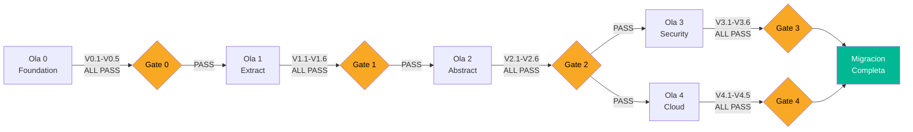

# Criterios de Validación — InvoiceManager

## Propósito

Estos criterios definen cuándo la migración de cada ola se considera **exitosa**. Cada criterio es verificable objetivamente — sin ambigüedad.

## Validación por Ola

### Ola 0: Foundation

| # | Criterio | Método de Verificación | Umbral |
|---|---|---|---|
| V0.1 | Build system funciona | `npm run build` → exit code 0 | Sin errores |
| V0.2 | Tests corren | `npm test` → exit code 0 | 100% de characterization tests pass |
| V0.3 | Error recovery | Inyectar JSON corrupto en localStorage → app no crashea | Muestra vista vacía, no pantalla blanca |
| V0.4 | SRI activo | Inspeccionar `<script>` y `<link>` → todos con `integrity` | 5/5 CDNs con SRI |
| V0.5 | Funcionalidad preservada | Crear factura → emitir → pagar → verificar balance = 0 | Flujo completo funciona |

### Ola 1: Extract Pure Logic

| # | Criterio | Método de Verificación | Umbral |
|---|---|---|---|
| V1.1 | Módulos extraídos compilan | `import` de cada módulo no falla | 0 errores de import |
| V1.2 | Unit tests de calculator | `npm test -- calculator` | ≥10 tests, 100% pass |
| V1.3 | Unit tests de state machine | `npm test -- invoice-state` | ≥7 tests (uno por estado), 100% pass |
| V1.4 | Unit tests de validators | `npm test -- validators` | ≥15 tests, 100% pass |
| V1.5 | Characterization tests siguen pasando | `npm test -- golden` | 100% pass (sin regresión) |
| V1.6 | `app.js` redujo LOC | `wc -l app.js` < 700 | Reducción ≥ 130 LOC |

### Ola 2: Abstractions

| # | Criterio | Método de Verificación | Umbral |
|---|---|---|---|
| V2.1 | `var data` eliminado | `grep "var data" app.js` → 0 resultados | 0 ocurrencias |
| V2.2 | InvoiceService testeable sin DOM | Test con mock store → pass | Sin dependencia a `$()` ni `document` |
| V2.3 | PaymentService testeable sin DOM | Test con mock store → pass | Sin dependencia a `$()` ni `document` |
| V2.4 | Store intercambiable | Pasar `InMemoryStore` en vez de `LocalStorageStore` → tests pass | Abstracción funciona |
| V2.5 | alert() eliminado | `grep "alert(" app.js` → 0 resultados | 0 ocurrencias |
| V2.6 | Funcionalidad preservada | Smoke test manual: crear + emitir + pagar + NC + PDF | Todo funciona |

### Ola 3: Security + UI

| # | Criterio | Método de Verificación | Umbral |
|---|---|---|---|
| V3.1 | 0 innerHTML con input no sanitizado | `grep -c "innerHTML" *.js` → 0 (o todos con escape) | 0 XSS vectors |
| V3.2 | jQuery removido | `grep -r "jquery\|\\\$(" src/` → 0 | 0 dependencias jQuery |
| V3.3 | Bootstrap 5 funcional | Todas las vistas renderizan correctamente | 0 clases BS3 residuales |
| V3.4 | Login obligatorio | Acceso a `/` sin auth → redirect a `/login` | No se pueden ver datos sin login |
| V3.5 | ES6+ syntax | ESLint con reglas ES6 → 0 errors | `no-var`, `prefer-const`, `prefer-arrow` pass |
| V3.6 | E2E tests | Playwright: 5 flujos principales → pass | ≥ 5 tests, 100% pass |

### Ola 4: Cloud Ready

| # | Criterio | Método de Verificación | Umbral |
|---|---|---|---|
| V4.1 | Container builds | `docker build .` → exit code 0 | Build exitoso |
| V4.2 | Health check | `GET /health` → 200 OK con JSON `{status: "ok"}` | Responde en < 1s |
| V4.3 | DB migration | Datos de localStorage migrados a BD → queries devuelven mismos datos | 100% datos preservados |
| V4.4 | CI green | Pipeline ejecuta: lint + test + build + deploy | Todos los stages pass |
| V4.5 | Multi-usuario | 2 sesiones simultáneas → datos consistentes | Sin corrupción |

## Criterios de Aceptación Globales (todas las olas)

| Criterio Global | Descripción |
|---|---|
| **No regression** | Characterization tests de Ola 0 pasan en TODAS las olas posteriores |
| **No data loss** | Los datos creados antes de la migración siguen accesibles después |
| **Same functionality** | Cada flujo del usuario (crear, emitir, pagar, NC, PDF, dashboard) funciona idénticamente |
| **Performance** | Tiempo de carga < 3s, operaciones < 500ms (medido con Lighthouse o DevTools) |
| **Accessibility** | Lighthouse Accessibility score ≥ 70 (post-Ola 3) |

## Diagrama de Gates de Validación

## Referencias

- [Component Order](component-order.md)
- [Test Specifications](test-specifications.md)
- [Remediation Plan](../technical-debt/remediation-plan.md)
- [Production Readiness](../analysis/production-readiness.md)
