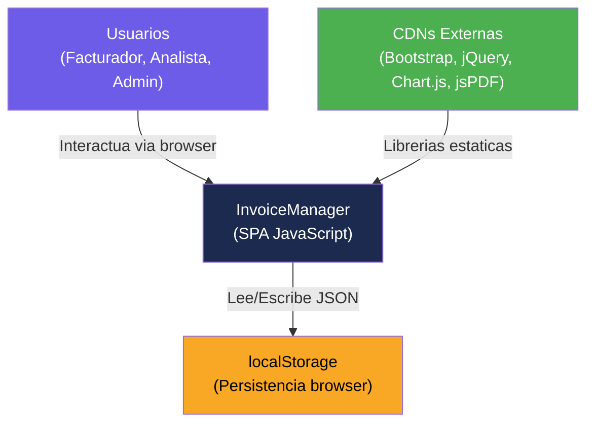

# Visión General del Proyecto — InvoiceManager

## Propósito del Sistema

InvoiceManager es una **aplicación web de facturación y cuentas por cobrar** diseñada para gestionar el ciclo completo de facturación de una empresa: creación de facturas, emisión, seguimiento de cartera, registro de pagos, notas crédito y auditoría. Opera como una Single Page Application (SPA) en el navegador con persistencia en `localStorage`.

## Stack Tecnológico

| Capa | Tecnología | Versión / Detalle |
|---|---|---|
| **Lenguaje** | JavaScript (ES5) | Sin transpilación, sin módulos |
| **Presentación** | HTML5 + CSS3 | SPA con navegación por vistas ocultas/visibles |
| **Framework CSS** | Bootstrap | 3.4.1 (CDN) |
| **Manipulación DOM** | jQuery | 1.12.4 (CDN) |
| **Gráficos** | Chart.js | 2.9.4 (CDN) |
| **Generación PDF** | jsPDF | 1.5.3 (CDN) |
| **Persistencia** | localStorage (browser) | Sin backend, sin base de datos |
| **Servidor** | Ninguno | Archivos estáticos servidos directamente |

## Integraciones Externas

No se detectan integraciones externas (APIs, servicios REST, SOAP, WebSockets). La aplicación opera 100% en el cliente sin comunicación con servidores.

**CDNs consumidas** (solo para librerías estáticas):
- `maxcdn.bootstrapcdn.com` — Bootstrap CSS y JS
- `code.jquery.com` — jQuery
- `cdnjs.cloudflare.com` — Chart.js y jsPDF

## Ambientes de Despliegue

No se detectan configuraciones de ambientes (dev/staging/production), pipelines CI/CD, ni archivos de despliegue. La aplicación se ejecuta directamente abriendo `index.html` en un navegador.

[SUPUESTO: La aplicación se despliega como archivos estáticos sin servidor web dedicado]

## Estructura de la Solución

```
App/
├── index.html       ← Punto de entrada, layout completo de la SPA (339 LOC)
├── app.js           ← Toda la lógica de negocio y presentación (830 LOC)
└── styles.css       ← Estilos personalizados complementarios a Bootstrap (103 LOC)
```

## Métricas del Proyecto (LOC)

| Lenguaje | Archivos | Código | Blancos | Comentarios |
|---|---|---|---|---|
| JavaScript | 1 | 830 | 108 | 0 |
| HTML | 1 | 339 | 16 | 0 |
| CSS | 1 | 103 | 24 | 0 |
| **TOTAL** | **3** | **1,272** | **148** | **0** |

**Fuente:** `_cloc-report.txt` (cloc v1.90)

### Metodología de Conteo LOC

- Se incluyen: todos los archivos de código fuente de la aplicación (`.js`, `.html`, `.css`)
- Se excluyen: carpetas `.kiro/` (configuración del agente), archivos `_app-name.txt` y `_cloc-report.txt` (metadata del análisis)
- Herramienta: `cloc v1.90`
- El conteo es exhaustivo: 3 archivos = 100% del código fuente de la aplicación

## Multi-Tenancy

No se detecta multi-tenancy formal. Sin embargo, existe un **selector de roles** (`#roleSelector`) que altera el comportamiento de la aplicación:

| Rol | Restricciones Detectadas |
|---|---|
| Facturador | No puede registrar pagos (validación en `applyPayment()`) |
| Analista de cartera | Sin restricciones detectadas en el código |
| Administrador | Sin restricciones detectadas en el código |

El rol se almacena en la variable `sessionUser.role` y se valida solo en la función `applyPayment()`.

## Modelo de Datos

La aplicación utiliza un objeto JSON persistido en `localStorage` bajo la clave `invoiceManagerData` con la siguiente estructura:

| Entidad | Tipo | Registros Iniciales | Propósito |
|---|---|---|---|
| `numeration` | Configuración | 1 | Prefijo y consecutivo de facturas |
| `clients` | Maestro | 3 | Clientes del sistema |
| `products` | Maestro | 4 | Productos/servicios facturables |
| `invoices` | Transaccional | 0 | Facturas emitidas |
| `payments` | Transaccional | 0 | Pagos registrados |
| `reminders` | Transaccional | 0 | Recordatorios de cobro enviados |
| `creditNotes` | Transaccional | 0 | Notas crédito emitidas |
| `audit` | Auditoría | 0 | Trazabilidad de operaciones |

## Roles y Actores

| Actor | Descripción | Evidencia |
|---|---|---|
| Facturador | Crea y emite facturas, genera PDF, envía por correo | `roleSelector` + restricción en pagos |
| Analista de cartera | Gestiona cuentas por cobrar, aplica pagos, envía recordatorios | Acceso completo a módulo de pagos |
| Administrador | Acceso completo al sistema | Sin restricciones en código |

## Diagrama de Contexto



Este diagrama muestra que InvoiceManager es una aplicación completamente autocontenida en el navegador, sin backend ni APIs externas.

## Hallazgos Clave

- **Aplicación monolítica de archivo único** — Toda la lógica (830 LOC) reside en un solo archivo JavaScript (`app.js`)
- **Sin backend** — Persistencia exclusiva en `localStorage` (pérdida de datos al limpiar browser)
- **Sin autenticación** — El "login" es solo un selector de rol, sin verificación de identidad
- **Sin modularización** — No hay módulos ES6, CommonJS, AMD, ni separación de concerns
- **JavaScript ES5** — Uso de `var`, `function`, `.forEach()`, sin `let/const/arrow functions/async`
- **0 comentarios** — Ninguna línea de comentario en 1,272 LOC totales
- **CDN-dependiente** — Todas las librerías externas se cargan desde CDNs públicas

## Referencias

- [Estructura del programa](reference/program-structure.md)
- [Documentación especializada](specialized/specialized-documentation.md)
