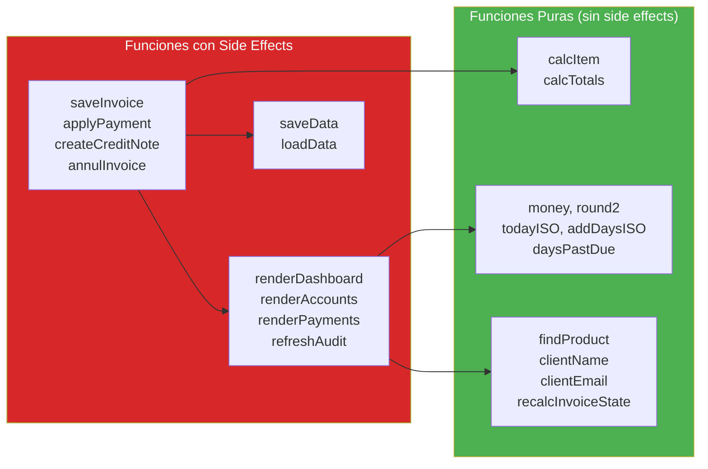

# Referencia de API — InvoiceManager

## APIs Externas Consumidas

**Ninguna.** La aplicación no consume APIs REST, SOAP, GraphQL ni WebSockets.

## APIs Externas Expuestas

**Ninguna.** La aplicación no expone endpoints HTTP, no tiene servidor web.

## API Interna (Funciones Públicas)

Al no existir módulos ni clases, la "API" del sistema son las **funciones en scope global** que pueden ser invocadas. Se documentan como API interna para efectos de modernización.

### Categoría: Datos y Persistencia

| Función | Firma | Retorno | Efecto Secundario | LOC |
|---|---|---|---|---|
| `loadData()` | Ningún param | Object (schema completo) | Lee localStorage | ~25 |
| `saveData()` | Ningún param | void | Escribe localStorage | 3 |
| `hydrateStaticData()` | Ningún param | void | Puebla dropdowns del DOM | ~22 |
| `resetInvoiceForm()` | Ningún param | void | Limpia formulario factura | ~12 |

### Categoría: Facturación

| Función | Firma | Retorno | Efecto Secundario | LOC |
|---|---|---|---|---|
| `addItemDraft()` | Ningún param (lee DOM) | void | Muta `currentItems` | ~30 |
| `renderCurrentItems()` | Ningún param | void | Muta DOM (tabla items) | ~22 |
| `removeItemDraft(id)` | id: Number | void | Muta `currentItems` | 3 |
| `saveInvoice(status)` | status: String | void | Muta `data.invoices`, localStorage | ~65 |
| `findMatchingDraft(clientId, date, total)` | 3 params | Invoice/undefined | Solo lectura | 5 |
| `previewInvoice()` | Ningún param | void | Abre modal Bootstrap | ~20 |
| `downloadPDF()` | Ningún param | void | Descarga archivo PDF | ~25 |
| `sendInvoice()` | Ningún param | void | Muta `inv.sentHistory` | ~20 |

### Categoría: Cuentas por Cobrar

| Función | Firma | Retorno | Efecto Secundario | LOC |
|---|---|---|---|---|
| `recalcInvoiceState(inv)` | inv: Object | String (estado) | Solo lectura (puro) | ~25 |
| `renderAccounts()` | Ningún param | void | Muta DOM | ~35 |
| `quickPayment(id)` | id: String | void | Navega a vista pagos | 6 |
| `quickReminder(id)` | id: String | void | Crea recordatorio | 5 |
| `sendBulkReminders()` | Ningún param | void | Muta data.reminders | ~14 |
| `sendReminderForInvoice(inv)` | inv: Object | void | Muta data.reminders | ~12 |

### Categoría: Pagos

| Función | Firma | Retorno | Efecto Secundario | LOC |
|---|---|---|---|---|
| `renderPaymentInvoiceCandidates()` | Ningún param | void | Muta DOM | ~18 |
| `applyPayment()` | Ningún param (lee DOM) | void | Muta invoices, data.payments | ~55 |
| `renderPaymentsHistory()` | Ningún param | void | Muta DOM | ~14 |

### Categoría: Notas Crédito / Anulación

| Función | Firma | Retorno | Efecto Secundario | LOC |
|---|---|---|---|---|
| `loadInvoiceDetail()` | Ningún param | void | Muta DOM + `selectedInvoiceId` | ~40 |
| `createCreditNote()` | Ningún param | void | Muta invoice, data.creditNotes | ~35 |
| `annulInvoice()` | Ningún param | void | Muta invoice | ~15 |

### Categoría: Dashboard y Reportes

| Función | Firma | Retorno | Efecto Secundario | LOC |
|---|---|---|---|---|
| `renderDashboard()` | Ningún param | void | Muta DOM + Chart.js | ~35 |
| `drawFinanceChart(f, r, p, v)` | 4 Numbers | void | Muta canvas via Chart.js | ~20 |
| `renderRecentInvoices()` | Ningún param | void | Muta DOM | ~15 |
| `exportAccountsCSV()` | Ningún param | void | Descarga archivo CSV | ~20 |

### Categoría: Auditoría

| Función | Firma | Retorno | Efecto Secundario | LOC |
|---|---|---|---|---|
| `refreshAudit()` | Ningún param | void | Muta DOM | ~14 |
| `addAudit(action, detail)` | 2 Strings | void | Muta `data.audit` | 8 |

### Categoría: Cálculos (Puras — sin efectos secundarios)

| Función | Firma | Retorno | Pura | LOC |
|---|---|---|---|---|
| `calcItem(i)` | i: ItemObj | {gross, discount, subtotal, tax, total} | ✅ | ~10 |
| `calcTotals(items, pct)` | Array, Number | {subtotal, taxTotal, withholding, total} | ✅ | ~15 |

### Categoría: Utilidades (Puras)

| Función | Firma | Retorno | LOC |
|---|---|---|---|
| `findProduct(id)` | Number | Product/undefined | 3 |
| `clientName(id)` | Number | String | 3 |
| `clientEmail(id)` | Number | String | 3 |
| `sum(arr, mapper)` | Array, Function | Number | 5 |
| `money(v)` | Number | String ("$X,XXX.XX") | 3 |
| `round2(v)` | Number | Number | 3 |
| `todayISO()` | — | String (YYYY-MM-DD) | 3 |
| `addDaysISO(days)` | Number | String (YYYY-MM-DD) | 6 |
| `daysPastDue(inv)` | Object | Number (≥0) | 6 |
| `averageDaysToPay()` | — | Number | ~10 |
| `nextDueCount(days)` | Number | Number | ~8 |

### Categoría: Orquestación

| Función | Firma | Retorno | Efecto | LOC |
|---|---|---|---|---|
| `refreshAll()` | — | void | Recalcula + re-renderiza TODO | ~10 |
| `updateStatusByBalance()` | — | void | Recalcula estados de todas las facturas | 5 |

## Diagrama de API Interna

## Total de Funciones

| Categoría | Cantidad | LOC Total Estimado |
|---|---|---|
| Datos/Persistencia | 4 | ~62 |
| Facturación | 8 | ~190 |
| Cuentas por Cobrar | 6 | ~97 |
| Pagos | 3 | ~87 |
| Notas Crédito | 3 | ~90 |
| Dashboard/Reportes | 4 | ~90 |
| Auditoría | 2 | ~22 |
| Cálculos | 2 | ~25 |
| Utilidades | 11 | ~56 |
| Orquestación | 2 | ~15 |
| Event Binding | 1 | ~55 |
| **TOTAL** | **46** | **~789** |

[ESTIMADO: LOC por función basado en lectura del código. Líneas restantes (~41) corresponden a declaraciones de variables globales y líneas finales `window.*`]

## Hallazgos Clave

- **46 funciones** en scope global — 100% accesibles sin restricción
- **Solo 13 funciones son puras** (sin side effects) — El resto muta estado global y/o DOM
- **0 funciones son async** — Todo es síncrono
- **0 funciones tienen validación de tipos en parámetros** — Sin TypeScript, sin type guards
- **Las funciones más complejas** leen directamente del DOM (`$(...).val()`) — imposible testear sin browser

## Referencias

- [Interfaces](interfaces.md)
- [Modelos de datos](data-models.md)
- [Módulos](modules.md)
- [Componentes](../architecture/components.md)
