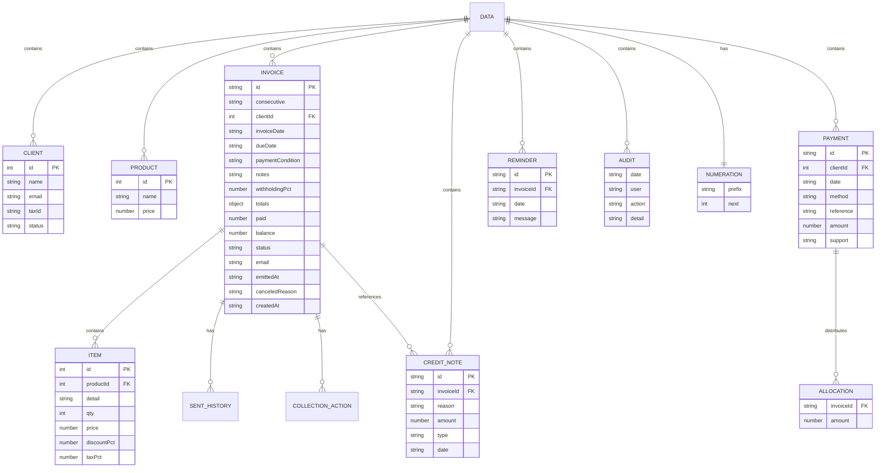

# Modelos de Datos — InvoiceManager

## Schema del Estado Persistido (localStorage)

El sistema almacena un único objeto JSON bajo la clave `"invoiceManagerData"`. Este objeto contiene todas las entidades del sistema.

### Diagrama ER

## Detalle por Entidad

### Entidad: `Client` (Maestro)

| Campo | Tipo | Obligatorio | Descripción | Evidencia |
|---|---|---|---|---|
| `id` | Number | Sí | Identificador único | `app.js:20` (seed data) |
| `name` | String | Sí | Razón social | `app.js:20` |
| `email` | String | Sí | Correo de contacto | `app.js:20` |
| `taxId` | String | Sí | NIT / ID tributario | `app.js:20` |
| `status` | String | Sí | "Activo" (único valor detectado) | `app.js:20-22` |

**Registros iniciales (seed):** 3 clientes hardcoded en `loadData()`.

### Entidad: `Product` (Maestro)

| Campo | Tipo | Obligatorio | Descripción | Evidencia |
|---|---|---|---|---|
| `id` | Number | Sí | Identificador único | `app.js:24` |
| `name` | String | Sí | Nombre del producto/servicio | `app.js:24` |
| `price` | Number | Sí | Precio unitario (sin IVA) | `app.js:24` |

**Registros iniciales (seed):** 4 productos hardcoded.

### Entidad: `Invoice` (Transaccional — Principal)

| Campo | Tipo | Obligatorio | Descripción | Evidencia |
|---|---|---|---|---|
| `id` | String | Sí | ID interno (`"INV-" + timestamp`) | `app.js:224` |
| `consecutive` | String | Sí | Consecutivo visible (`"FAC-1001"` o `"BORR-N"`) | `app.js:231-233` |
| `clientId` | Number | Sí | FK a cliente | `app.js:244` |
| `invoiceDate` | String | Sí | Fecha de emisión (ISO date) | `app.js:244` |
| `dueDate` | String | No | Fecha de vencimiento | `app.js:245` |
| `paymentCondition` | String | Sí | "Contado" o "Credito" | `app.js:245` |
| `notes` | String | No | Observaciones | `app.js:246` |
| `items` | Array[Item] | Sí | Líneas de detalle (deep copy) | `app.js:248` |
| `withholdingPct` | Number | No | Porcentaje retención (0-100) | `app.js:249` |
| `totals` | Object | Sí | {subtotal, taxTotal, withholding, total} | `app.js:250` |
| `paid` | Number | Sí | Total pagado hasta ahora | `app.js:251` (init 0) |
| `balance` | Number | Sí | Saldo pendiente (total - paid) | `app.js:252` |
| `status` | String | Sí | Estado de la máquina de estados (7 valores) | `app.js:253` |
| `email` | String | No | Correo del destinatario | `app.js:254` |
| `emittedAt` | String/null | No | Timestamp de emisión | `app.js:255` |
| `sentHistory` | Array | Sí | Historial de envíos | `app.js:256` |
| `collectionActions` | Array | Sí | Historial de gestiones de cobro | `app.js:257` |
| `creditNotes` | Array | Sí | Notas crédito asociadas | `app.js:258` |
| `createdAt` | String | Sí | Timestamp de creación | `app.js:259` |
| `canceledReason` | String | No | Motivo de anulación | `app.js:260` |

### Entidad: `Payment` (Transaccional)

| Campo | Tipo | Obligatorio | Descripción | Evidencia |
|---|---|---|---|---|
| `id` | String | Sí | `"PAY-" + timestamp` | `app.js:518` |
| `clientId` | Number | Sí | FK a cliente | `app.js:519` |
| `date` | String | Sí | Fecha del pago (ISO date) | `app.js:520` |
| `method` | String | Sí | "Transferencia"/"Efectivo"/"Tarjeta"/"Cheque" | `app.js:521` |
| `reference` | String | No | Referencia bancaria | `app.js:522` |
| `amount` | Number | Sí | Monto total del pago | `app.js:523` |
| `support` | String | No | Soporte / comprobante | `app.js:524` |
| `allocations` | Array[{invoiceId, amount}] | Sí | Distribución entre facturas | `app.js:525` |

### Entidad: `CreditNote` (Transaccional)

| Campo | Tipo | Obligatorio | Descripción | Evidencia |
|---|---|---|---|---|
| `id` | String | Sí | `"NC-" + timestamp` | `app.js:735` |
| `invoiceId` | String | Sí | FK a factura | `app.js:736` |
| `reason` | String | Sí | Motivo de la NC | `app.js:737` |
| `amount` | Number | Sí | Monto de la NC | `app.js:738` |
| `type` | String | Sí | "Parcial" o "Total" | `app.js:739` |
| `date` | String | Sí | Timestamp ISO | `app.js:740` |

### Entidad: `Reminder` (Transaccional)

| Campo | Tipo | Obligatorio | Descripción | Evidencia |
|---|---|---|---|---|
| `id` | String | Sí | `"REM-" + timestamp + random` | `app.js:554` |
| `invoiceId` | String | Sí | FK a factura | `app.js:555` |
| `date` | String | Sí | Timestamp ISO | `app.js:556` |
| `message` | String | Sí | Mensaje del recordatorio | `app.js:557` |

### Entidad: `Audit` (Log/Auditoría)

| Campo | Tipo | Obligatorio | Descripción | Evidencia |
|---|---|---|---|---|
| `date` | String | Sí | Timestamp ISO | `app.js:808` |
| `user` | String | Sí | "nombre (rol)" | `app.js:809` |
| `action` | String | Sí | Tipo de acción | `app.js:810` |
| `detail` | String | Sí | Detalle descriptivo | `app.js:811` |

## Relaciones entre Entidades

| Relación | Tipo | Evidencia |
|---|---|---|
| Invoice → Client | N:1 via `clientId` | `app.js:244` |
| Invoice → Item[] | 1:N (embebido) | `app.js:248` |
| Payment → Client | N:1 via `clientId` | `app.js:519` |
| Payment → Invoice[] | N:M via `allocations[].invoiceId` | `app.js:525` |
| CreditNote → Invoice | N:1 via `invoiceId` | `app.js:736` |
| Reminder → Invoice | N:1 via `invoiceId` | `app.js:555` |

## Hallazgos Clave

- **Schema sin validación** — No hay tipos, constraints, ni validaciones de integridad referencial
- **IDs basados en timestamp** — `Date.now()` + random — no son UUID, no garantizan unicidad bajo concurrencia
- **Datos embebidos (denormalizados)** — Items, creditNotes, collectionActions, sentHistory se guardan dentro de Invoice
- **Sin índices** — Búsquedas usan `Array.find()` (O(n) lineal)
- **Sin versionamiento de schema** — Si se agregan campos, los registros viejos no se migran
- **Acoplamiento por convención** — Las relaciones se mantienen solo por IDs sin integridad referencial

## Referencias

- [Interfaces](interfaces.md)
- [Referencia API](api-reference.md)
- [Análisis de BD](../database/schema-analysis.md)
- [Lógica de negocio](../behavior/business-logic.md)
