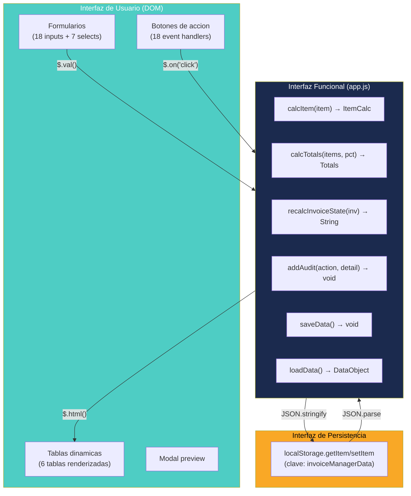

# Interfaces y Contratos — InvoiceManager

## Interfaces Externas

**No existen interfaces externas.** La aplicación no expone ni consume APIs REST, SOAP, GraphQL, WebSockets, ni ningún protocolo de red.

## Interfaces Internas (Contratos Implícitos entre Funciones)

Al no usar TypeScript, interfaces formales ni JSDoc, los contratos son **implícitos** — inferidos del uso real en el código.

### Contrato: Función `calcItem(item)` → ItemCalc

**Input:**
```javascript
// Objeto item (sin tipo formal)
{
    qty: Number,        // Cantidad
    price: Number,      // Precio unitario
    discountPct: Number, // Porcentaje descuento (0-100)
    taxPct: Number      // Porcentaje impuesto (0-100)
}
```

**Output:**
```javascript
{
    gross: Number,      // qty × price
    discount: Number,   // gross × (discountPct/100)
    subtotal: Number,   // gross - discount
    tax: Number,        // subtotal × (taxPct/100)
    total: Number       // subtotal + tax
}
```

**Evidencia:** `app.js:815-825`

### Contrato: Función `calcTotals(items, withholdingPct)` → Totals

**Input:**
- `items`: Array de objetos item (mismo formato que `calcItem`)
- `withholdingPct`: Number (0-100)

**Output:**
```javascript
{
    subtotal: Number,     // Σ subtotales (redondeado a 2 decimales)
    taxTotal: Number,     // Σ impuestos
    withholding: Number,  // (subtotal + taxTotal) × (withholdingPct/100)
    total: Number         // (subtotal + taxTotal) - withholding
}
```

**Evidencia:** `app.js:827-840`

### Contrato: Función `addAudit(action, detail)`

**Input:**
- `action`: String — Tipo de acción ("Factura Emitida", "Pago registrado", etc.)
- `detail`: String — Detalle descriptivo

**Efecto secundario:** Agrega entrada a `data.audit[]`:
```javascript
{
    date: String (ISO 8601),
    user: String ("nombre (rol)"),
    action: String,
    detail: String
}
```

**Evidencia:** `app.js:805-812`

### Contrato: Función `recalcInvoiceState(inv)` → String

**Input:** Objeto invoice completo
**Output:** String — uno de: `"Anulada"`, `"Pagada"`, `"Con nota credito"`, `"Parcialmente pagada"`, `"Vencida"`, `"Borrador"`, `"Emitida"`

**Evidencia:** `app.js:315-355`

## Eventos de UI (Interface DOM)

| Selector jQuery | Evento | Handler | Vista |
|---|---|---|---|
| `.nav-sections a` | click | Navegación de vistas | Sidebar |
| `#roleSelector` | change | Cambio de rol | Sidebar |
| `#itemProduct` | change | Actualiza precio | Factura |
| `#addItemBtn` | click | `addItemDraft()` | Factura |
| `#saveDraftBtn` | click | `saveInvoice("Borrador")` | Factura |
| `#emitBtn` | click | `saveInvoice("Emitida")` | Factura |
| `#previewBtn` | click | `previewInvoice()` | Factura |
| `#downloadPdfBtn` | click | `downloadPDF()` | Factura |
| `#sendInvoiceBtn` | click | `sendInvoice()` | Factura |
| `#accountSearch` | keyup | `renderAccounts()` | Cuentas |
| `#accountStateFilter` | change | `renderAccounts()` | Cuentas |
| `#exportAccountsBtn` | click | `exportAccountsCSV()` | Cuentas |
| `#bulkReminderBtn` | click | `sendBulkReminders()` | Cuentas |
| `#paymentClient` | change | `renderPaymentInvoiceCandidates()` | Pagos |
| `#applyPaymentBtn` | click | `applyPayment()` | Pagos |
| `#detailLoadBtn` | click | `loadInvoiceDetail()` | Detalle |
| `#createCreditBtn` | click | `createCreditNote()` | Detalle |
| `#annulInvoiceBtn` | click | `annulInvoice()` | Detalle |

**Evidencia:** `bindUI()` en `app.js:60-114`

## Funciones Expuestas al Scope Global (via `window.*`)

| Función | Razón | Uso |
|---|---|---|
| `window.removeItemDraft` | Llamada desde `onclick` en HTML generado | Botón "x" en tabla de items |
| `window.quickPayment` | Llamada desde `onclick` en HTML generado | Botón "Pago" en tabla de cuentas |
| `window.quickReminder` | Llamada desde `onclick` en HTML generado | Botón "Recordar" en tabla de cuentas |

**Evidencia:** `app.js:895-897`

**Hallazgo:** Estas 3 funciones se exponen explícitamente porque se usan en atributos `onclick` de HTML generado dinámicamente (patrón inseguro — favorece XSS).

## Diagrama de Interfaces



## Hallazgos Clave

- **0 interfaces formales** (no hay TypeScript, ni JSDoc, ni contratos de API)
- **18 event handlers** registrados en `bindUI()` — es el punto central de entrada de la UI
- **3 funciones expuestas a `window`** — patrón legacy para onclick en HTML dinámico
- **Contratos implícitos** — Solo inferibles leyendo el código; cambiar la estructura de un objeto rompe silenciosamente a los consumidores
- **Sin versionamiento de contratos** — No hay backward compatibility considerations

## Referencias

- [Modelos de datos](data-models.md)
- [Referencia API](api-reference.md)
- [Componentes](../architecture/components.md)
- [Lógica de negocio](../behavior/business-logic.md)
