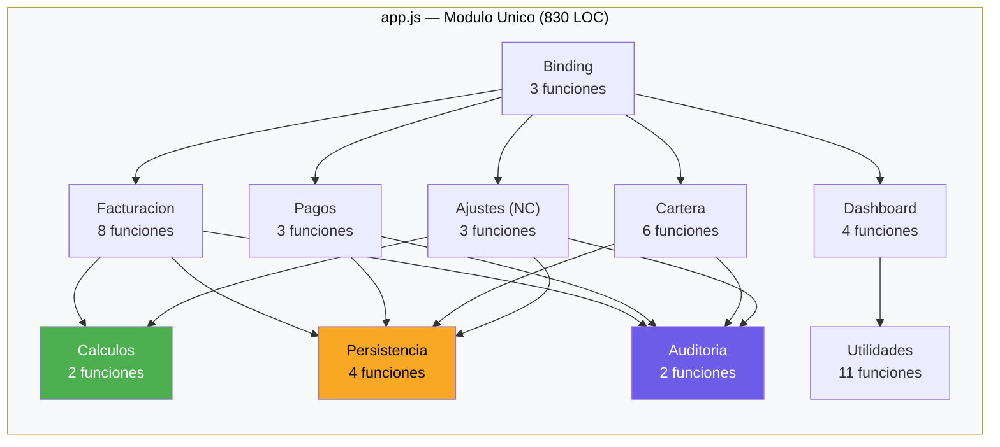

# Módulos del Sistema — InvoiceManager

## Estado de Modularización

**No existen módulos formales.** La aplicación no utiliza:
- ES6 modules (`import`/`export`)
- CommonJS (`require`/`module.exports`)
- AMD (`define`/`require`)
- IIFE Pattern (Immediately Invoked Function Expression)
- Namespace objects

Todo el código reside en **scope global** dentro de un único archivo `app.js`.

## Módulos Lógicos (Inferidos por Agrupación)

Aunque no hay modules formales, el código se puede agrupar lógicamente por dominio funcional:

| Módulo Lógico | Funciones | LOC | Cohesión | Responsabilidad |
|---|---|---|---|---|
| **Facturación** | 8 | ~190 | Media | Crear, emitir, previsualizar, PDF, enviar facturas |
| **Pagos** | 3 | ~87 | Alta | Registrar y aplicar pagos a facturas |
| **Cartera** | 6 | ~97 | Media | Estados, visualización, recordatorios, filtros |
| **Ajustes** | 3 | ~90 | Alta | Notas crédito parciales/totales, anulación |
| **Dashboard** | 4 | ~90 | Alta | KPIs, gráficos, reportes visuales |
| **Auditoría** | 2 | ~22 | Alta | Registro y visualización de trazabilidad |
| **Cálculos** | 2 | ~25 | Alta | Aritmética financiera pura |
| **Utilidades** | 11 | ~56 | Baja | Formato, fechas, búsquedas, helpers |
| **Persistencia** | 4 | ~62 | Alta | localStorage read/write, seed data |
| **Binding/Orquestación** | 3 | ~70 | Media | Event handlers, refresh global |

## Diagrama de Módulos Lógicos

## Candidatos de Extracción (para Modernización)

Si se modernizara esta aplicación, estos serían los módulos a extraer:

| Módulo Target | Contenido Actual | Tipo Target | Dependencias |
|---|---|---|---|
| `invoicing.service.js` | 8 funciones de facturación | ES Module | Cálculos, Persistencia |
| `payments.service.js` | 3 funciones de pagos | ES Module | Persistencia |
| `accounts.service.js` | 6 funciones de cartera | ES Module | Persistencia, Utilidades |
| `credit-notes.service.js` | 3 funciones NC/anulación | ES Module | Persistencia, Cálculos |
| `dashboard.service.js` | 4 funciones de reporting | ES Module | Utilidades |
| `audit.service.js` | 2 funciones | ES Module | Ninguna |
| `calculator.js` | `calcItem`, `calcTotals` | ES Module (puro) | Ninguna |
| `formatters.js` | `money`, `round2`, helpers | ES Module (puro) | Ninguna |
| `storage.service.js` | `loadData`, `saveData` | ES Module | localStorage API |
| `app.controller.js` | `bindUI`, `refreshAll` | ES Module | Todos los anteriores |

## Hallazgos Clave

- **0 módulos formales** — toda la app es un script procedural de 830 LOC
- **Alta cohesión lógica** — las funciones se agrupan naturalmente por dominio, lo cual facilitaría una modularización
- **Bajo acoplamiento entre dominios** — Facturación y Pagos no se llaman mutuamente; solo comparten `data` y `saveData()`
- **El mayor obstáculo** para modularizar es el acceso directo al DOM (`$(...)`) en funciones de negocio
- **Patrón recomendado:** Separar en módulos ES6 + un controlador/mediador que orqueste

## Referencias

- [Estructura del programa](program-structure.md)
- [Interfaces](interfaces.md)
- [Componentes](../architecture/components.md)
- [Patrones](../architecture/patterns.md)
