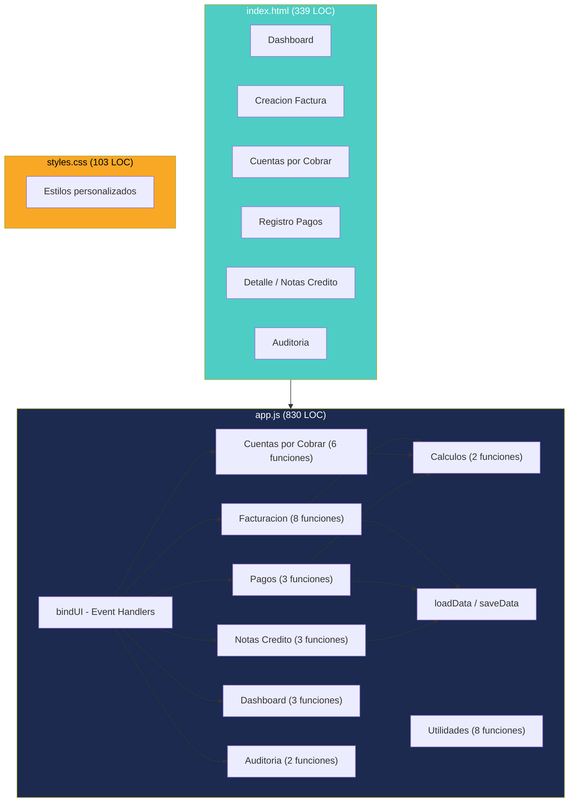

# Estructura del Programa — InvoiceManager

## Árbol Completo del Proyecto

```
App/
├── index.html          ← Layout SPA, estructura de todas las vistas (339 LOC)
├── app.js              ← Lógica de negocio, controladores, persistencia (830 LOC)
└── styles.css          ← Estilos personalizados sobre Bootstrap (103 LOC)
```

**Total:** 3 archivos de código fuente | 1,272 LOC

## Clasificación por Capa

| Archivo | Capa | Responsabilidad |
|---|---|---|
| `index.html` | Presentación (Template) | Estructura HTML de las 6 vistas, layout sidebar + main content |
| `app.js` | Presentación + Negocio + Datos | Controladores de UI, lógica de negocio, acceso a localStorage |
| `styles.css` | Presentación (Estilo) | Estilos visuales complementarios a Bootstrap 3.4.1 |

## Organización de Vistas (en index.html)

El archivo `index.html` define 6 secciones (`<section class="view">`) que se muestran/ocultan dinámicamente:

| Vista (data-view) | ID HTML | Propósito |
|---|---|---|
| `dashboard` | `#view-dashboard` | Dashboard financiero con KPIs y gráficos |
| `invoice-create` | `#view-invoice-create` | Formulario de creación de facturas + listado reciente |
| `accounts` | `#view-accounts` | Cuentas por cobrar con filtros y acciones de cobro |
| `payments` | `#view-payments` | Registro de pagos con aplicación a facturas |
| `invoice-detail` | `#view-invoice-detail` | Consulta de detalle, notas crédito y anulación |
| `audit` | `#view-audit` | Tabla de auditoría (trazabilidad) |

## Organización de Funciones (en app.js)

### Variables Globales (líneas 1-5)

| Variable | Tipo | Propósito |
|---|---|---|
| `storeKey` | string | Clave de localStorage (`"invoiceManagerData"`) |
| `sessionUser` | object | Usuario activo (hardcoded `usuario.demo`) |
| `currentItems` | array | Items del formulario de factura actual |
| `selectedInvoiceId` | string/null | Factura seleccionada en detalle |
| `financeChart` | Chart/null | Referencia al gráfico Chart.js |

### Funciones por Dominio

#### Datos y Persistencia (4 funciones)

| Función | Línea aprox. | LOC | Operación |
|---|---|---|---|
| `loadData()` | ~8 | 25 | Carga JSON de localStorage o retorna seed data |
| `saveData()` | ~34 | 3 | Persiste `data` a localStorage |
| `hydrateStaticData()` | ~38 | 22 | Inicializa selectores y campos de fecha |
| `resetInvoiceForm()` | ~590 | 12 | Limpia formulario de factura |

#### Binding de Eventos UI (1 función)

| Función | Línea aprox. | LOC | Operación |
|---|---|---|---|
| `bindUI()` | ~60 | 55 | Registra todos los handlers jQuery |

#### Facturación (8 funciones)

| Función | Línea aprox. | LOC | Responsabilidad |
|---|---|---|---|
| `addItemDraft()` | ~115 | 30 | Agrega item al borrador |
| `renderCurrentItems()` | ~145 | 22 | Renderiza tabla de items |
| `removeItemDraft(id)` | ~168 | 3 | Elimina item del borrador |
| `saveInvoice(status)` | ~172 | 65 | Guarda factura (Borrador/Emitida) |
| `findMatchingDraft(...)` | ~238 | 5 | Busca borrador duplicado |
| `previewInvoice()` | ~244 | 20 | Modal de vista previa |
| `downloadPDF()` | ~265 | 25 | Genera y descarga PDF con jsPDF |
| `sendInvoice()` | ~292 | 20 | Simula envío por correo |

#### Cuentas por Cobrar (6 funciones)

| Función | Línea aprox. | LOC | Responsabilidad |
|---|---|---|---|
| `recalcInvoiceState(inv)` | ~315 | 25 | Máquina de estados de factura |
| `renderAccounts()` | ~380 | 35 | Renderiza tabla de cuentas |
| `quickPayment(id)` | ~415 | 6 | Navega a pagos con factura preseleccionada |
| `quickReminder(id)` | ~422 | 5 | Envía recordatorio individual |
| `sendBulkReminders()` | ~428 | 14 | Envía recordatorios masivos |
| `sendReminderForInvoice(inv)` | ~443 | 12 | Lógica de envío de recordatorio |

#### Pagos (3 funciones)

| Función | Línea aprox. | LOC | Responsabilidad |
|---|---|---|---|
| `renderPaymentInvoiceCandidates()` | ~457 | 18 | Lista facturas pendientes del cliente |
| `applyPayment()` | ~476 | 55 | Registra pago y aplica a facturas |
| `renderPaymentsHistory()` | ~532 | 14 | Tabla de historial de pagos |

#### Notas Crédito y Anulación (3 funciones)

| Función | Línea aprox. | LOC | Responsabilidad |
|---|---|---|---|
| `loadInvoiceDetail()` | ~548 | 40 | Carga y renderiza detalle |
| `createCreditNote()` | ~590 | 35 | Genera nota crédito parcial/total |
| `annulInvoice()` | ~626 | 15 | Anula factura con motivo |

#### Dashboard (3 funciones)

| Función | Línea aprox. | LOC | Responsabilidad |
|---|---|---|---|
| `renderDashboard()` | ~350 | 35 | Calcula KPIs y renderiza |
| `drawFinanceChart(...)` | ~386 | 20 | Dibuja gráfico de barras |
| `renderRecentInvoices()` | ~407 | 15 | Tabla de facturas recientes |

#### Exportación (1 función)

| Función | Línea aprox. | LOC | Responsabilidad |
|---|---|---|---|
| `exportAccountsCSV()` | ~644 | 20 | Genera y descarga CSV |

#### Auditoría (2 funciones)

| Función | Línea aprox. | LOC | Responsabilidad |
|---|---|---|---|
| `refreshAudit()` | ~665 | 14 | Renderiza tabla de auditoría |
| `addAudit(action, detail)` | ~680 | 8 | Registra evento de auditoría |

#### Cálculos Financieros (2 funciones)

| Función | Línea aprox. | LOC | Responsabilidad |
|---|---|---|---|
| `calcItem(i)` | ~690 | 10 | Calcula subtotal/impuesto por item |
| `calcTotals(items, withholding)` | ~700 | 15 | Totales de factura con retención |

#### Utilidades (8 funciones)

| Función | Línea aprox. | LOC | Responsabilidad |
|---|---|---|---|
| `findProduct(id)` | ~718 | 3 | Busca producto por ID |
| `clientName(id)` | ~722 | 3 | Nombre de cliente por ID |
| `clientEmail(id)` | ~726 | 3 | Email de cliente por ID |
| `sum(arr, mapper)` | ~730 | 5 | Suma con función mapeadora |
| `money(v)` | ~735 | 3 | Formato moneda COP |
| `round2(v)` | ~738 | 3 | Redondeo a 2 decimales |
| `todayISO()` / `addDaysISO(d)` | ~741 | 6 | Fechas ISO |
| `daysPastDue(inv)` | ~747 | 6 | Días de mora |

#### Orquestación (2 funciones)

| Función | Línea aprox. | LOC | Responsabilidad |
|---|---|---|---|
| `refreshAll()` | ~340 | 10 | Refresca todas las vistas |
| `updateStatusByBalance()` | ~350 | 5 | Recalcula estados de facturas |

## Diagrama de Estructura



Este diagrama muestra la estructura monolítica de la aplicación: un único HTML con 6 vistas, un único JS con toda la lógica agrupada por dominio funcional, y un CSS complementario.

## Dependencias Externas (CDN)

| Librería | Versión | CDN | Uso en la App |
|---|---|---|---|
| Bootstrap CSS | 3.4.1 | maxcdn.bootstrapcdn.com | Grid, paneles, formularios, modales |
| Bootstrap JS | 3.4.1 | maxcdn.bootstrapcdn.com | Modal (preview factura) |
| jQuery | 1.12.4 | code.jquery.com | Manipulación DOM, eventos, selectores |
| Chart.js | 2.9.4 | cdnjs.cloudflare.com | Gráfico de barras del dashboard |
| jsPDF | 1.5.3 | cdnjs.cloudflare.com | Generación de PDF de facturas |

## Hallazgos Clave

- **Monolito de un solo archivo** — No hay separación en módulos, clases o componentes
- **~40 funciones** todas en scope global (pattern de programación procedural)
- **3 funciones expuestas al scope global via `window.*`** — `removeItemDraft`, `quickPayment`, `quickReminder`
- **Sin patrón MVC/MVVM** — Las funciones mezclan lógica de negocio con renderizado DOM
- **Sin gestión de errores** — Solo `alert()` para validaciones, sin `try/catch`
- **Sin transpilación** — JavaScript ES5 nativo (compatible con IE11+)

## Referencias

- [Visión general del proyecto](../project-overview.md)
- [Documentación especializada](../specialized/specialized-documentation.md)
