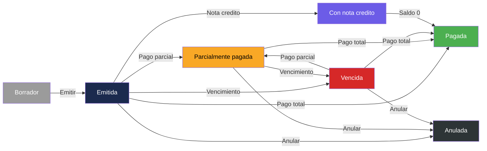

# Documentación Especializada — InvoiceManager

## Integraciones Detectadas

### Integraciones Externas (Runtime)

**No se detectan integraciones con servicios externos.** La aplicación opera completamente offline en el navegador del usuario.

| Tipo | Estado | Evidencia |
|---|---|---|
| APIs REST | No detectadas | Sin `fetch()`, `XMLHttpRequest`, ni `$.ajax()` en `app.js` |
| WebSockets | No detectados | Sin `WebSocket` ni `socket.io` |
| Servicios SOAP | No detectados | Sin WSDL, sin XML processing |
| Bases de datos externas | No detectadas | Solo `localStorage` |
| Servicios de autenticación | No detectados | Sin OAuth, JWT, SAML, ni login real |
| Servicios de email | No detectados | `sendInvoice()` simula envío sin API real |
| Pasarelas de pago | No detectadas | Pagos son solo registro contable |

### Dependencias CDN (Carga Estática)

| Recurso | URL | Evidencia |
|---|---|---|
| Bootstrap CSS | `https://maxcdn.bootstrapcdn.com/bootstrap/3.4.1/css/bootstrap.min.css` | `index.html:8` |
| jQuery | `https://code.jquery.com/jquery-1.12.4.min.js` | `index.html:228` |
| Bootstrap JS | `https://maxcdn.bootstrapcdn.com/bootstrap/3.4.1/js/bootstrap.min.js` | `index.html:229` |
| Chart.js | `https://cdnjs.cloudflare.com/ajax/libs/Chart.js/2.9.4/Chart.bundle.min.js` | `index.html:230` |
| jsPDF | `https://cdnjs.cloudflare.com/ajax/libs/jspdf/1.5.3/jspdf.debug.js` | `index.html:231` |

## Multi-Tenancy

### Tipo Detectado: Basada en Rol (client-side)

La aplicación implementa un **mecanismo de roles** simplificado sin autenticación:

```javascript
// app.js:2
var sessionUser = { name: "usuario.demo", role: "Facturador" };
```

| Rol | Comportamiento |
|---|---|
| Facturador | Restricción en `applyPayment()`: "El rol Facturador no registra pagos" |
| Analista de cartera | Sin restricciones detectadas en código |
| Administrador | Sin restricciones detectadas en código |

**Impacto en migración:** Cualquier sistema de roles real requerirá autenticación y autorización en backend.

## Mapeo Configuración → Implementación

### Estado de la Aplicación (Seed Data)

| Concepto | Valor | Consumer | Propósito |
|---|---|---|---|
| `storeKey` | `"invoiceManagerData"` | `loadData()`, `saveData()` en `app.js` | Clave de localStorage para persistir estado |
| `numeration.prefix` | `"FAC-"` | `saveInvoice()` en `app.js` | Prefijo de consecutivos de factura |
| `numeration.next` | `1001` | `saveInvoice()` en `app.js` | Siguiente número de consecutivo |

### Datos Maestros Embebidos (hardcoded)

| Entidad | Cantidad | Campos | Ubicación |
|---|---|---|---|
| Clientes | 3 | id, name, email, taxId, status | `loadData()` → `data.clients` |
| Productos | 4 | id, name, price | `loadData()` → `data.products` |

## Particularidades del Dominio

### Dominio: Facturación y Cuentas por Cobrar (Colombia)

| Aspecto | Implementación | Evidencia |
|---|---|---|
| **Moneda** | Peso colombiano (COP) | `money()` usa `es-CO` locale |
| **Impuesto (IVA)** | Default 19% por item | `index.html` input `#itemTax` value="19" |
| **Retención en la fuente** | Porcentaje sobre total bruto | Campo `#withholding` en formulario |
| **Condiciones de pago** | Contado / Crédito | Select `#paymentCondition` |
| **Vencimiento default** | 30 días | `addDaysISO(30)` en `resetInvoiceForm()` |
| **Numeración consecutiva** | `FAC-1001`, `FAC-1002`... | `data.numeration` |
| **Notas crédito** | Parcial / Total | `#creditType` select |
| **NIT / ID Tributario** | Campo `taxId` en clientes | Seed data: `"900111222"`, etc. |

### Máquina de Estados de Factura



Este diagrama muestra los 7 estados posibles de una factura según la función `recalcInvoiceState()` en `app.js`.

## Herramientas de Transformación Aplicables

| Herramienta | Aplicabilidad | Razón |
|---|---|---|
| **Webpack/Vite** | Alta | Modularizar el archivo monolítico `app.js` |
| **TypeScript** | Alta | Agregar tipado al código ES5 sin tipos |
| **React/Vue/Angular** | Alta | Reemplazar manipulación DOM manual por componentes |
| **Node.js + Express** | Alta | Agregar backend para persistencia real (reemplazar localStorage) |
| **PostgreSQL/MySQL** | Alta | Base de datos relacional para las entidades |
| **Auth0/Keycloak** | Alta | Autenticación real (reemplazar selector de rol) |
| **Jest/Vitest** | Alta | Testing (actualmente 0% cobertura) |
| **ESLint/Prettier** | Alta | Linting y formateo (sin estándar actual) |

## Regulaciones del Dominio

[SUPUESTO: La aplicación opera en contexto colombiano basado en el locale `es-CO`, IVA 19%, y formato de NIT]

| Regulación | Relevancia | Estado en la App |
|---|---|---|
| **DIAN - Facturación electrónica** | Alta | No implementado — no genera XML UBL ni se conecta a la DIAN |
| **Resolución de numeración** | Media | El consecutivo es local (`FAC-NNNN`), sin validación de resolución |
| **Retención en la fuente** | Implementado | Campo `withholding` aplicado al total |
| **NIT con dígito de verificación** | Parcial | Campo `taxId` sin validación de DV |

## Observaciones de Seguridad Inmediatas

| Hallazgo | Severidad | Evidencia |
|---|---|---|
| Sin autenticación | **Alta** | `sessionUser` hardcoded — cualquier usuario accede a todo |
| Datos en localStorage | **Alta** | Datos financieros sin cifrado en browser |
| Sin HTTPS enforcement | **Media** | No hay redirección a HTTPS ni headers de seguridad |
| jQuery 1.12.4 | **Media** | Versión antigua con CVEs conocidos de XSS |
| jsPDF debug version | **Baja** | Se usa `jspdf.debug.js` en lugar de minificado |
| Sin CSP headers | **Media** | Carga scripts de CDN sin Content Security Policy |

## Referencias

- [Visión general del proyecto](../project-overview.md)
- [Estructura del programa](../reference/program-structure.md)
