# Reporte Ejecutivo de Deuda Técnica — InvoiceManager

## Resumen Ejecutivo

InvoiceManager es una aplicación de facturación funcional pero técnicamente frágil. Con **18 issues de deuda técnica** (8 de severidad Alta), la aplicación opera en un estado de riesgo permanente: vulnerabilidades activas de XSS, ausencia total de autenticación, y dependencias sin soporte desde 2016.

**Veredicto:** La aplicación requiere modernización completa antes de poder considerarse apta para producción empresarial. El costo estimado de remediación es de **10-15 semanas** de un developer senior.

## Hallazgos Críticos (Severidad Alta)

| # | Hallazgo | Impacto de Negocio | Acción Inmediata |
|---|---|---|---|
| 1 | **jQuery 1.12.4 sin parches de seguridad** | Vulnerabilidad explotable por atacantes — datos financieros expuestos | Migrar o eliminar |
| 2 | **22 puntos de inyección XSS** via innerHTML | Un campo malicioso puede ejecutar código arbitrario | Sanitizar inputs |
| 3 | **Sin autenticación** — acceso sin login | Cualquiera con el URL accede a datos financieros | Implementar auth |
| 4 | **God Object global** — todo acoplado | Imposible agregar features sin riesgo de romper todo | Refactorizar a módulos |
| 5 | **0 tests automatizados** | Cualquier cambio puede romper funcionalidad sin aviso | Escribir characterization tests |
| 6 | **Bootstrap 3.4.1 EOL** | Sin parches, incompatible con estándares modernos | Migrar a BS5 |
| 7 | **3 funciones de 50-80 LOC** | Código difícil de entender y mantener | Extract Method |
| 8 | **localStorage sin backup** | Limpieza de browser = pérdida total de datos financieros | Migrar a BD real |

## Hallazgos Medios

| # | Hallazgo | Impacto |
|---|---|---|
| 9 | Sin módulos JS (ES5 global scope) | No se puede tree-shake ni lazy-load |
| 10 | Sin autenticación real (variable JS) | Role bypass con DevTools |
| 11 | Refresh-All en cada operación | Performance degrada con más datos |
| 12 | CDN sin SRI (Subresource Integrity) | Supply chain attack posible |
| 13 | Sin validación de tamaño de datos | localStorage se llenará eventualmente |
| 14 | Código sin comentarios (0) | Onboarding lento para nuevos devs |
| 15 | jsPDF versión debug en producción | Archivo más pesado sin beneficio |

## Costo de NO Actuar

| Escenario | Probabilidad | Impacto Financiero |
|---|---|---|
| XSS explotado → datos manipulados | Alta (22 vectores) | Pérdida de confianza + costos legales |
| localStorage borrado → datos perdidos | Media | Reingreso manual de toda la facturación |
| CDN comprometida → supply chain attack | Baja-Media | Ejecución de código malicioso en contexto financiero |
| jQuery CVE explotado | Media | Acceso no autorizado a datos |
| App inmantenible → rewrite forzado | Alta (a 12 meses) | Costo de rewrite > costo de modernización gradual |

## Roadmap de Remediación Recomendado

```mermaid
flowchart LR
    subgraph URGENTE["Inmediato (Semana 1-2)"]
        A1["Tests characterization"]
        A2["SRI en CDNs"]
        A3["try-catch en loadData"]
    end

    subgraph CORTO["Corto Plazo (Semana 3-7)"]
        B1["Extraer modulos puros"]
        B2["Introducir Repository"]
        B3["Eliminar God Object"]
    end

    subgraph MEDIO["Medio Plazo (Semana 8-14)"]
        C1["Sanitizar XSS"]
        C2["Migrar jQuery"]
        C3["Agregar auth"]
        C4["Backend + BD real"]
    end

    URGENTE --> CORTO --> MEDIO

    style URGENTE fill:#d62828,color:#fff
    style CORTO fill:#f9a826,color:#000
    style MEDIO fill:#00b894,color:#fff
```

## Métricas de Mantenibilidad

| Dimensión | Score Actual | Target Post-Migración |
|---|---|---|
| Modificabilidad | 2/5 | 4/5 |
| Analizabilidad | 3/5 | 5/5 |
| Testabilidad | 1/5 | 5/5 |
| Reusabilidad | 2/5 | 4/5 |
| Modularidad | 1/5 | 5/5 |
| **Promedio** | **1.8/5** | **4.6/5** |

## Conclusión

La aplicación es un **prototipo funcional** que cumple su propósito a nivel básico, pero NO es apta para uso empresarial en su estado actual. Los riesgos de seguridad (XSS, sin auth), la fragilidad de datos (localStorage), y la imposibilidad de escalar (monolito client-side) requieren una inversión de modernización estimada en **10-15 semanas**.

La estrategia recomendada es **Rebuild incremental** (Strangler Fig): construir la nueva versión módulo por módulo sin interrumpir la funcionalidad actual, comenzando por tests y extracción de lógica pura.

## Referencias

- [Detalle completo de deuda técnica](analysis/tech-debt.md)
- [Summary de deuda](technical-debt/summary.md)
- [Outdated Components](technical-debt/outdated-components.md)
- [Remediation Plan](technical-debt/remediation-plan.md)
- [Plan de Migración](migration/component-order.md)
- [Production Readiness](analysis/production-readiness.md)
- [Security Patterns](analysis/security-patterns.md)
