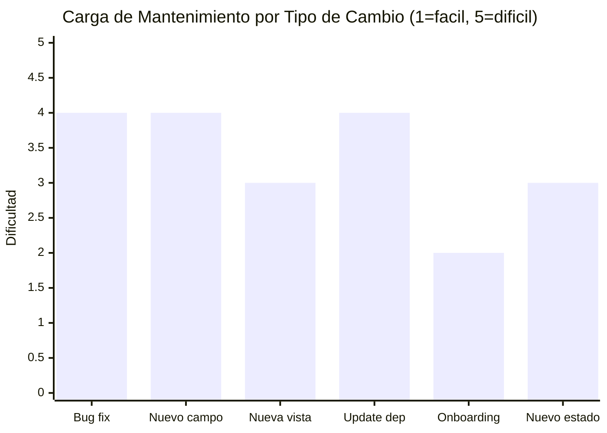

# Carga de Mantenimiento — InvoiceManager

## Esfuerzo de Mantenimiento Actual

| Dimensión | Esfuerzo | Justificación |
|---|---|---|
| **Corregir un bug** | Alto | Sin tests → cada fix es riesgoso. Global state → side-effects impredecibles. 0 logging → difícil diagnosticar. |
| **Agregar un campo a Factura** | Alto | Requiere cambiar: model en `loadData`, `saveInvoice`, `renderRecentInvoices`, `renderAccounts`, `loadInvoiceDetail`, `exportAccountsCSV`, `downloadPDF` — mínimo 7 funciones |
| **Agregar una nueva vista** | Medio | Agregar `<section>` en HTML + `renderNewView()` en JS + link en nav + llamada en `refreshAll()` |
| **Actualizar una dependencia** | Alto | Sin package manager, sin tests, sin SRI — cambiar URL CDN sin forma de validar |
| **Onboarding de un developer nuevo** | Medio | 0 comentarios pero naming razonable. 1,272 LOC es abarcable en 1-2 días de lectura |
| **Agregar un nuevo estado a la factura** | Medio | Modificar `recalcInvoiceState()` + rendering en tablas + filtros en cuentas por cobrar |

## Métricas de Mantenibilidad

## Shotgun Surgery Map

Agregar un campo (ej: "moneda" a factura) requiere modificar:

| # | Archivo | Función | Cambio necesario |
|---|---|---|---|
| 1 | `app.js` | `saveInvoice()` | Leer campo del form, agregarlo al objeto invoice |
| 2 | `app.js` | `renderRecentInvoices()` | Agregar columna a tabla |
| 3 | `app.js` | `renderAccounts()` | Agregar columna a tabla |
| 4 | `app.js` | `loadInvoiceDetail()` | Mostrar en detalle |
| 5 | `app.js` | `exportAccountsCSV()` | Agregar al CSV |
| 6 | `app.js` | `downloadPDF()` | Incluir en PDF |
| 7 | `index.html` | Form de factura | Agregar `<input>` o `<select>` |
| 8 | `index.html` | Tabla de facturas | Agregar `<th>` |

**Total: 8 puntos de modificación** para un solo campo nuevo — evidencia de Divergent Change y Shotgun Surgery.

## Costo de NO Actuar (Status Quo)

| Riesgo | Probabilidad | Impacto | Costo estimado |
|---|---|---|---|
| **XSS explotado** (datos financieros robados) | Media | Crítico | Pérdida de confianza + datos |
| **localStorage se llena** (datos perdidos) | Alta (con uso intensivo) | Alto | Pérdida de facturas sin backup |
| **CDN comprometido** (supply chain) | Baja | Crítico | Inyección de código malicioso |
| **Browser actualiza y rompe jQuery 1.x** | Media | Alto | App deja de funcionar |
| **Regulación exige autenticación** | Alta (GDPR, Habeas Data Colombia) | Alto | Bloqueo regulatorio |

## Hallazgos Clave

- **Shotgun Surgery severo** — agregar un campo requiere 8 cambios en 2 archivos
- **Sin tests = alto riesgo de regresión** — cada cambio puede romper algo sin aviso
- **Carga de mantenimiento desproporcionada** para un proyecto de 1,272 LOC — se comporta como si tuviera 10x más código
- **El costo de NO actuar crece exponencialmente** — cada día que pasa con jQuery 1.12.4 EOL aumenta el riesgo

## Referencias

- [Resumen de deuda técnica](summary.md)
- [Componentes obsoletos](outdated-components.md)
- [Plan de remediación](remediation-plan.md)
- [Complejidad](../analysis/complexity-analysis.md)
