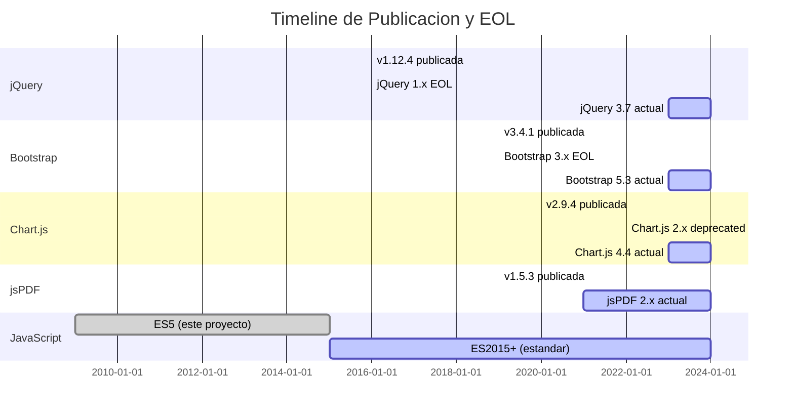

# Componentes Obsoletos — InvoiceManager

## Inventario de Componentes EOL/Desactualizados

| Componente | Versión Actual | Última Estable | Desfase | Estado | Fecha EOL |
|---|---|---|---|---|---|
| jQuery | 1.12.4 | 3.7.1 | 8 major | **EOL** | 2016 |
| Bootstrap CSS/JS | 3.4.1 | 5.3.3 | 2 major | **EOL** | Feb 2019 |
| Chart.js | 2.9.4 | 4.4.x | 2 major | Mantenimiento solo | 2022 (v2 deprecated) |
| jsPDF | 1.5.3 (debug) | 2.5.x | 1 major | Desactualizado | 2020 (v1 sin soporte) |
| JavaScript (ES5) | ES5 (2009) | ES2024 | 15 años | Legacy | — |

## Timeline de Obsolescencia

## Riesgo por Componente

### jQuery 1.12.4 — RIESGO CRÍTICO

| Factor | Detalle |
|---|---|
| **Años sin soporte** | ~10 años (EOL 2016) |
| **CVEs conocidos** | XSS en versiones < 3.0 via `.html()` / `$.parseHTML()` — [PENDIENTE: verificar CVE-2020-11022, CVE-2020-11023] |
| **Surface area** | 100% del código JS (`app.js` completo) |
| **Alternativa** | Vanilla JS, Alpine.js, htmx |
| **Migración** | Breaking — requiere reescritura de selectores y event handling |

### Bootstrap 3.4.1 — RIESGO ALTO

| Factor | Detalle |
|---|---|
| **Años sin soporte** | ~7 años (EOL 2019) |
| **Cambios de API** | `panel` → `card`, grid rediseñado, jQuery removido |
| **Surface area** | 100% del HTML layout |
| **Alternativa** | Bootstrap 5.3, Tailwind CSS |
| **Migración** | Breaking — rewrite de clases HTML |

### ES5 JavaScript — RIESGO MEDIO

| Factor | Detalle |
|---|---|
| **Años de desfase** | 15 años (ES5 es de 2009) |
| **Features ausentes** | `let/const`, arrow functions, destructuring, modules, `async/await`, classes, template literals |
| **Impacto** | Código verbose, sin módulos, sin encapsulamiento moderno |
| **Migración** | Relativamente mecánica — tools como `lebab` pueden automatizar parte |

## Hallazgos Clave

- **4 de 5 dependencias están EOL o desactualizadas** — solo la "ausencia de framework" no está obsoleta
- **jQuery 1.12.4 es el componente más crítico** — 10 años sin soporte, CVEs activos, 100% coupling
- **El lenguaje mismo (ES5) es legacy** — 15 años detrás del estándar actual
- **Sin package manager** — imposible automatizar actualizaciones o detectar CVEs

## Referencias

- [Resumen de deuda técnica](summary.md)
- [Carga de mantenimiento](maintenance-burden.md)
- [Plan de remediación](remediation-plan.md)
- [Dependencias](../architecture/dependencies.md)
- [Assessment de seguridad](../analysis/dependency-security-assessment.md)
