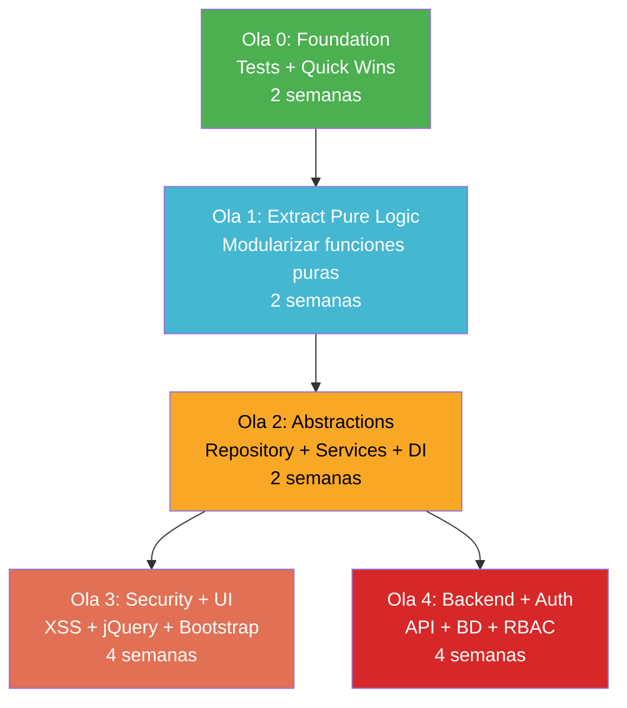

# Plan de Remediación — InvoiceManager

## Estrategia de Remediación

La remediación sigue el orden de **Michael Feathers**: Tests → Dependency Breaking → Refactoring → Modernización.

Sin tests, cualquier refactoring es un riesgo. Los tests van primero, SIEMPRE.

## Roadmap por Olas

### Ola 0: Foundation (Semana 1-2) — Prerequisitos

| # | Acción | Refactoring (Fowler) | Esfuerzo | Riesgo |
|---|---|---|---|---|
| 0.1 | Instalar `npm init` + Jest/Vitest | Introduce Build System | 2h | Bajo |
| 0.2 | Escribir characterization tests para `calcItem`, `calcTotals`, `recalcInvoiceState` | Write Tests (Feathers) | 1-2 días | Bajo |
| 0.3 | Agregar `try/catch` en `loadData()` | Wrap with Exception Handling | 1h | Bajo |
| 0.4 | Reemplazar `jspdf.debug.js` → `jspdf.min.js` | Remove Dead Code | 5 min | Bajo |
| 0.5 | Agregar SRI a todos los CDNs | Security Hardening | 1h | Bajo |

**DoD Ola 0:** Characterization tests pasan ✅, JSON corrupto no crashea, SRI activo.

---

### Ola 1: Extract Pure Logic (Semana 3-4) — Reducir acoplamiento

| # | Acción | Refactoring (Fowler) | Esfuerzo | Riesgo |
|---|---|---|---|---|
| 1.1 | Extraer funciones puras a `src/domain/calculator.js` | Extract Method + Move Function to Module | 1 día | Bajo |
| 1.2 | Extraer state machine a `src/domain/invoice-state.js` | Extract Class | 1 día | Bajo |
| 1.3 | Extraer utilidades a `src/utils/format.js` | Move Function to Module | 4h | Bajo |
| 1.4 | Crear `src/domain/validators.js` — consolidar 22 validaciones | Extract Method + Consolidate Conditional | 2 días | Medio |
| 1.5 | Introducir `const InvoiceStatus = {...}` enum | Replace Data Value with Object | 2h | Bajo |

**DoD Ola 1:** Tests siguen pasando ✅. Lógica pura en módulos separados. `app.js` reduce ~150 LOC.

---

### Ola 2: Introduce Abstractions (Semana 5-6) — Dependency Inversion

| # | Acción | Refactoring (Fowler) | Esfuerzo | Riesgo |
|---|---|---|---|---|
| 2.1 | Crear `DataStore` interface + `LocalStorageStore` adapter | Extract Interface + Introduce Repository | 2 días | Medio |
| 2.2 | Crear `InvoiceService` que encapsula operaciones de negocio | Extract Class | 3 días | Medio |
| 2.3 | Crear `ErrorHandler` que reemplaza `alert()` | Replace Error Code with Exception | 1 día | Medio |
| 2.4 | Crear `EventBus` para desacoplar refresh | Introduce Observer | 2 días | Medio |
| 2.5 | Eliminar `var data` global → inyectar `store` | Parameterize Constructor (Feathers) | 1 día | Alto |

**DoD Ola 2:** `var data` eliminado ✅. Business logic testeable sin DOM ✅. `alert()` reemplazado ✅.

---

### Ola 3: Security + Modernize UI (Semana 7-10) — Eliminar vulnerabilidades

| # | Acción | Refactoring (Fowler) | Esfuerzo | Riesgo |
|---|---|---|---|---|
| 3.1 | Sanitizar innerHTML → usar `.textContent` o template engine | Replace innerHTML with Safe Methods | 1 semana | Medio |
| 3.2 | Migrar jQuery 1.12 → vanilla JS o eliminarlo | Replace Framework | 2-3 semanas | Alto |
| 3.3 | Migrar Bootstrap 3 → 5 (o Tailwind) | Migrate CSS Framework | 2 semanas | Alto |
| 3.4 | Migrar ES5 → ES6+ (modules, let/const, arrow) | Modernize Syntax | 1 semana | Bajo |
| 3.5 | Agregar CSP header + X-Frame-Options | Security Configuration | 1 día | Bajo |

**DoD Ola 3:** 0 XSS posibles ✅. 0 dependencias EOL ✅. Código ES6+ modular ✅.

---

### Ola 4: Backend + Auth (Semana 11-14) — Producción real

| # | Acción | Refactoring (Fowler) | Esfuerzo | Riesgo |
|---|---|---|---|---|
| 4.1 | Crear REST API (Node.js/Express o equivalente) | Architecture Migration | 2 semanas | Alto |
| 4.2 | Implementar autenticación (JWT + OAuth2) | Introduce Authentication | 1 semana | Alto |
| 4.3 | Migrar localStorage → BD real (PostgreSQL/MongoDB) | Replace Data Store | 1 semana | Medio |
| 4.4 | Implementar RBAC server-side | Introduce Authorization | 3 días | Medio |
| 4.5 | Agregar logging + health checks + CI/CD | Introduce Observability | 3 días | Bajo |

**DoD Ola 4:** Auth real ✅. BD real ✅. CI/CD ✅. Production-ready ✅.

## Diagrama de Precedencia

## Esfuerzo Total

| Ola | Duración | Equipo | Riesgo |
|---|---|---|---|
| Ola 0 | 2 semanas | 1 dev senior | Bajo |
| Ola 1 | 2 semanas | 1 dev senior | Bajo |
| Ola 2 | 2 semanas | 1 dev senior | Medio |
| Ola 3 | 4 semanas | 1 dev senior + 1 frontend | Alto |
| Ola 4 | 4 semanas | 1 dev senior + 1 backend | Alto |
| **TOTAL** | **14 semanas** | **Equipo de 2** | — |

## Quick Wins (Implementables hoy)

| # | Acción | Tiempo | Impacto |
|---|---|---|---|
| 1 | Agregar SRI a CDNs | 1 hora | Mitiga supply chain |
| 2 | Cambiar `jspdf.debug.js` → `jspdf.min.js` | 5 min | Reduce superficie |
| 3 | Agregar `try/catch` en `loadData()` | 30 min | Previene crash |
| 4 | Limitar `data.audit` a 500 registros | 15 min | Previene overflow |

## Hallazgos Clave

- **Plan de 14 semanas** para llevar de prototipo a producción
- **Prerequisito absoluto: tests** (Ola 0) — sin tests no hay refactoring seguro
- **Olas 0-2 son bajo riesgo** y entregan valor incremental sin romper funcionalidad
- **Olas 3-4 son alto riesgo** pero necesarias para seguridad y escalabilidad
- **4 quick wins** implementables inmediatamente sin riesgo

## Referencias

- [Resumen de deuda técnica](summary.md)
- [Componentes obsoletos](outdated-components.md)
- [Carga de mantenimiento](maintenance-burden.md)
- [Complejidad](../analysis/complexity-analysis.md)
- [Seguridad](../analysis/security-patterns.md)
