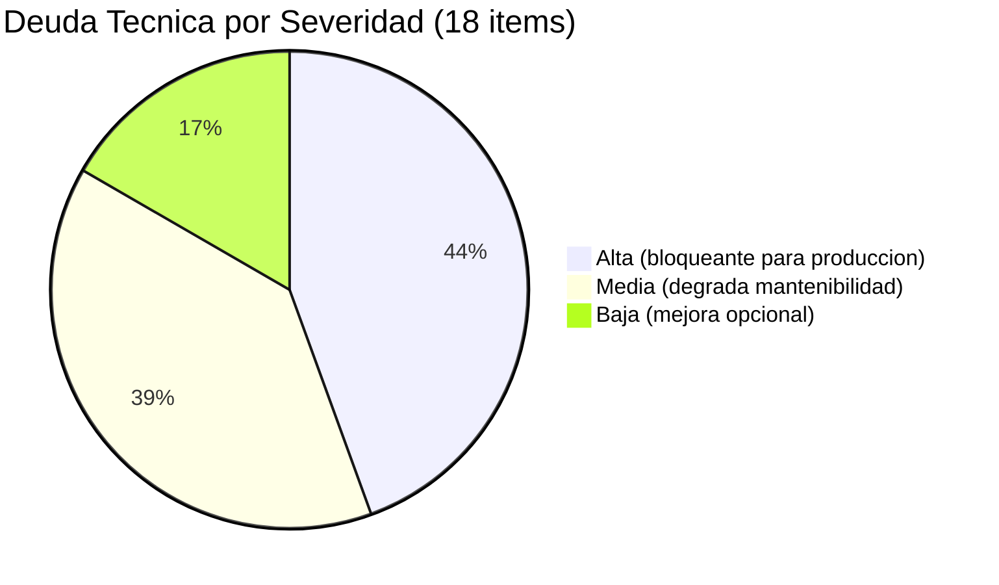
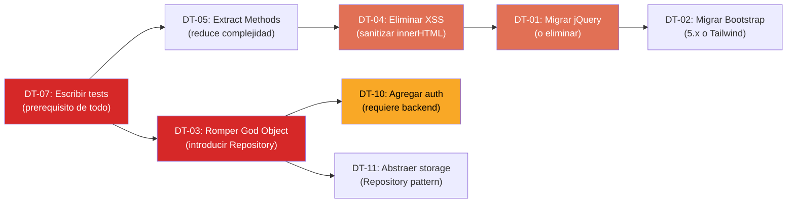

# Resumen de Deuda Técnica — InvoiceManager

## Distribución por Severidad

| Severidad | Cantidad | Items |
|---|---|---|
| **Alta** | 8 | DT-01 a DT-08 |
| **Media** | 7 | DT-09 a DT-15 |
| **Baja** | 3 | DT-16 a DT-18 |

## Top 5 Issues Críticos

| # | Issue | Impacto | Esfuerzo Remediación |
|---|---|---|---|
| 1 | **jQuery 1.12.4 EOL** — CVEs de XSS, 100% del código depende | Seguridad crítica + bloqueo de migración | Alto (2-4 semanas) |
| 2 | **22 puntos de XSS** via innerHTML sin sanitización | Inyección de código malicioso | Medio (1-2 semanas) |
| 3 | **God Object `var data`** — todo acoplado a un global mutable | Imposible testear, modularizar o escalar | Alto (3-4 semanas) |
| 4 | **0 tests** — sin safety net para refactoring | Cualquier cambio puede romper todo sin aviso | Medio (1-2 semanas para characterization tests) |
| 5 | **Sin autenticación** — variable hardcoded como "sesión" | Cualquiera accede y modifica datos financieros | Alto (requiere backend) |

## Impacto en Mantenibilidad

| Dimensión | Score (1-5) | Justificación |
|---|---|---|
| **Modificabilidad** | 2/5 | Cambios pequeños requieren modificar múltiples funciones (shotgun surgery) por acoplamiento al God Object |
| **Analizabilidad** | 3/5 | 0 comentarios pero naming razonable — un developer experimentado puede entender el flujo |
| **Testabilidad** | 1/5 | 0 tests, 0 seams de inyección, dependencia directa a DOM/localStorage |
| **Reusabilidad** | 2/5 | Solo las funciones puras (cálculos, utilities) son reutilizables |
| **Modularidad** | 1/5 | Todo en 1 archivo, 5 globals, sin boundaries |

**Score promedio de mantenibilidad: 1.8/5**

## Costo Estimado de Remediación

| Categoría | Items | Esfuerzo Total | Prerequisitos |
|---|---|---|---|
| Seguridad (DT-01,02,04,10,12,13) | 6 | 4-6 semanas | Tests primero |
| Arquitectura (DT-03,09,11,15) | 4 | 4-6 semanas | Tests + design |
| Calidad de código (DT-05,06,07,08,14) | 5 | 2-3 semanas | Tests primero |
| Mejoras menores (DT-16,17,18) | 3 | 2-3 días | Minimal |

**Esfuerzo total estimado: 10-15 semanas** para remediación completa (1 developer senior).

## Diagrama de Precedencia de Remediación

## Hallazgos Clave

- **8 issues de severidad Alta** — la mayoría relacionados con seguridad y acoplamiento
- **Mantenibilidad 1.8/5** — el código es funcional pero extremadamente difícil de mantener y evolucionar
- **Prerequisito universal: tests** — sin tests no se puede refactorizar nada con seguridad
- **Esfuerzo de remediación: 10-15 semanas** — más que el tamaño del código justificaría (1,272 LOC)
- **Costo de NO actuar:** vulnerabilidades activas (XSS, auth bypass), degradación progresiva (localStorage lleno), imposibilidad de agregar features

## Referencias

- [Componentes obsoletos](outdated-components.md)
- [Carga de mantenimiento](maintenance-burden.md)
- [Plan de remediación](remediation-plan.md)
- [Análisis detallado](../analysis/tech-debt.md)
