# Story Map — InvoiceManager (Rebuild Incremental)

## Diagrama Visual del Mapa de Historias

```mermaid
flowchart TD
    subgraph OLA0["Ola 0: Foundation (Sprint 1)"]
        direction TB
        MG001["MG-001 Setup Build System"]
        TK001["TK-001 Characterization Tests"]
        TK002["TK-002 Error Recovery"]
        TK003["TK-003 CDN Security (SRI)"]
        TK004["TK-004 Code Formatting"]
    end

    subgraph OLA1["Ola 1: Extract Logic (Sprint 2)"]
        direction TB
        TK005["TK-005 Extract Calculator"]
        TK006["TK-006 Extract State Machine"]
        TK007["TK-007 Extract Validators"]
        TK008["TK-008 Extract Utilities"]
        TK009["TK-009 Invoice Status Enum"]
        TK010["TK-010 Remove alert() calls"]
    end

    subgraph OLA2["Ola 2: Abstractions (Sprint 3)"]
        direction TB
        DT001["DT-001 DataStore Interface"]
        DT002["DT-002 InvoiceService"]
        DT003["DT-003 PaymentService"]
        FN001["FN-001 Crear Factura (new)"]
        FN002["FN-002 Emitir Factura (new)"]
        FN003["FN-003 Aplicar Pago (new)"]
        FN004["FN-004 Nota Credito (new)"]
        FN005["FN-005 Anular Factura (new)"]
    end

    subgraph OLA3["Ola 3: Security + UI (Sprint 4)"]
        direction TB
        SC001["SC-001 Autenticacion"]
        SC002["SC-002 Sanitizar XSS"]
        SC003["SC-003 RBAC Backend"]
        SC004["SC-004 Cifrado localStorage"]
        SC005["SC-005 Input Validation"]
        SC006["SC-006 HTTPS + CSP Headers"]
        FN006["FN-006 Generar PDF moderno"]
        FN007["FN-007 Enviar factura (email)"]
        FN008["FN-008 Dashboard KPIs"]
        FN009["FN-009 Recordatorios CxC"]
        FN010["FN-010 Export CSV"]
        MG002["MG-002 Migrar jQuery a vanilla"]
    end

    subgraph OLA4["Ola 4: Cloud Ready (Sprint 5)"]
        direction TB
        IN001["IN-001 Backend REST API"]
        FN011["FN-011 Multi-usuario"]
        FN012["FN-012 Busqueda avanzada"]
        FN013["FN-013 Reportes gerenciales"]
        FN014["FN-014 Configuracion empresa"]
        FN015["FN-015 Gestion de clientes"]
        MG003["MG-003 Containerizar"]
        MG004["MG-004 CI/CD Pipeline"]
        OB001["OB-001 Structured Logging"]
        OB002["OB-002 Health Checks"]
        RS001["RS-001 Data Backup"]
    end

    OLA0 --> OLA1
    OLA1 --> OLA2
    OLA2 --> OLA3
    OLA2 --> OLA4

    style OLA0 fill:#00b894,color:#fff
    style OLA1 fill:#00b894,color:#fff
    style OLA2 fill:#f9a826,color:#000
    style OLA3 fill:#d62828,color:#fff
    style OLA4 fill:#6c5ce7,color:#fff
```

## Leyenda de Tipos

| Prefijo | Color | Significado |
|---|---|---|
| FN-### | Azul | Funcional (capacidad de negocio) |
| TK-### | Verde | Técnica (refactoring, tests, build) |
| SC-### | Rojo | Seguridad (vulnerabilidades, auth) |
| MG-### | Morado | Migración de tecnología |
| DT-### | Naranja | Datos y persistencia |
| IN-### | Morado oscuro | Integración |
| OB-### | Gris | Observabilidad |
| RS-### | Cyan | Resiliencia |

## Notas sobre Priorización

1. **Ola 0 es bloqueante** — Sin tests no se refactoriza. Sin build system no hay módulos.
2. **Ola 1 desbloquea todo** — Extraer lógica pura permite testear, migrar y containerizar.
3. **Ola 3 y 4 son paralelizables** — Con 2 developers, Security/UI y Cloud pueden ir en paralelo.
4. **Las HUs funcionales (FN-) se implementan NUEVAS** — No se migra el código legacy, se reescribe con la misma spec.

## Referencias

- [Backlog completo](backlog.md)
- [Épica 1: Core Business](epics/01-core-business.md)
- [Épica 7: Deuda Técnica](epics/07-tech-debt.md)
- [Migration Component Order](../migration/component-order.md)
