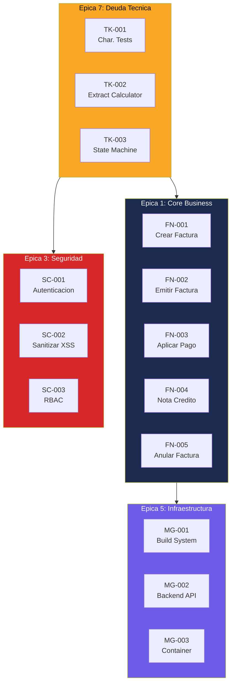
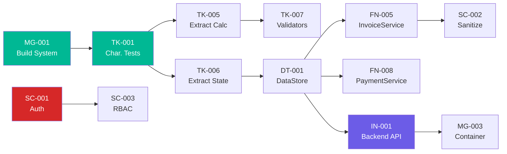

# Backlog de Historias de Usuario — InvoiceManager

## Resumen

| Indicador | Valor |
|---|---|
| **Total HUs** | 42 |
| **Variante seleccionada** | Rebuild incremental (Strangler Fig) |
| **Épicas** | 7 |
| **Timeline estimado** | 11-14 semanas (1 developer senior) |
| **Distribución por tipo** | FN: 15, TK: 10, SC: 6, MG: 4, DT: 3, OB: 2, IN: 1, RS: 1 |

### Distribución por Épica

| # | Épica | HUs | Esfuerzo Total |
|---|---|---|---|
| 1 | Core Business (Facturación + Pagos) | 15 | XL |
| 2 | Integraciones y Persistencia | 4 | L |
| 3 | Seguridad | 6 | L |
| 4 | Datos y Persistencia | 3 | M |
| 5 | Infraestructura | 4 | M |
| 6 | Observabilidad | 2 | S |
| 7 | Deuda Técnica | 8 | L |

## User Story Map

## Olas → Sprints (Mapeo)

| Ola Migración | Sprint | HUs Incluidas | Prioridad |
|---|---|---|---|
| Ola 0: Foundation | Sprint 1 (2 sem) | TK-001 a TK-004, MG-001 | Crítica |
| Ola 1: Extract Logic | Sprint 2 (2 sem) | TK-005 a TK-010, FN-001 a FN-004 | Alta |
| Ola 2: Abstractions | Sprint 3 (2-3 sem) | DT-001 a DT-003, FN-005 a FN-010 | Alta |
| Ola 3: Security + UI | Sprint 4 (3-4 sem) | SC-001 a SC-006, FN-011 a FN-015, MG-002 | Alta |
| Ola 4: Cloud Ready | Sprint 5 (2-3 sem) | IN-001, MG-003, MG-004, OB-001, OB-002, RS-001 | Media |

## Dependencias entre HUs

## Criterios de Done Globales

Aplican a TODAS las HUs del backlog:

1. ✅ Código pasa linting (ESLint con reglas definidas en Ola 0)
2. ✅ Tests unitarios escritos ANTES de la implementación (TDD)
3. ✅ Cobertura de tests ≥ 80% para lógica de negocio
4. ✅ Sin `innerHTML` ni manipulación directa de DOM con datos de usuario
5. ✅ Sin variables globales (`var data`, `var sessionUser`)
6. ✅ Funciones ≤ 30 LOC (máximo)
7. ✅ Documentación en JSDoc para funciones públicas
8. ✅ Code review aprobado (o pair programming)
9. ✅ Sin `alert()` — usar sistema de notificaciones
10. ✅ Build pasa en CI (si pipeline existe)

## Estimación de Esfuerzo Total

| Épica | Story Points (Fibonacci) | Semanas |
|---|---|---|
| Core Business | 55 | 4-5 |
| Integraciones | 21 | 2 |
| Seguridad | 34 | 3 |
| Datos | 13 | 1-2 |
| Infraestructura | 21 | 2 |
| Observabilidad | 8 | 1 |
| Deuda Técnica | 34 | 2-3 |
| **TOTAL** | **186** | **11-14** |

[ESTIMADO: Timeline basado en 1 developer senior full-time, velocity 13-21 SP/sprint de 2 semanas]

## Referencias

- [Migration Component Order](../migration/component-order.md)
- [Modernization Assessment](../analysis/modernization-assessment.md)
- [Remediation Plan](../technical-debt/remediation-plan.md)
- [Business Logic](../behavior/business-logic.md)
- [Workflows](../behavior/workflows.md)
- [Security Patterns](../analysis/security-patterns.md)
- [Production Readiness](../analysis/production-readiness.md)
