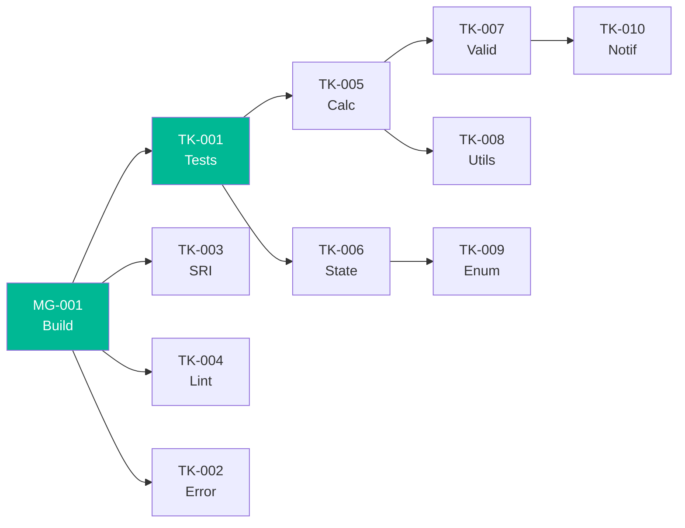

# Épica 7: Deuda Técnica

## Descripción

Refactoring del código legacy para habilitar testabilidad, modularidad y modernización. Sigue la secuencia de Michael Feathers: Tests → Dependency Breaking → Extract → Modernize.

## HUs Contenidas

---

### TK-001 Escribir characterization tests (golden masters)

**Como** equipo de desarrollo
**Quiero** tests que capturen el comportamiento actual de las funciones puras
**Para** poder refactorizar con confianza de no introducir regresiones

#### Criterios de Aceptación
- [ ] Tests para `calcItem()`: 5+ escenarios (con/sin descuento, con/sin impuesto)
- [ ] Tests para `calcTotals()`: 3+ escenarios (con/sin retención, múltiples ítems)
- [ ] Tests para `recalcInvoiceState()`: 7 escenarios (uno por cada estado posible)
- [ ] Tests para `money()`, `round2()`, `formatDate()`: edge cases
- [ ] Todos pasan con el comportamiento ACTUAL (sin cambiar lógica)

#### Notas Técnicas
- Fuente: `technical-debt/remediation-plan.md` (Ola 0, item 0.2)
- Técnica: Write Tests (Feathers) — Characterization Tests
- Complejidad: M
- Dependencias: MG-001 (build system con test runner)

#### Evidencia del Análisis
- 0% cobertura actual: `analysis/code-metrics.md`
- Funciones puras candidatas: `app.js:817-837` (calc), `app.js:797-807` (utils)

---

### TK-002 Error recovery en loadData()

**Como** usuario final
**Quiero** que la aplicación no se quede en pantalla blanca si los datos están corruptos
**Para** poder seguir usando la app aunque algo falle en localStorage

#### Criterios de Aceptación
- [ ] `loadData()` envuelto en try/catch
- [ ] Si JSON es inválido → inicializar con datos vacíos (no crash)
- [ ] Mostrar mensaje amigable: "Los datos se reiniciaron por un error"
- [ ] Registrar el error en console.error con detalles del JSON corrupto

#### Notas Técnicas
- Fuente: `behavior/error-handling.md` — "JSON.parse sin try/catch"
- Lógica actual: `JSON.parse(localStorage...)` sin protección — `app.js:13-14`
- Refactoring: Wrap with Exception Handling (Fowler)
- Complejidad: S
- Dependencias: MG-001

#### Evidencia del Análisis
- Sin error handling: `app.js:13-14` — `JSON.parse()` puede lanzar SyntaxError

---

### TK-003 Agregar SRI a scripts CDN

**Como** equipo de seguridad
**Quiero** que todos los scripts de CDN tengan Subresource Integrity
**Para** detectar si un CDN fue comprometido y bloquear la carga

#### Criterios de Aceptación
- [ ] Todos los `<script src="cdn...">` tienen atributo `integrity="sha384-..."` y `crossorigin="anonymous"`
- [ ] Afecta: jQuery, Bootstrap JS, Bootstrap CSS, Chart.js
- [ ] Si la integridad falla, el script no se carga (comportamiento nativo del browser)

#### Notas Técnicas
- Fuente: `analysis/security-patterns.md` — "CDN sin SRI — supply chain attack"
- Estado actual: `index.html:7-8, 228-231` — sin integrity
- Complejidad: S (generar hashes con `openssl`)
- Dependencias: Ninguna

#### Evidencia del Análisis
- jQuery CDN sin SRI: `index.html:7`
- Bootstrap CSS CDN sin SRI: `index.html:8`

---

### TK-004 Configurar linting y formatting

**Como** equipo de desarrollo
**Quiero** reglas de ESLint y Prettier estrictas aplicadas al código
**Para** garantizar consistencia y detectar problemas tempranamente

#### Criterios de Aceptación
- [ ] ESLint configurado con reglas: no-var, no-alert, no-innerHTML, prefer-const
- [ ] Prettier con: single quotes, semicolons, 2 spaces indent
- [ ] Script `lint:fix` que auto-corrige lo posible
- [ ] Pre-commit hook que ejecuta lint

#### Notas Técnicas
- Fuente: `analysis/code-metrics.md` — "0 herramientas de calidad"
- Estado actual: Sin `.eslintrc`, sin `.prettierrc`, sin hooks
- Complejidad: S
- Dependencias: MG-001

---

### TK-005 Extraer motor de cálculos a módulo

**Como** equipo de desarrollo
**Quiero** que `calcItem()` y `calcTotals()` estén en un módulo independiente
**Para** poder testearlos unitariamente y reutilizarlos en backend

#### Criterios de Aceptación
- [ ] Archivo `src/domain/calculator.js` con `calcItem()` y `calcTotals()` exportados
- [ ] Sin dependencia de `var data`, DOM, ni localStorage
- [ ] Tests unitarios con 100% cobertura de branches
- [ ] `app.js` importa y usa las funciones del nuevo módulo

#### Notas Técnicas
- Fuente: `technical-debt/remediation-plan.md` (Ola 1, item 1.1)
- Refactoring: Move Function to Module (Fowler)
- Legacy Level: A — Testable (funciones puras)
- Complejidad: S
- Dependencias: TK-001 (characterization tests validan que no rompió)

#### Evidencia del Análisis
- Funciones puras: `app.js:817-837` — solo math, sin side effects

---

### TK-006 Extraer state machine a módulo

**Como** equipo de desarrollo
**Quiero** que `recalcInvoiceState()` sea un módulo independiente con estados explícitos
**Para** tener una máquina de estados documentada, testeable y sin side effects

#### Criterios de Aceptación
- [ ] Archivo `src/domain/invoice-state.js`
- [ ] Constante `InvoiceStatus` con los 7 estados como enum
- [ ] Función pura que recibe invoice → retorna nuevo estado (sin mutar)
- [ ] Tests para cada transición posible

#### Notas Técnicas
- Fuente: `behavior/business-logic.md` — RN-03 (Máquina de Estados)
- Refactoring: Extract Class + Replace Data Value with Object (Fowler)
- Legacy Level: B — Seam-Rich (lee `data` pero puede parametrizarse)
- Complejidad: M
- Dependencias: TK-001, TK-005

#### Evidencia del Análisis
- 7 estados: `behavior/business-logic.md` (tabla RN-03)
- Implementación actual: Cadena de if/else en función dispersa

---

### TK-007 Extraer y consolidar validadores

**Como** equipo de desarrollo
**Quiero** un módulo centralizado con todas las funciones de validación
**Para** tener validaciones reutilizables, testeables y consistentes

#### Criterios de Aceptación
- [ ] Archivo `src/domain/validators.js`
- [ ] Funciones: `validateInvoice()`, `validatePayment()`, `validateCreditNote()`
- [ ] Cada función retorna `{valid: boolean, errors: string[]}` (no usa alert)
- [ ] 15+ validaciones cubiertas (tabla V-01 a V-15)
- [ ] Tests unitarios para cada validación

#### Notas Técnicas
- Fuente: `behavior/business-logic.md` — 15 validaciones dispersas
- Refactoring: Extract Method + Consolidate Conditional (Fowler)
- Legacy Level: B — Seam-Rich (if/alert → función que retorna errores)
- Complejidad: M
- Dependencias: TK-001, TK-005

#### Evidencia del Análisis
- 15 validaciones en tabla: `behavior/business-logic.md`
- Pattern actual: `if (!x) { alert("msg"); return; }` — 15 instancias

---

### TK-008 Extraer utilidades a módulo

**Como** equipo de desarrollo
**Quiero** funciones utilitarias (`money`, `formatDate`, `daysDiff`) en módulo propio
**Para** eliminar duplicación y tener una única fuente de formateo

#### Criterios de Aceptación
- [ ] Archivo `src/utils/format.js`
- [ ] Funciones: `money()`, `round2()`, `formatDate()`, `daysDiff()`, `nextDueCount()`
- [ ] Sin dependencia de jQuery (actualmente usa `$.number`)
- [ ] Tests unitarios con edge cases (negativos, NaN, null)

#### Notas Técnicas
- Fuente: `architecture/components.md` — utilidades dispersas
- Refactoring: Move Function to Module (Fowler)
- Legacy Level: A — Testable (puras excepto `money()` que usa jQuery)
- Complejidad: S
- Dependencias: MG-001

#### Evidencia del Análisis
- `money()`: `app.js:797-799` — usa `$.number()` de jQuery.number plugin
- `round2()`, `formatDate()`, `daysDiff()`: funciones puras sin deps

---

### TK-009 Introducir Invoice Status como enum/constantes

**Como** equipo de desarrollo
**Quiero** un enum con los estados de factura ("Emitida", "Pagada", etc.)
**Para** evitar typos en strings y tener autocompletado en el IDE

#### Criterios de Aceptación
- [ ] Constante `InvoiceStatus` con: DRAFT, EMITTED, PARTIALLY_PAID, PAID, OVERDUE, CREDITED, ANNULLED
- [ ] Todos los `=== "Emitida"` reemplazados por `=== InvoiceStatus.EMITTED`
- [ ] No más magic strings para estados

#### Notas Técnicas
- Fuente: `behavior/business-logic.md` — RN-03 con 7 estados como strings
- Refactoring: Replace Data Value with Object (Fowler)
- Complejidad: S
- Dependencias: TK-006

---

### TK-010 Reemplazar alert() por sistema de notificaciones

**Como** usuario final
**Quiero** ver notificaciones elegantes en vez de alerts del navegador
**Para** tener una experiencia de usuario moderna y no intrusiva

#### Criterios de Aceptación
- [ ] 0 usos de `alert()` en el código
- [ ] Reemplazados por notificación toast (éxito/error/warning)
- [ ] Las notificaciones desaparecen automáticamente (3-5 seg) excepto errores
- [ ] Accesibles (role="alert", aria-live)

#### Notas Técnicas
- Fuente: `behavior/error-handling.md` — "alert() como único feedback"
- Estado actual: 15+ `alert()` distribuidos en funciones de negocio
- Refactoring: Replace Error Code with Exception (Fowler)
- Complejidad: M
- Dependencias: TK-007 (validators retornan errores, no alertan)

#### Evidencia del Análisis
- `alert()` en: `app.js:152,154,158,209,214,219,229,303,480,500,505,514,711,723,728,761`

## Resumen de Épica

| Tipo | Cantidad | SP Estimados |
|---|---|---|
| Técnica (TK) | 10 | 34 |
| Complejidad S | 5 | 10 |
| Complejidad M | 5 | 24 |

## Orden de Ejecución

## Referencias

- [Backlog](../backlog.md)
- [Remediation Plan](../../technical-debt/remediation-plan.md)
- [Complexity Analysis](../../analysis/complexity-analysis.md)
- [Modernization Assessment](../../analysis/modernization-assessment.md)
