# Laboratorio de Modernización Asistida por IA - BankScore2

## Objetivo del Laboratorio

Este laboratorio permite experimentar un proceso completo de modernización asistida por IA utilizando la plataforma OneClick y su Cognitive Layer.

Durante el ejercicio los participantes trabajarán bajo el enfoque del **Patrón Centauro**, combinando criterio humano con capacidades de análisis, documentación y transformación impulsadas por IA.

Al finalizar el laboratorio los participantes comprenderán:

- Cómo entender un sistema legado.
- Cómo explorar y ejecutar una aplicación monolítica.
- Cómo iniciar un proceso de modernización asistida.
- Cómo aprovechar una capa cognitiva para acelerar el time-to-market y reducir el esfuerzo de análisis manual.

---

# El Laboratorio se divide en 4 momentos

## 1. Entendiendo el sistema

### Estructura del ejercicio

Cada participante encontrará dos carpetas principales:

```text
01-Reporte-Tecnico
App
```

### 01-Reporte-Tecnico

Contiene:

- Assessment técnico
- Hallazgos arquitectónicos
- Riesgos identificados
- Recomendaciones
- Estrategia de modernización
- Artefactos generados por el Quick Scan

### App

Contiene la aplicación que será modernizada durante el laboratorio.

### Qué revisar primero

1. Entrar a `01-Reporte-Tecnico`
2. Revisar los documentos en orden para entender:
   - Contexto funcional
   - Contexto técnico
   - Alcance de modernización
   - Restricciones
   - Riesgos
   - Arquitectura recomendada

### Stack tecnológico identificado

| Componente | Tecnología |
|------------|------------|
| Plataforma | ASP.NET Core MVC |
| Framework | .NET 5 |
| Lenguaje | C# |
| Frontend | Razor Views |
| Arquitectura | Monolito Web |
| Persistencia de sesión | ASP.NET Session |
| Base tecnológica | Server Side Rendering |

### Capacidades funcionales actuales

- Inicio de sesión
- Gestión de solicitantes
- Evaluación de score bancario
- Historial de evaluaciones

### Configuración de GitHub Copilot en VS Code
#### Paso 1
Abrir VS Code para iniciar con el taller
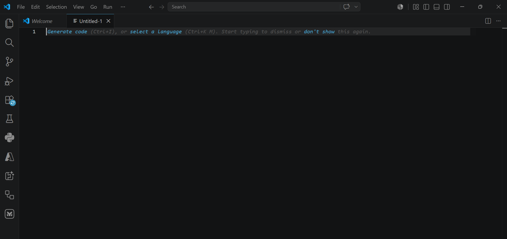

#### Paso 2
Abrir en un nuevo workspace la carpeta que contiene el taller
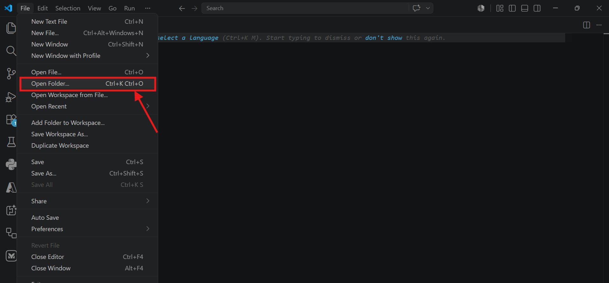
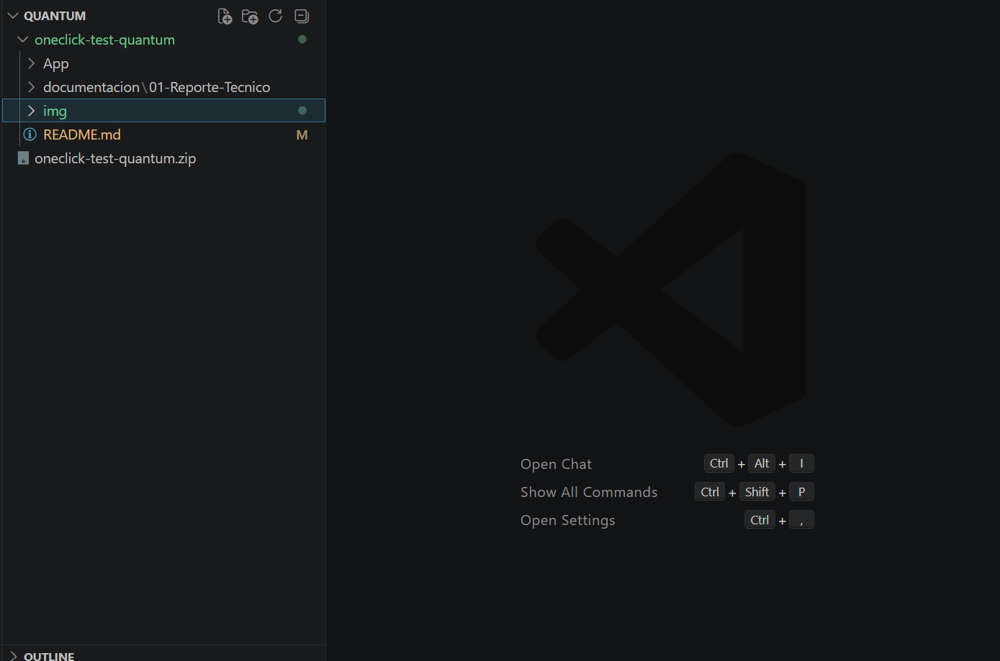

#### Paso 3
Iniciar sesión con GitHub.

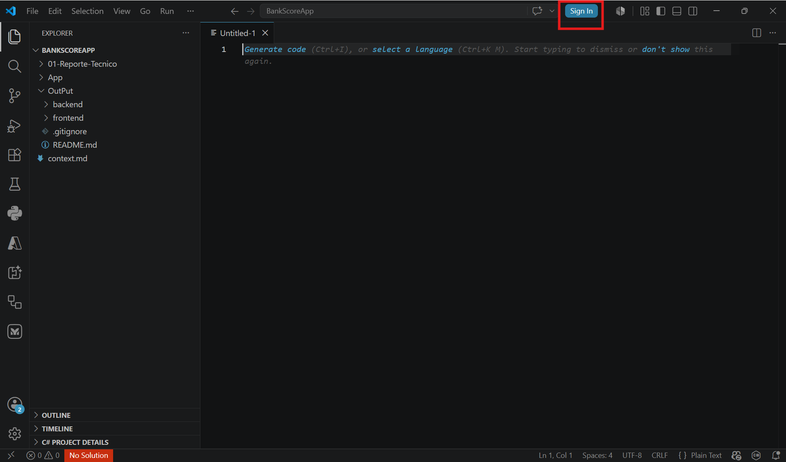
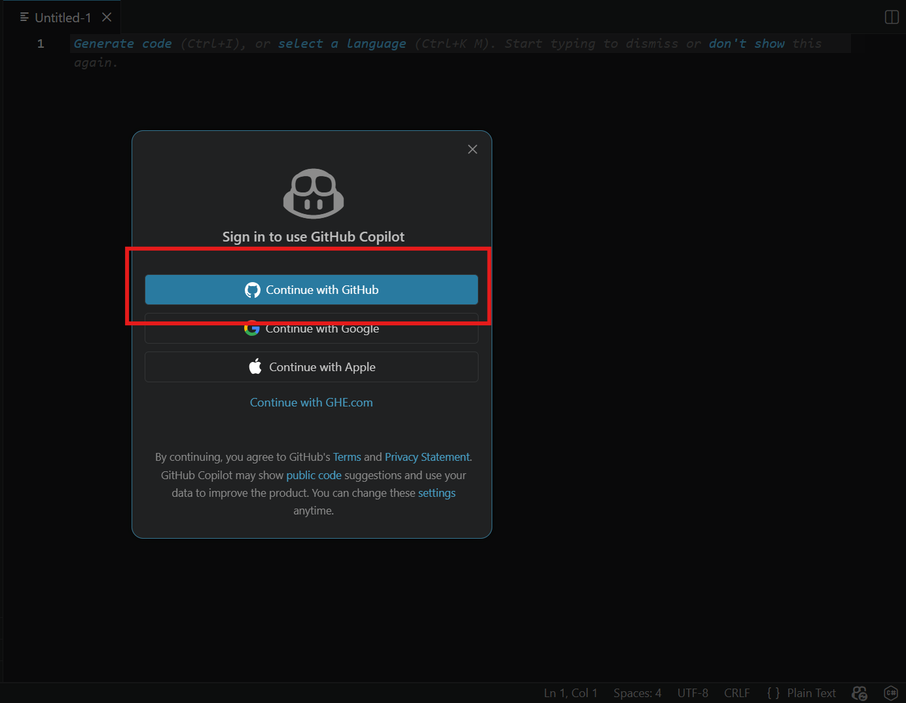
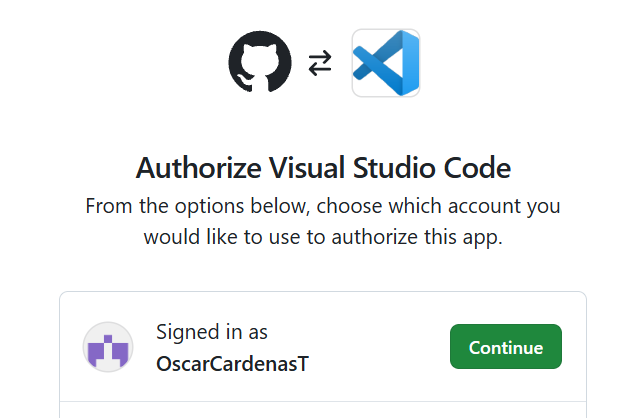

#### Paso 4
Validar que Copilot se encuentre activo.

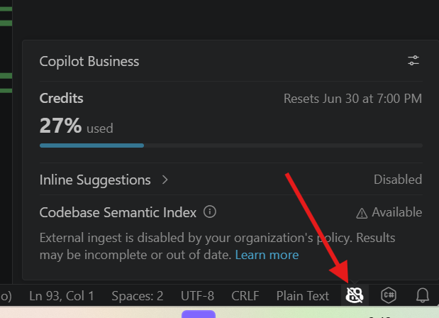

---

## 2. Explorando el sistema
### Prompt sugerido para Copilot

```text
Por favor levanta en ambiente local la aplicación que se encuentra en la carpeta App
```

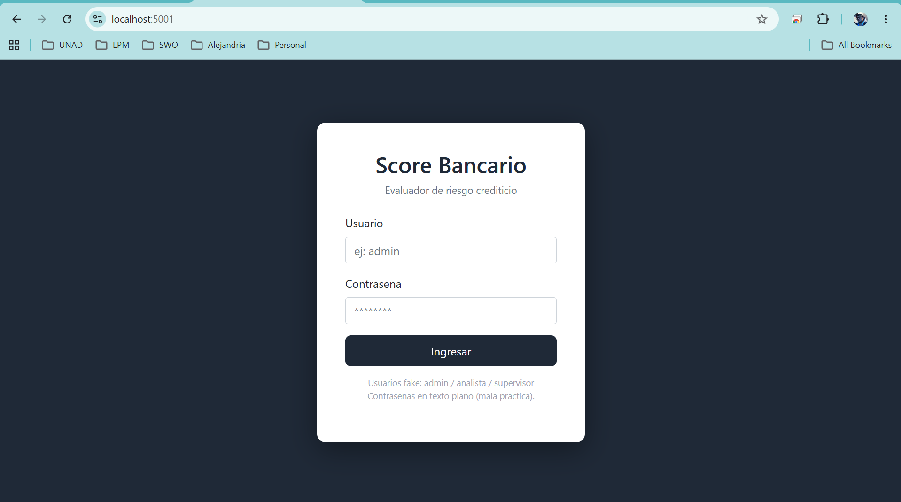

### Acceder a la aplicación

```text
https://localhost:5001
http://localhost:5000
```

### Credenciales de prueba

```text
admin / admin123
analista / analista2024
supervisor / pass1234
```


---

## 3. Modernizando el sistema

### Iniciando la capa cognitiva

Seleccionar en VS Code:

```text
OneClick Guardian
```


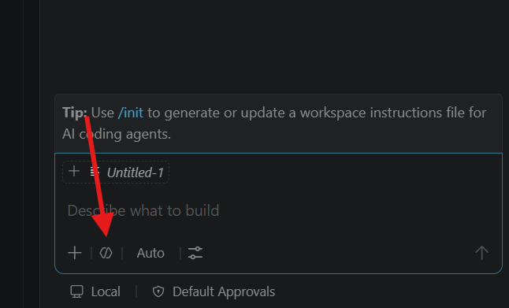
---
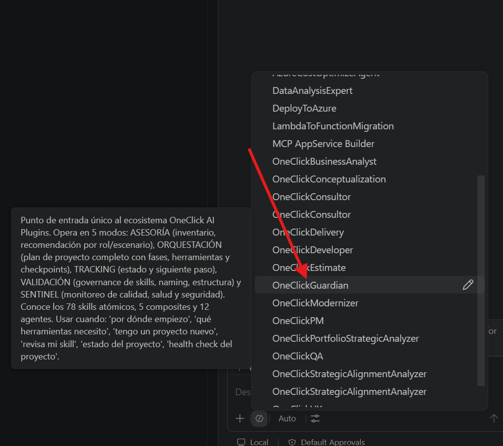
---
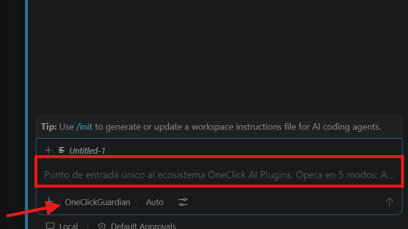

### Prompt inicial recomendado

```text
Para iniciar quiero que ejecutes la modernizacion segun el contexto que se encuentra en la carpeta documentacion
```

### Prompt para análisis profundo

```text
Usando toda la documentación del assessment y el código fuente:

1. Construye un mapa de componentes.
2. Identifica bounded contexts.
3. Detecta acoplamientos críticos.
4. Identifica oportunidades de modernización.
5. Sugiere patrones cloud-native.
6. Genera un backlog priorizado de modernización.
```


### Flujo esperado de la Cognitive Layer

1. Lectura del Assessment.
2. Lectura del Quick Scan.
3. Comprensión de la aplicación.
4. Identificación de deuda técnica.
5. Propuesta arquitectónica.
6. Estrategia de modernización.
7. Generación de backlog.
8. Preparación para despliegue cloud.

---

## 4. Documentando y compartiendo conocimiento

### Prompt recomendado

```text
Genera la documentación ejecutiva y técnica del proceso realizado.

Incluye:

- Estado actual (As-Is)
- Estado objetivo (To-Be)
- Riesgos identificados
- Arquitectura propuesta
- Decisiones arquitectónicas
- Roadmap de modernización
- Beneficios esperados
- Impacto en time-to-market
- Recomendaciones para despliegue en Azure
```

---

## Beneficios esperados del laboratorio

✅ Entendimiento acelerado de aplicaciones legacy.

✅ Uso práctico del Patrón Centauro.

✅ Aplicación de una Cognitive Layer para modernización.

✅ Generación automatizada de artefactos técnicos.

✅ Reducción significativa del tiempo de análisis.

✅ Aceleración del proceso de modernización y time-to-market.

✅ Construcción de documentación viva basada en IA.

---

## Nota operativa para sesiones de capacitación

Cuando se despliegue la solución en Azure, cada participante deberá crear un Resource Group único utilizando un GUID para evitar conflictos entre laboratorios concurrentes.

Ejemplo:

```text
rg-bankscore-4f7a2e91
```
