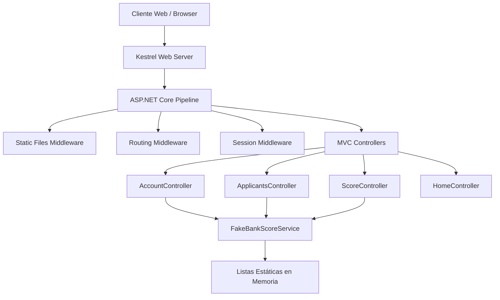

# 01.01 — Resumen Ejecutivo Técnico

## Frontier QuickScan — Bank Score Evaluator

| Campo | Valor |
|-------|-------|
| **Cliente** | SoftwareOne |
| **Proyecto** | Bank Score Evaluator |
| **Fecha de Análisis** | 2026-06-04 |
| **Agente** | OneClickXRay v1.0 |
| **Fuente de Datos** | AWS Transform Custom (codebase-analysis) |

---

## Descripción de la Aplicación

**Bank Score Evaluator** es una aplicación web monolítica ASP.NET Core 5.0 MVC que simula el análisis de riesgo crediticio bancario. Calcula un puntaje (0–1000) basado en cinco componentes ponderados: capacidad de pago, historial crediticio, nivel de endeudamiento, tipo de empleo y edad del solicitante.

## Datos Clave

| Métrica | Valor |
|---------|-------|
| Lenguaje | C# |
| Framework | ASP.NET Core 5.0 (EOL mayo 2022) |
| LOC (C#) | ~450 |
| LOC Total (incl. Razor, CSS, JS) | ~1,054 |
| Archivos de código | 10 C# + 12 Razor |
| Clases | 9 |
| Dependencias NuGet | 2 (Newtonsoft.Json 9.0.1, System.Data.SqlClient 4.8.3) |
| Cobertura de pruebas | 0% |
| Anti-patrones de seguridad | 12 (intencionales/académicos) |
| Base de datos | Ninguna (datos en memoria estática) |

## Arquitectura AS-IS

## Hallazgos Críticos

| # | Hallazgo | Severidad | Impacto |
|---|----------|-----------|---------|
| 1 | Runtime .NET 5.0 en EOL — sin parches de seguridad | 🔴 High | Toda la aplicación expuesta |
| 2 | 12 vulnerabilidades de seguridad intencionales | 🔴 High | No apta para producción sin remediación |
| 3 | Datos en memoria sin persistencia real | 🔴 High | Pérdida total al reiniciar |
| 4 | God Object (FakeBankScoreService) concentra toda la lógica | 🟡 Medium | Difícil de escalar y testear |
| 5 | 0% de cobertura de pruebas | 🟡 Medium | Riesgo de regresiones |
| 6 | Dependencias NuGet obsoletas/deprecadas | 🟡 Medium | Vulnerabilidades conocidas |

## Score Consolidado QuickScan

| Indicador | Valor |
|-----------|-------|
| **Score Final** | **57.6 / 100** |
| **Banda** | ⚠️ **Advisory** (50–64) |
| **Elegibilidad FAM** | Elegible con extensiones significativas |

## Variante Recomendada

| Variante | Estrategia | Talla FAM | Créditos Est. |
|----------|-----------|-----------|---------------|
| **Replatform + Refactor** | Migrar a .NET 8 LTS, remediar seguridad, separar responsabilidades, agregar persistencia real | Frontera S | 12,000–18,000 |

## Decisión de Elegibilidad

La aplicación **califica para el servicio FAM con condiciones**. Su tamaño pequeño (~1,054 LOC) y arquitectura simple (monolito MVC) la hacen ideal para una modernización rápida. Sin embargo, la naturaleza académica del proyecto y la cantidad de anti-patrones intencionales requieren un enfoque de remediación antes de considerar una modernización cloud-native.

[DECISIÓN AUTÓNOMA: Se clasifica como Advisory porque las vulnerabilidades intencionales y la ausencia de persistencia real afectan múltiples dimensiones del scoring, pero el tamaño pequeño facilita la remediación completa dentro de un paquete Frontera S.]

---

*Documento generado por OneClickXRay — Frontier QuickScan Agent*
*Fuente: AWS Transform Custom Report — Bank Score Evaluator*
