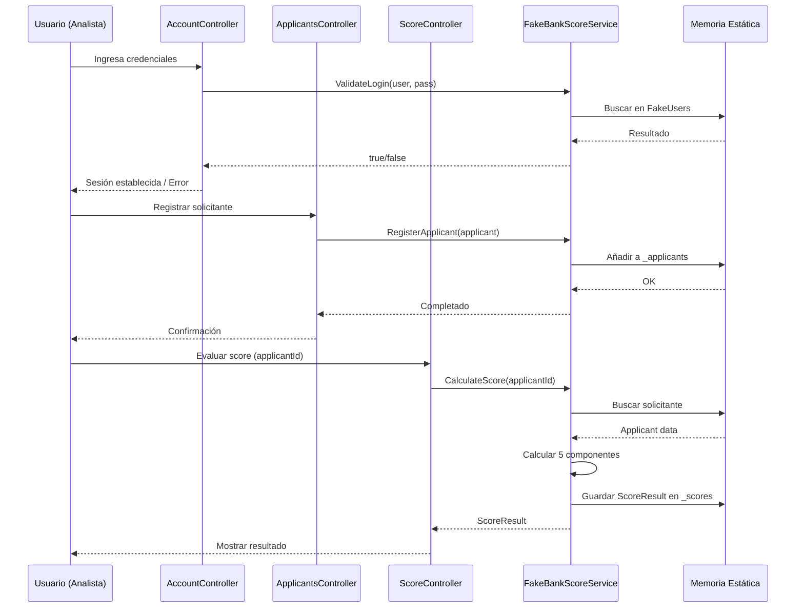
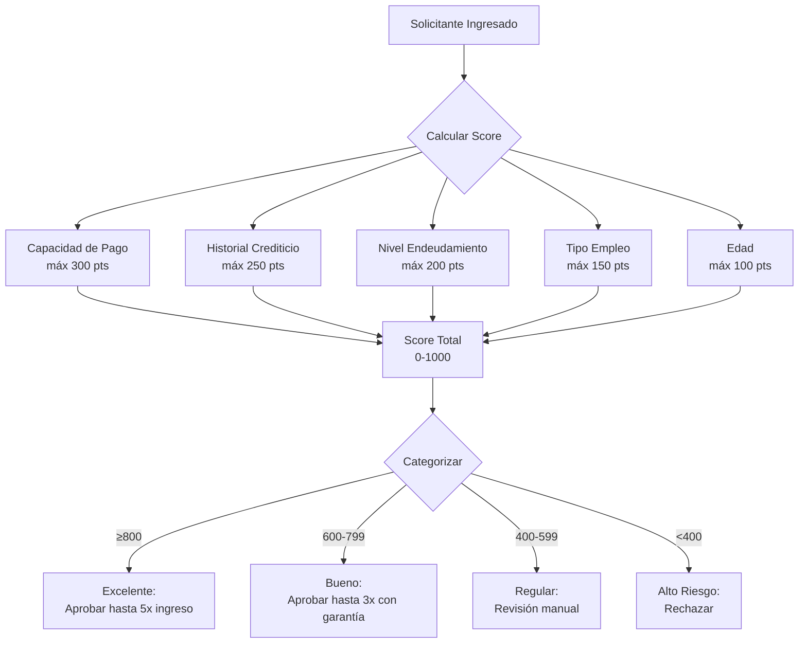
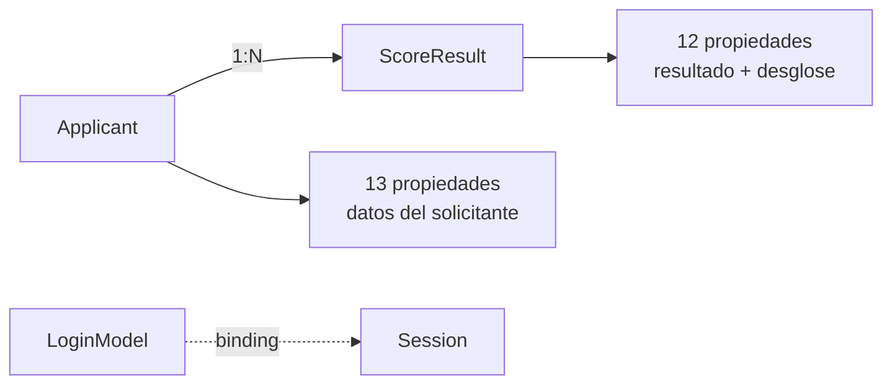
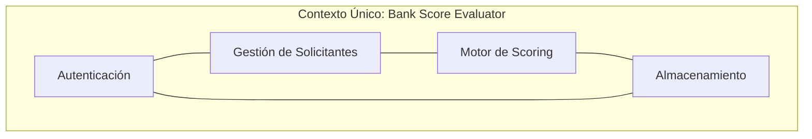

# 01.02 — Event Storming AS-IS

## Frontier QuickScan — Bank Score Evaluator

---

## Resumen del Event Storming

Análisis de eventos de dominio, comandos, actores, sistemas externos, políticas y entidades del sistema Bank Score Evaluator en su estado actual (AS-IS).

---

## Diagrama de Flujo Principal (Event Storming)

---

## Eventos de Dominio

| # | Evento | Trigger | Ubicación |
|---|--------|---------|-----------|
| 1 | **UsuarioAutenticado** | Login exitoso | AccountController.Login POST |
| 2 | **SesionCerrada** | Logout | AccountController.Logout |
| 3 | **SolicitanteRegistrado** | Formulario Create | ApplicantsController.Create POST |
| 4 | **SolicitanteEliminado** | Confirmación Delete | ApplicantsController.DeleteConfirmed |
| 5 | **ScoreCalculado** | Evaluación ejecutada | ScoreController.Evaluate |
| 6 | **HistorialConsultado** | Consulta de historial | ScoreController.History |
| 7 | **LoginFallido** | Credenciales inválidas | AccountController.Login POST |

---

## Comandos

| # | Comando | Actor | Evento Resultante |
|---|---------|-------|-------------------|
| 1 | IniciarSesion | Analista | UsuarioAutenticado / LoginFallido |
| 2 | CerrarSesion | Analista | SesionCerrada |
| 3 | RegistrarSolicitante | Analista | SolicitanteRegistrado |
| 4 | EliminarSolicitante | Analista | SolicitanteEliminado |
| 5 | EvaluarScore | Analista | ScoreCalculado |
| 6 | ConsultarHistorial | Analista | HistorialConsultado |

---

## Actores

| Actor | Rol | Interacción |
|-------|-----|-------------|
| **Analista de Crédito** | Usuario principal | Login, CRUD solicitantes, evaluación de score |
| **Supervisor** | Usuario con acceso | Mismas acciones (sin diferenciación de roles) |
| **Admin** | Usuario con acceso | Mismas acciones (sin diferenciación de roles) |

[DECISIÓN AUTÓNOMA: Se identifican 3 actores basados en los usuarios hardcodeados (admin, analista, supervisor), pero todos tienen los mismos permisos porque no existe sistema de roles.]

---

## Sistemas Externos

| Sistema | Tipo | Estado Real |
|---------|------|-------------|
| SQL Server (127.0.0.1) | Base de datos | **NO CONECTADO** — connection string existe pero nunca ejecuta queries |
| Browser/Cliente Web | Frontend | Activo — Razor server-side rendering |

[DECISIÓN AUTÓNOMA: No existen integraciones reales con sistemas externos. La conexión SQL es simulada.]

---

## Políticas / Reglas de Negocio

### Reglas Detalladas

| Componente | Regla | Peso Máx |
|-----------|-------|----------|
| Capacidad de Pago | ingreso_neto = ingreso - gastos; >2000→300, >1000→200, >500→100, ≤500→0 | 300 |
| Historial Crediticio | default previo = 0pts; ≥60m→250, ≥24m→150, ≥6m→80, <6m→20 | 250 |
| Endeudamiento | ratio = deuda/ingreso; <3→200, <6→120, <12→60, ≥12→0 | 200 |
| Tipo Empleo | Dependiente→150, Pensionado→120, Independiente→90, Otro→30 | 150 |
| Edad | 25-55→100, 56-65→70, 18-24→60, Otro→30 | 100 |

### Regla de Autenticación
- Comparación directa username/password contra diccionario estático
- Sin hash, sin salt, sin bloqueo por intentos, sin MFA

### Regla de Persistencia
- Datos en listas estáticas compartidas
- Sin transacciones, sin concurrencia controlada
- Pérdida total al reiniciar proceso

---

## Entidades Principales

| Entidad | Propiedades Clave | Persistencia |
|---------|-------------------|--------------|
| **Applicant** | Id, FullName, Document, Age, MonthlyIncome, MonthlyExpenses, TotalDebt, CreditHistoryMonths, HasPreviousDefault, EmploymentType | Lista estática en memoria |
| **ScoreResult** | Id, ApplicantId, Score, Category, Recommendation, ScoreCapacidad/Historial/Endeudamiento/Empleo/Edad | Lista estática en memoria |
| **LoginModel** | Username, Password | No persistido (transiente) |
| **FakeUsers** | Dictionary<string,string> | Hardcodeado en código |

---

## Bounded Contexts Identificados

[DECISIÓN AUTÓNOMA: Todo el sistema opera dentro de un único bounded context. No existe separación de dominios. El FakeBankScoreService actúa como un aggregate root implícito para toda la lógica.]

---

*Documento generado por OneClickXRay — Frontier QuickScan Agent*
