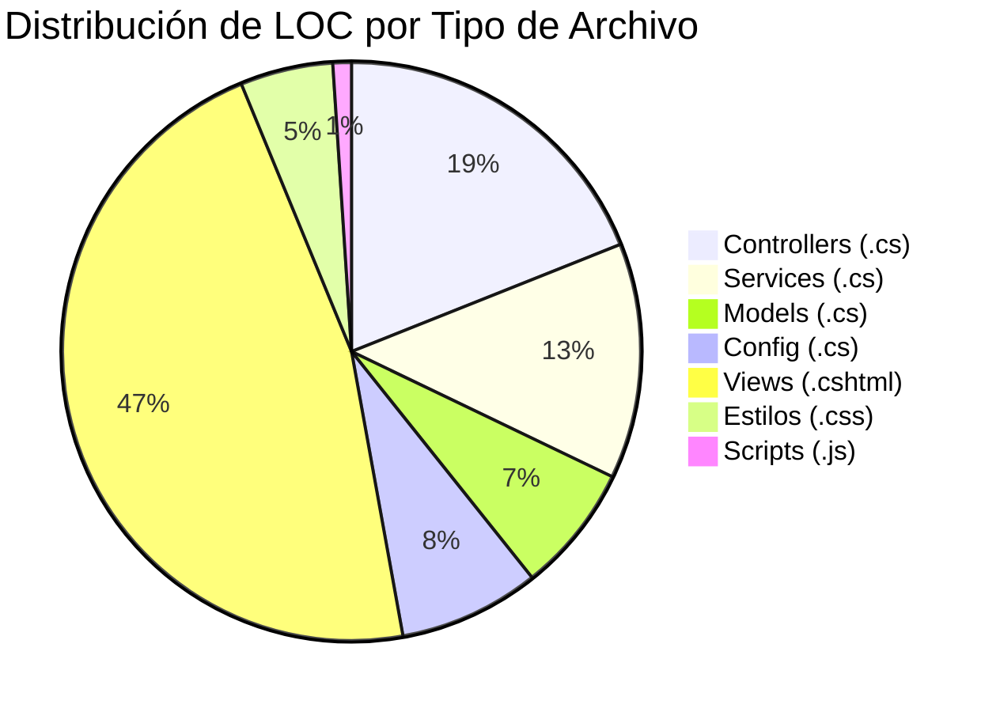

# 01.03 — Inventario Tecnológico

## Frontier QuickScan — Bank Score Evaluator

---

## Stack Tecnológico Completo

### Backend

| Componente | Tecnología | Versión | Estado | EOL |
|-----------|-----------|---------|--------|-----|
| Runtime | .NET | 5.0 | 🔴 EOL | Mayo 2022 |
| Framework Web | ASP.NET Core MVC | 5.0 | 🔴 EOL | Mayo 2022 |
| Lenguaje | C# | 9.0 | ✅ Activo | — |
| IDE | Visual Studio | 2022 | ✅ Activo | — |
| Serialización JSON | Newtonsoft.Json | 9.0.1 | 🟡 Obsoleta | — |
| Cliente SQL | System.Data.SqlClient | 4.8.3 | 🟡 Deprecado | — |
| Sesiones | Microsoft.AspNetCore.Session | (implícita) | ✅ | — |

### Frontend

| Componente | Tecnología | Versión | Uso |
|-----------|-----------|---------|-----|
| UI Framework | Bootstrap | ~4.x (bundled) | Layout y componentes responsivos |
| DOM | jQuery | ~3.x (bundled) | Manipulación DOM |
| Validación Client | jQuery Validation | (bundled) | Validación de formularios |
| Validación Unobtrusive | jQuery Validation Unobtrusive | (bundled) | Integración con Data Annotations |
| Views Engine | Razor (.cshtml) | 5.0 | Server-side rendering |

### Infraestructura

| Componente | Tecnología | Configuración |
|-----------|-----------|---------------|
| Web Server | Kestrel | Default (integrado en ASP.NET Core) |
| Hosting Model | In-Process | Program.cs + Startup.cs (patrón pre-.NET 6) |
| Base de Datos | **Ninguna** | Datos en memoria estática |
| Caché | Ninguno | — |
| Message Queue | Ninguno | — |
| CI/CD | No detectado | — |
| Contenedores | No detectado | — |
| Cloud Services | No detectado | — |

---

## Inventario de Archivos por Tipo

---

## Mapa de Componentes

| Capa | Componentes | Archivos | LOC |
|------|------------|----------|-----|
| **Presentación** | 12 vistas Razor, Layout, CSS, JS | 15 | ~510 |
| **Controladores** | 4 controllers MVC | 4 | 183 |
| **Servicios** | 1 servicio monolítico | 1 | 127 |
| **Modelos** | 4 clases POCO | 4 | 69 |
| **Configuración** | Program.cs, Startup.cs, appsettings | 4 | ~96 |
| **Total** | — | 28 | ~1,054 |

---

## Dependencias NuGet (PackageReference)

| Paquete | Versión Instalada | Versión Actual | Gap | Criticidad |
|---------|-------------------|----------------|-----|-----------|
| Newtonsoft.Json | 9.0.1 (sept 2016) | 13.0.3+ | ~7 major versions | 🟡 Medium |
| System.Data.SqlClient | 4.8.3 | Deprecado | N/A | 🟡 Medium |

---

## Dependencias Implícitas del Framework (SDK net5.0)

| Paquete | Uso en el Proyecto |
|---------|-------------------|
| Microsoft.AspNetCore.Mvc | Controllers, Views, Routing, ModelBinding |
| Microsoft.AspNetCore.Session | Gestión de sesión HTTP |
| Microsoft.AspNetCore.Http.Abstractions | HttpContext, Session extensions |
| Microsoft.Extensions.Logging | ILogger (HomeController) |
| Microsoft.Extensions.Configuration | IConfiguration |
| Microsoft.Extensions.DependencyInjection | Service container (no usado por app) |
| Microsoft.Extensions.Hosting | Host builder pattern |

---

## Protocolos y Puertos

| Protocolo | Puerto | Configuración |
|-----------|--------|---------------|
| HTTP | 5000 | launchSettings.json (Kestrel) |
| HTTPS | 5001 | launchSettings.json (Kestrel) |
| HTTP | 44300+ | launchSettings.json (IIS Express) |

---

## Configuración Detectada

| Archivo | Contenido |
|---------|-----------|
| `appsettings.json` | Logging levels (Information, Warning) |
| `appsettings.Development.json` | Override de logging para desarrollo |
| `launchSettings.json` | Perfiles IIS Express y Kestrel |
| `BankScoreEvaluator.Web.csproj` | Target net5.0, 2 PackageReference |

---

## Capacidades Ausentes (Gaps de Infraestructura)

| Capacidad | Estado | Impacto |
|-----------|--------|---------|
| Base de datos persistente | ❌ Ausente | Sin persistencia real |
| ORM / Data Access Layer | ❌ Ausente | Sin abstracción de datos |
| Autenticación robusta | ❌ Ausente | Solo sesión con users hardcodeados |
| Autorización / Roles | ❌ Ausente | Sin diferenciación de permisos |
| Logging estructurado | ❌ Ausente | Solo Console.WriteLine |
| Health checks | ❌ Ausente | Sin monitoreo |
| API REST separada | ❌ Ausente | Solo MVC server-rendered |
| Pruebas automatizadas | ❌ Ausente | 0% cobertura |
| CI/CD Pipeline | ❌ Ausente | Sin automatización |
| Containerización | ❌ Ausente | Sin Dockerfile |
| Observabilidad (APM) | ❌ Ausente | Sin métricas/tracing |
| Rate limiting | ❌ Ausente | Sin protección DoS |

---

*Documento generado por OneClickXRay — Frontier QuickScan Agent*
