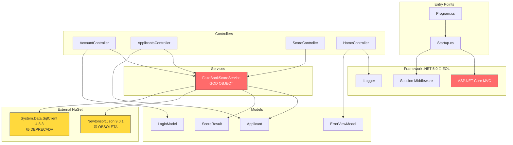
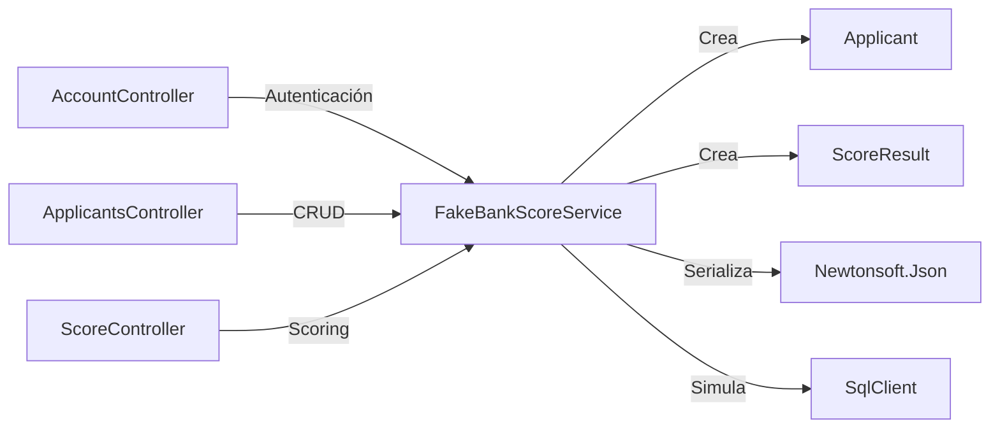
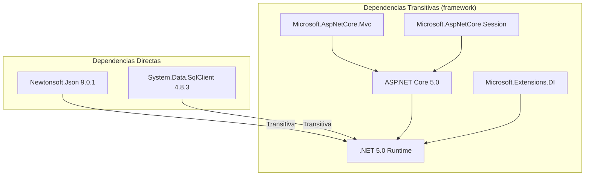
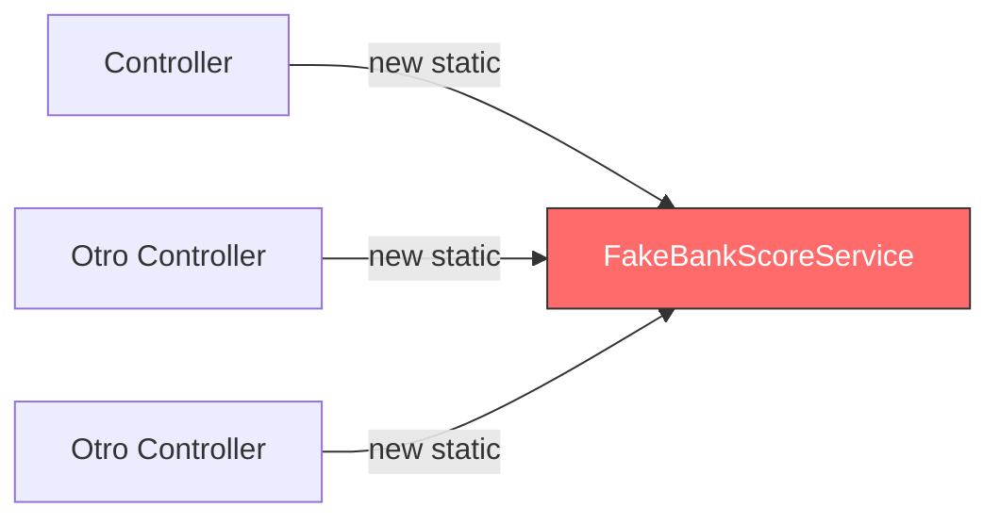

# 01.04 — Análisis de Dependencias

## Frontier QuickScan — Bank Score Evaluator

---

## Grafo de Dependencias



---

## Matriz de Dependencias Internas

| Componente ↓ Depende de → | FakeBankScoreService | Applicant | ScoreResult | LoginModel | ErrorViewModel | Session |
|---------------------------|:---:|:---:|:---:|:---:|:---:|:---:|
| AccountController | ✅ | — | — | ✅ | — | ✅ |
| ApplicantsController | ✅ | ✅ | — | — | — | ✅ |
| ScoreController | ✅ | — | ✅ | — | — | ✅ |
| HomeController | — | — | — | — | ✅ | — |
| FakeBankScoreService | — | ✅ | ✅ | — | — | — |

---

## Análisis de Acoplamiento

### Componente Más Crítico: FakeBankScoreService



| Métrica | Valor | Evaluación |
|---------|-------|-----------|
| Fan-in (dependido por) | 3 controllers | 🔴 Alto acoplamiento aferente |
| Fan-out (depende de) | 4 componentes | 🟡 Medio acoplamiento eferente |
| Instability Index | 4/(3+4) = 0.57 | Zona intermedia |
| Responsabilidades | 4 (Auth + CRUD + Score + Storage) | 🔴 Viola SRP |

---

## Dependencias Externas — Análisis de Riesgo

### Newtonsoft.Json 9.0.1

| Atributo | Detalle |
|----------|---------|
| Fecha de publicación | Septiembre 2016 |
| Versión actual | 13.0.3+ |
| Gap de versiones | ~7 major releases |
| CVEs conocidos | Versiones < 13.0.1 tienen vulnerabilidades de deserialización |
| Uso en proyecto | 1 punto: `JsonConvert.SerializeObject()` en FakeBankScoreService |
| Impacto de reemplazo | Bajo — puede sustituirse por `System.Text.Json` (built-in) |
| Riesgo | 🟡 Medium — vulnerabilidades conocidas pero uso limitado |

### System.Data.SqlClient 4.8.3

| Atributo | Detalle |
|----------|---------|
| Estado oficial | Deprecado por Microsoft |
| Reemplazo | Microsoft.Data.SqlClient |
| Uso en proyecto | 1 punto: `new SqlConnection()` — nunca ejecuta queries reales |
| Impacto de reemplazo | Mínimo — eliminar o reemplazar por Microsoft.Data.SqlClient |
| Riesgo | 🟡 Medium — deprecado pero sin uso real de BD |

---

## Análisis de Transitividad



**Riesgo de cascada**: La migración de .NET 5.0 → .NET 8.0 es la dependencia raíz. Una vez migrada, las dependencias NuGet se actualizan trivialmente.

---

## Dependencias de Frontend

| Librería | Entregada vía | Riesgo |
|----------|---------------|--------|
| Bootstrap | wwwroot/lib/ (estático) | 🟢 Bajo — bundled |
| jQuery | wwwroot/lib/ (estático) | 🟡 Medio — posible versión antigua |
| jQuery Validation | wwwroot/lib/ (estático) | 🟢 Bajo |
| jQuery Validation Unobtrusive | wwwroot/lib/ (estático) | 🟢 Bajo |

[DECISIÓN AUTÓNOMA: Las versiones exactas de librerías frontend no son verificables sin inspección de los archivos minificados. Se asume que fueron generadas por el template de proyecto .NET 5.0 (2020), lo cual las hace potencialmente obsoletas.]

---

## Patrón de Instanciación (Anti-patrón)



**Problema**: Los controllers instancian `FakeBankScoreService` como campo estático en lugar de usar Dependency Injection:
```csharp
private static FakeBankScoreService _service = new FakeBankScoreService();
```

**Impacto**:
- Imposible hacer mock/stub para testing
- Estado compartido entre requests (no thread-safe)
- Violación del principio de inversión de dependencias

---

## Recomendaciones de Modernización de Dependencias

| Actual | Recomendado | Esfuerzo | Prioridad |
|--------|------------|----------|-----------|
| .NET 5.0 | .NET 8.0 LTS | Medium | 🔴 P1 |
| Newtonsoft.Json 9.0.1 | System.Text.Json (built-in) | Low | 🟡 P2 |
| System.Data.SqlClient 4.8.3 | Eliminar o Microsoft.Data.SqlClient + EF Core | Low | 🟡 P2 |
| Static instantiation | DI + Interfaces | Medium | 🟡 P3 |
| jQuery (frontend) | Evaluar eliminación si se moderniza UI | Low | 🟢 P4 |

---

*Documento generado por OneClickXRay — Frontier QuickScan Agent*
