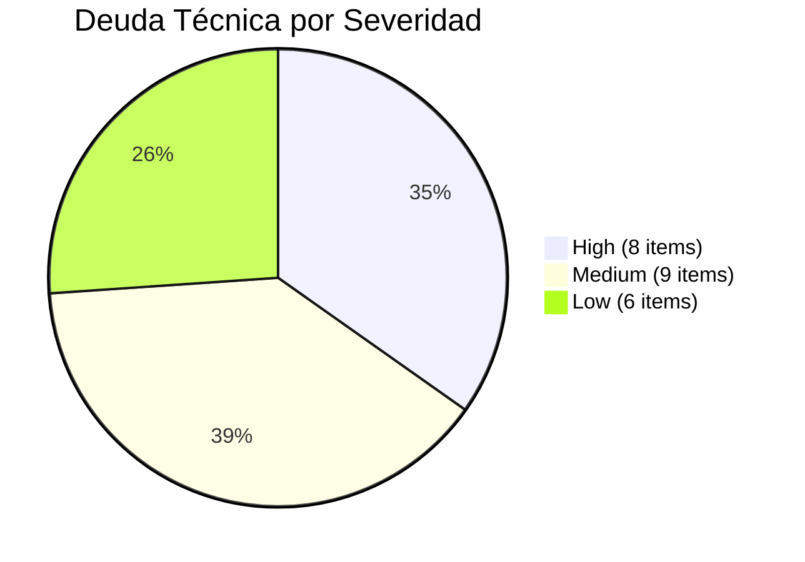
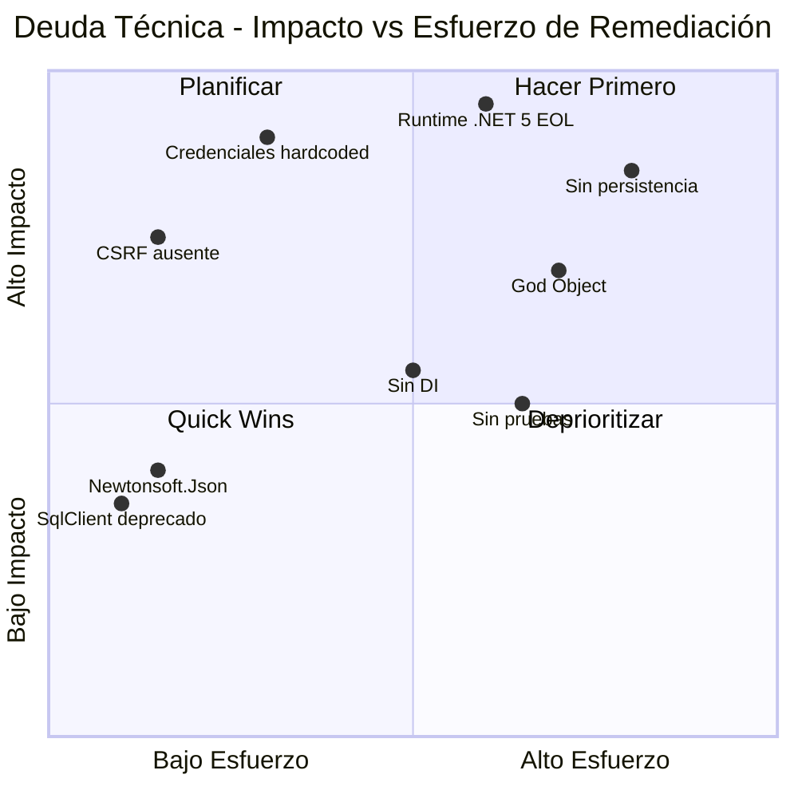

# 01.05 — Deuda Técnica Detallada

## Frontier QuickScan — Bank Score Evaluator

---

## Resumen de Deuda Técnica

| Categoría | Items High | Items Medium | Items Low | Total |
|-----------|:---:|:---:|:---:|:---:|
| Runtime/Framework | 2 | 0 | 0 | 2 |
| Seguridad | 6 | 3 | 2 | 11 |
| Dependencias | 0 | 2 | 0 | 2 |
| Arquitectura | 0 | 3 | 1 | 4 |
| Calidad | 0 | 1 | 3 | 4 |
| **Total** | **8** | **9** | **6** | **23** |

---

## Distribución de Severidad

---

## Deuda High — Acción Inmediata

### DT-H01: Runtime .NET 5.0 en End of Life

| Campo | Detalle |
|-------|---------|
| Severidad | 🔴 High |
| Archivo | BankScoreEvaluator.Web.csproj |
| EOL | Mayo 2022 (>4 años sin soporte) |
| Impacto | Sin parches de seguridad, hosting limitado, dependencias incompatibles |
| Remediación | Migrar a .NET 8.0 LTS |
| Esfuerzo estimado | 2-3 días (proyecto pequeño) |

### DT-H02: ASP.NET Core 5.0 — Hosting Model Legacy

| Campo | Detalle |
|-------|---------|
| Severidad | 🔴 High |
| Archivos | Program.cs, Startup.cs |
| Problema | Patrón Startup.cs separado (pre-.NET 6) |
| Impacto | Incompatible con features modernos, patrón no mantenido |
| Remediación | Migrar a minimal hosting model (.NET 8) |
| Esfuerzo estimado | 1 día |

### DT-H03: Credenciales Hardcodeadas en Código Fuente

| Campo | Detalle |
|-------|---------|
| Severidad | 🔴 High |
| Archivo | FakeBankScoreService.cs, líneas 13-19 |
| CWE | CWE-798 |
| Evidencia | `FakeConnectionString = "...Password=SuperSecret123*;"` y diccionario FakeUsers |
| Impacto | Acceso no autorizado si el código se expone |
| Remediación | Mover a secrets management (Key Vault, env vars) |

### DT-H04: Contraseñas en Texto Plano

| Campo | Detalle |
|-------|---------|
| Severidad | 🔴 High |
| Archivo | FakeBankScoreService.cs, líneas 16-19 |
| CWE | CWE-256 |
| Evidencia | `{"admin", "admin123"}, {"analista", "analista2024"}` |
| Impacto | Compromiso total de cuentas |
| Remediación | Implementar hashing (BCrypt/Argon2) |

### DT-H05: Logging de Datos Sensibles

| Campo | Detalle |
|-------|---------|
| Severidad | 🔴 High |
| Archivo | FakeBankScoreService.cs, líneas 36, 46, 73, 116 |
| CWE | CWE-532 |
| Evidencia | Console.WriteLine expone credenciales y connection strings |
| Impacto | Exposición de secretos en logs de producción |
| Remediación | Eliminar Console.WriteLine, implementar ILogger sin PII |

### DT-H06: Ausencia de Protección CSRF

| Campo | Detalle |
|-------|---------|
| Severidad | 🔴 High |
| Archivos | AccountController.cs, ApplicantsController.cs |
| CWE | CWE-352 |
| Evidencia | Ningún POST usa `[ValidateAntiForgeryToken]` |
| Impacto | Acciones maliciosas ejecutadas en nombre del usuario |
| Remediación | Agregar atributo a todos los POST |

### DT-H07: SQL Injection Pattern (Simulado)

| Campo | Detalle |
|-------|---------|
| Severidad | 🔴 High |
| Archivo | FakeBankScoreService.cs, líneas 46, 55 |
| CWE | CWE-89 |
| Evidencia | SQL construido por concatenación de strings |
| Impacto | Si se conectara a DB real, exfiltración/modificación de datos |
| Remediación | Queries parametrizadas o EF Core |

### DT-H08: Datos en Memoria Sin Persistencia

| Campo | Detalle |
|-------|---------|
| Severidad | 🔴 High |
| Archivo | FakeBankScoreService.cs (listas estáticas) |
| Impacto | Pérdida total de datos al reiniciar la aplicación |
| Remediación | Implementar persistencia real (SQL Server, PostgreSQL, etc.) |

---

## Deuda Medium — Acción Prioritaria

### DT-M01: Newtonsoft.Json 9.0.1 Obsoleta

| Campo | Detalle |
|-------|---------|
| Archivo | BankScoreEvaluator.Web.csproj |
| Gap | 7+ major versions atrasada |
| CVEs | Vulnerabilidades de deserialización en versiones < 13.0.1 |
| Remediación | Reemplazar por System.Text.Json o actualizar a 13.0.3 |

### DT-M02: System.Data.SqlClient Deprecado

| Campo | Detalle |
|-------|---------|
| Archivo | BankScoreEvaluator.Web.csproj |
| Estado | Oficialmente deprecado por Microsoft |
| Remediación | Eliminar (no se usa realmente) o migrar a Microsoft.Data.SqlClient |

### DT-M03: God Object — FakeBankScoreService

| Campo | Detalle |
|-------|---------|
| Archivo | Services/FakeBankScoreService.cs (127 LOC) |
| Problema | Concentra autenticación + CRUD + scoring + almacenamiento |
| Impacto | Imposible testear, modificar o escalar independientemente |
| Remediación | Separar en IAuthService, IApplicantRepository, IScoreCalculator |

### DT-M04: Estado Estático Compartido (No Thread-Safe)

| Campo | Detalle |
|-------|---------|
| Archivo | FakeBankScoreService.cs |
| Problema | Listas estáticas compartidas entre todos los requests |
| Impacto | Race conditions, datos corruptos bajo carga concurrente |
| Remediación | DbContext con scope por request |

### DT-M05: Sin Inyección de Dependencias

| Campo | Detalle |
|-------|---------|
| Archivos | Todos los controllers |
| Evidencia | `private static FakeBankScoreService _service = new FakeBankScoreService()` |
| Impacto | Imposible mock/test, violación de SOLID |
| Remediación | Registrar servicios en DI container |

### DT-M06: Autenticación Débil

| Campo | Detalle |
|-------|---------|
| CWE | CWE-287 |
| Problema | Sin rate limiting, sin bloqueo de cuenta, sin MFA |
| Remediación | Implementar ASP.NET Core Identity |

### DT-M07: Sesión Sin Configuración de Seguridad

| Campo | Detalle |
|-------|---------|
| Archivo | Startup.cs, línea 28 |
| CWE | CWE-613 |
| Problema | `services.AddSession()` sin timeout, sin secure cookies |
| Remediación | Configurar SessionOptions con IdleTimeout, SecurePolicy |

### DT-M08: Exposición de SQL en Modelo de Respuesta

| Campo | Detalle |
|-------|---------|
| Archivo | ScoreResult.cs, propiedad RawSqlUsed |
| CWE | CWE-200 |
| Impacto | Information disclosure al frontend |
| Remediación | Eliminar propiedad |

### DT-M09: Sin Validación de Modelo en POST

| Campo | Detalle |
|-------|---------|
| Archivo | ApplicantsController.cs, Create POST |
| CWE | CWE-20 |
| Impacto | Datos inválidos/maliciosos aceptados |
| Remediación | Verificar ModelState.IsValid + Data Annotations |

---

## Deuda Low — Mejora Planificada

| ID | Descripción | Archivo |
|----|-------------|---------|
| DT-L01 | Sin pruebas automatizadas (0% cobertura) | N/A — no existe proyecto de tests |
| DT-L02 | ViewBag en lugar de ViewModels tipados | Controllers → Views |
| DT-L03 | Sin logging estructurado (Console.WriteLine) | FakeBankScoreService.cs |
| DT-L04 | Código duplicado — verificación de sesión | ApplicantsController, ScoreController |
| DT-L05 | Sin documentación XML completa | Todos los archivos .cs |
| DT-L06 | Redirección silenciosa sin feedback | ApplicantsController.Details |

---

## Mapa de Calor: Deuda por Archivo

---

## Esfuerzo de Remediación Estimado

| Categoría | Esfuerzo | Dependencias |
|-----------|----------|--------------|
| Migración .NET 8.0 | 2-3 días | Ninguna — primer paso |
| Actualización NuGet | 0.5 días | Post migración .NET 8 |
| Remediación seguridad | 3-5 días | Post migración .NET 8 |
| Separación de responsabilidades | 2-3 días | Post seguridad |
| Implementar persistencia | 2-3 días | Post separación |
| Agregar pruebas | 2-3 días | Post refactorización |
| **Total estimado** | **12-18 días** | Secuencial |

---

*Documento generado por OneClickXRay — Frontier QuickScan Agent*
