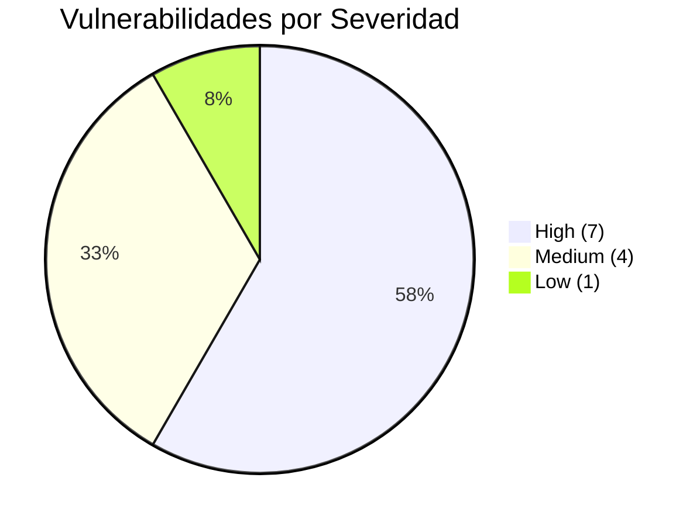
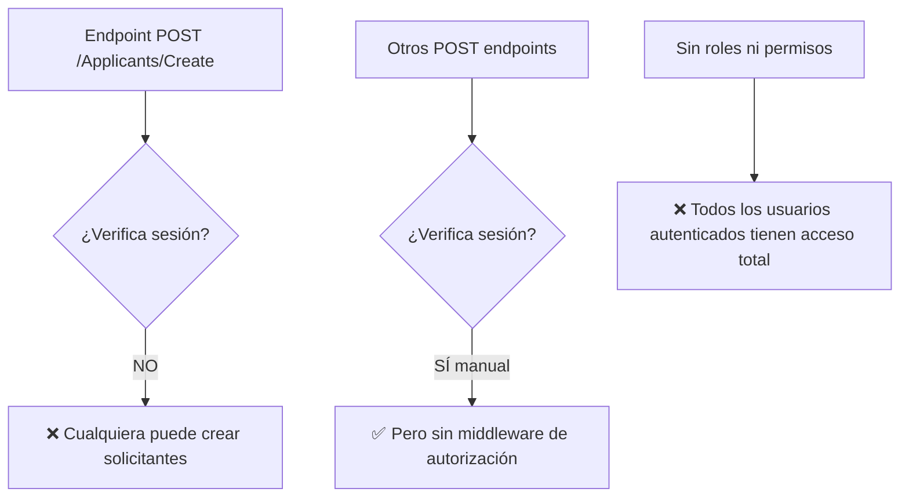
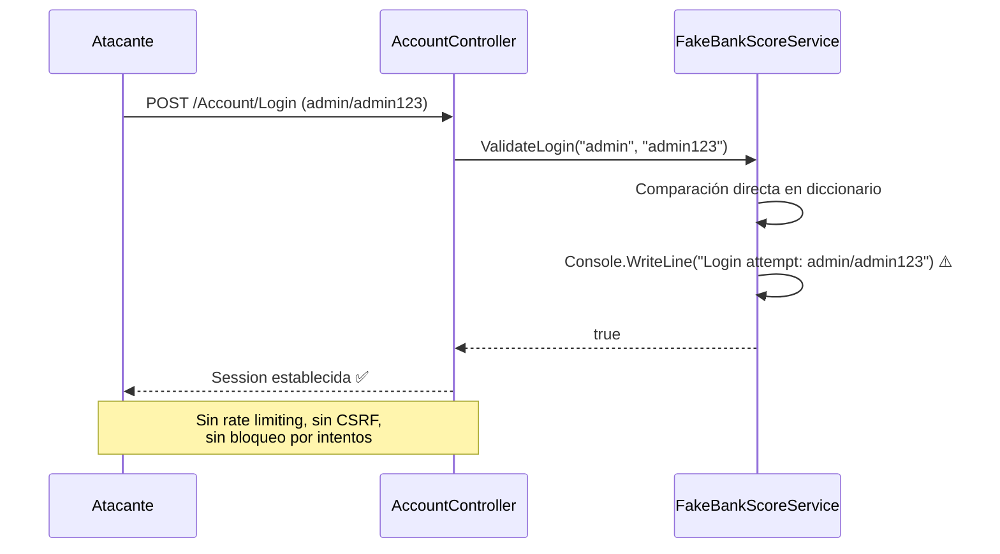

# 01.06 — Análisis de Seguridad

## Frontier QuickScan — Bank Score Evaluator

---

## Resumen de Seguridad

| Indicador | Valor |
|-----------|-------|
| Vulnerabilidades High | 7 |
| Vulnerabilidades Medium | 4 |
| Vulnerabilidades Low | 1 |
| **Total** | **12** |
| CWEs únicos identificados | 10 |
| Archivos afectados | 4 de 10 archivos de código |
| Naturaleza | Intencionales (propósito académico) |

⚠️ **Nota importante**: Todas las vulnerabilidades fueron introducidas intencionalmente con propósitos educativos. Están marcadas en el código fuente con comentarios "MALA PRACTICA".

---

## Mapa de Vulnerabilidades por Severidad

---

## Catálogo Completo de Vulnerabilidades

### Severidad HIGH

| # | Vulnerabilidad | CWE | Archivo | Línea(s) | CVSS Est. |
|---|---------------|-----|---------|----------|-----------|
| SEC-01 | Credenciales hardcodeadas | CWE-798 | FakeBankScoreService.cs | 13-19 | 9.1 |
| SEC-02 | Passwords en texto plano | CWE-256 | FakeBankScoreService.cs | 16-19 | 8.6 |
| SEC-03 | Logging de credenciales | CWE-532 | FakeBankScoreService.cs | 36, 46, 73, 116 | 7.5 |
| SEC-04 | Sin protección CSRF | CWE-352 | AccountController.cs, ApplicantsController.cs | POST endpoints | 8.0 |
| SEC-05 | SQL Injection (simulado) | CWE-89 | FakeBankScoreService.cs | 46, 55 | 9.8 |
| SEC-06 | Autenticación débil | CWE-287 | AccountController.cs | Login POST | 8.2 |
| SEC-07 | Connection string expuesta | CWE-798 | FakeBankScoreService.cs | 13 | 7.5 |

### Severidad MEDIUM

| # | Vulnerabilidad | CWE | Archivo | Línea(s) | CVSS Est. |
|---|---------------|-----|---------|----------|-----------|
| SEC-08 | Sesión sin timeout | CWE-613 | Startup.cs | 28 | 5.4 |
| SEC-09 | Exposición de SQL en response | CWE-200 | ScoreResult.cs | RawSqlUsed | 5.3 |
| SEC-10 | Autorización inconsistente | CWE-862 | ApplicantsController.cs | Create POST | 6.5 |
| SEC-11 | Sin validación de entrada | CWE-20 | ApplicantsController.cs | 44 | 5.3 |

### Severidad LOW

| # | Vulnerabilidad | CWE | Archivo | Línea(s) | CVSS Est. |
|---|---------------|-----|---------|----------|-----------|
| SEC-12 | Info excesiva en error | CWE-209 | Startup.cs | DeveloperExceptionPage | 3.7 |

---

## Análisis Detallado por Categoría OWASP

### A01:2021 — Broken Access Control

**Hallazgos**:
- Sin middleware `[Authorize]` — verificación manual por método
- POST Create no verifica sesión (bypass)
- Sin sistema de roles (admin/analista/supervisor tienen mismos permisos)
- Sin autorización a nivel de recursos

### A02:2021 — Cryptographic Failures

**Hallazgos**:
- Contraseñas almacenadas en texto plano (sin hash)
- Connection string con password en código fuente
- Sin cifrado de datos en tránsito entre componentes (no aplica — monolito)

### A03:2021 — Injection

**Hallazgos**:
- SQL construido por concatenación de strings (simulado)
- Sin queries parametrizadas
- Sin ORM que abstraiga el acceso

### A07:2021 — Identification and Authentication Failures

**Hallazgos**:
- Sin rate limiting en login
- Sin bloqueo tras intentos fallidos
- Sin MFA
- Sin política de contraseñas
- Sin expiración de sesión configurada

---

## Controles de Seguridad Presentes

| Control | Estado | Efectividad |
|---------|--------|-------------|
| HTTPS Redirection | ✅ Configurado | Funcional |
| HSTS | ✅ Configurado (producción) | Funcional |
| Exception Handler (producción) | ✅ Configurado | Funcional |
| Anti-forgery tokens | ❌ No implementado | — |
| Authentication middleware | ❌ No implementado | — |
| Authorization middleware | ❌ No implementado | — |
| Input validation | ❌ No implementado | — |
| Secure session config | ❌ No implementado | — |
| Rate limiting | ❌ No implementado | — |
| Security headers | ❌ No implementado | — |

---

## Flujo de Ataque: Login Sin Protección

---

## Plan de Remediación de Seguridad (Priorizado)

| Prioridad | Acción | Esfuerzo | Impacto |
|-----------|--------|----------|---------|
| P1 | Eliminar credenciales del código fuente | 2h | Elimina SEC-01, SEC-07 |
| P1 | Implementar hashing de contraseñas | 4h | Elimina SEC-02 |
| P1 | Eliminar Console.WriteLine con PII | 1h | Elimina SEC-03 |
| P1 | Agregar [ValidateAntiForgeryToken] | 1h | Elimina SEC-04 |
| P2 | Implementar ASP.NET Core Identity | 1-2d | Elimina SEC-06 |
| P2 | Usar queries parametrizadas / EF Core | 4h | Elimina SEC-05 |
| P2 | Configurar SessionOptions | 1h | Elimina SEC-08 |
| P2 | Eliminar RawSqlUsed de ScoreResult | 30min | Elimina SEC-09 |
| P3 | Agregar [Authorize] a controllers | 2h | Elimina SEC-10 |
| P3 | Implementar validación de modelo | 2h | Elimina SEC-11 |
| P3 | Configurar exception handling | 1h | Elimina SEC-12 |

---

## Cumplimiento Regulatorio

| Framework | Cumple | Observaciones |
|-----------|:---:|---------------|
| OWASP Top 10 (2021) | ❌ | Viola A01, A02, A03, A07 |
| PCI DSS | ❌ | Credenciales en texto plano, sin cifrado |
| SOC 2 Type II | ❌ | Sin controles de acceso, sin logging |
| GDPR / Ley Protección Datos | ❌ | Datos personales sin protección |
| ISO 27001 | ❌ | Sin controles de seguridad de información |

[DECISIÓN AUTÓNOMA: Se evalúa el cumplimiento regulatorio basado en los controles observables en el código. Al ser un proyecto académico, ninguno de estos frameworks aplica formalmente, pero se documenta para informar la decisión de modernización.]

---

*Documento generado por OneClickXRay — Frontier QuickScan Agent*
