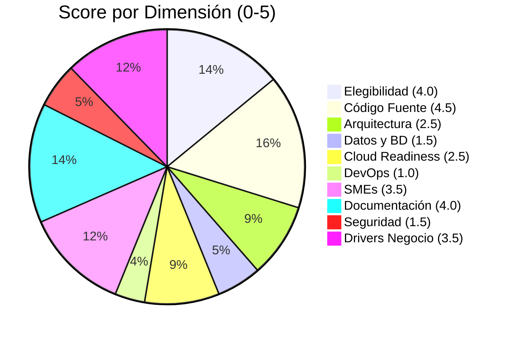

# 01.07 — Scoring de 10 Dimensiones

## Frontier QuickScan — Bank Score Evaluator

---

## Metodología de Scoring

- **Escala por dimensión**: 0–5
- **Fórmula del Score Final**: Σ (score_dimensión × peso × 20) → escala 0–100
- **Fuente de evidencia**: Reporte AWS Transform Custom (codebase-analysis)

---

## Resultado Consolidado

---

## Detalle por Dimensión

### 1. Elegibilidad de la Aplicación

| Campo | Valor |
|-------|-------|
| **Score** | **4.0 / 5** |
| **Peso** | 12% |
| **Contribución** | 4.0 × 0.12 × 20 = **9.6** |

**Evidencia**:
- ✅ Aplicación web con stack estándar (ASP.NET Core MVC)
- ✅ Tamaño pequeño (~1,054 LOC) — ideal para paquete Frontera S
- ✅ Monolito simple, sin dependencias de mainframe ni legacy extremo
- ✅ Propósito de negocio claro (evaluación crediticia)
- ⚠️ Naturaleza académica/demostrativa — podría no justificar inversión real

**Justificación**: Score 4.0 porque cumple todos los criterios técnicos de elegibilidad pero su naturaleza académica reduce ligeramente el valor de negocio.

---

### 2. Disponibilidad de Código Fuente

| Campo | Valor |
|-------|-------|
| **Score** | **4.5 / 5** |
| **Peso** | 12% |
| **Contribución** | 4.5 × 0.12 × 20 = **10.8** |

**Evidencia**:
- ✅ Código fuente 100% disponible (10 archivos C#, 12 Razor)
- ✅ Solución compilable (BankScoreEvaluator.sln)
- ✅ Estructura estándar de proyecto ASP.NET Core
- ✅ Sin ofuscación ni componentes binarios cerrados
- ⚠️ Sin historial de cambios visible (no evaluable VCS)

**Justificación**: Score 4.5 porque el código está completamente disponible y es legible. Se descuenta 0.5 por no poder verificar el historial de versionado.

---

### 3. Arquitectura y Acoplamiento

| Campo | Valor |
|-------|-------|
| **Score** | **2.5 / 5** |
| **Peso** | 12% |
| **Contribución** | 2.5 × 0.12 × 20 = **6.0** |

**Evidencia**:
- ✅ Patrón MVC reconocible
- ❌ God Object (FakeBankScoreService) concentra 4 responsabilidades
- ❌ Sin interfaces definidas — acoplamiento directo
- ❌ Estado estático compartido (no thread-safe)
- ❌ Sin inyección de dependencias real
- ❌ Sin separación de capas (no hay Repository, no hay Domain)

**Justificación**: Score 2.5 porque aunque usa MVC, la implementación interna viola múltiples principios SOLID y no tiene separación de concerns real.

---

### 4. Datos y Bases de Datos

| Campo | Valor |
|-------|-------|
| **Score** | **1.5 / 5** |
| **Peso** | 10% |
| **Contribución** | 1.5 × 0.10 × 20 = **3.0** |

**Evidencia**:
- ❌ Sin base de datos real — datos en listas estáticas en memoria
- ❌ Sin persistencia — pérdida total al reiniciar
- ❌ Sin ORM ni data access layer
- ❌ Connection string simulada (nunca se conecta)
- ✅ Modelos de datos bien definidos (Applicant, ScoreResult)
- ⚠️ System.Data.SqlClient referenciado pero no usado

**Justificación**: Score 1.5 porque no existe capa de datos real, pero los modelos de dominio están bien estructurados y servirían como base para implementar persistencia.

---

### 5. Cloud Readiness

| Campo | Valor |
|-------|-------|
| **Score** | **2.5 / 5** |
| **Peso** | 10% |
| **Contribución** | 2.5 × 0.10 × 20 = **5.0** |

**Evidencia**:
- ✅ ASP.NET Core es cloud-native friendly
- ✅ Sin dependencia de filesystem local para datos
- ✅ Stateless a nivel de runtime (datos en memoria se recrean)
- ❌ .NET 5.0 EOL — imágenes Docker no disponibles oficialmente
- ❌ Sin Dockerfile ni configuración de contenedores
- ❌ Sin health checks
- ❌ Sin configuración externalizada (secrets en código)
- ❌ Estado estático rompe escalamiento horizontal

**Justificación**: Score 2.5 porque el framework base es cloud-ready pero la implementación actual tiene anti-patrones que impiden el despliegue cloud sin remediación.

---

### 6. DevOps y Observabilidad

| Campo | Valor |
|-------|-------|
| **Score** | **1.0 / 5** |
| **Peso** | 8% |
| **Contribución** | 1.0 × 0.08 × 20 = **1.6** |

**Evidencia**:
- ❌ Sin CI/CD pipeline
- ❌ Sin Dockerfile
- ❌ Sin pruebas automatizadas (0% cobertura)
- ❌ Sin logging estructurado (solo Console.WriteLine)
- ❌ Sin health checks ni métricas
- ❌ Sin APM ni tracing distribuido
- ✅ Proyecto compilable con `dotnet build` (build estándar)

**Justificación**: Score 1.0 porque la única capacidad DevOps es el sistema de build estándar de .NET. No existe ninguna otra práctica de DevOps implementada.

---

### 7. Disponibilidad de SMEs

| Campo | Valor |
|-------|-------|
| **Score** | **3.5 / 5** |
| **Peso** | 12% |
| **Contribución** | 3.5 × 0.12 × 20 = **8.4** |

**Evidencia**:
- ✅ Stack tecnológico mainstream (ASP.NET Core, C#) — fácil encontrar expertise
- ✅ Código bien comentado con anti-patrones marcados ("MALA PRACTICA")
- ✅ Lógica de negocio documentada explícitamente en código
- ✅ Proyecto pequeño — un SME puede comprenderlo en horas
- ⚠️ No hay evidencia de equipo de desarrollo activo
- ⚠️ Origen académico — puede no tener SME de negocio dedicado

[DECISIÓN AUTÓNOMA: Se asigna 3.5 porque la simplicidad del código y el stack mainstream facilitan que cualquier desarrollador .NET actúe como SME técnico, pero no hay certeza sobre SME de negocio bancario.]

**Justificación**: Score 3.5 porque el stack es mainstream y el código es comprensible, pero la disponibilidad real de SMEs de negocio no es verificable.

---

### 8. Documentación y Conocimiento

| Campo | Valor |
|-------|-------|
| **Score** | **4.0 / 5** |
| **Peso** | 8% |
| **Contribución** | 4.0 × 0.08 × 20 = **6.4** |

**Evidencia**:
- ✅ Reporte AWS Transform completo (README, architecture, behavior, analysis, etc.)
- ✅ Lógica de negocio documentada con reglas explícitas
- ✅ Anti-patrones marcados intencionalmente en código
- ✅ Datos de referencia para validación documentados
- ✅ Plan de remediación existente
- ⚠️ Sin documentación de usuario final
- ⚠️ Sin ADRs formales

**Justificación**: Score 4.0 porque la documentación técnica generada por AWS Transform es exhaustiva y la lógica está explícita en el código. Solo falta documentación de usuario/negocio.

---

### 9. Seguridad y Compliance

| Campo | Valor |
|-------|-------|
| **Score** | **1.5 / 5** |
| **Peso** | 8% |
| **Contribución** | 1.5 × 0.08 × 20 = **2.4** |

**Evidencia**:
- ❌ 12 vulnerabilidades de seguridad documentadas
- ❌ 7 de severidad High
- ❌ No cumple OWASP Top 10, PCI DSS, ni SOC 2
- ❌ Credenciales en código fuente
- ❌ Sin cifrado de contraseñas
- ✅ HTTPS y HSTS configurados
- ✅ Vulnerabilidades son intencionales y están documentadas

**Justificación**: Score 1.5 porque aunque las vulnerabilidades son intencionales/académicas, representan el estado real de la aplicación que debe remediarse antes de producción. Se da 1.5 (no 0) por el hecho de que HTTPS/HSTS están configurados y las vulnerabilidades están explícitamente documentadas.

---

### 10. Drivers de Negocio y Sponsorship

| Campo | Valor |
|-------|-------|
| **Score** | **3.5 / 5** |
| **Peso** | 8% |
| **Contribución** | 3.5 × 0.08 × 20 = **5.6** |

**Evidencia**:
- ✅ Caso de uso claro: evaluación de riesgo crediticio (dominio bancario)
- ✅ Dominio con alto valor de negocio (fintech/banca)
- ✅ Potencial de evolución a producto SaaS
- ⚠️ Origen académico — driver de negocio real no verificado
- ⚠️ Sin evidencia de sponsors ejecutivos
- ⚠️ Sin presión regulatoria inmediata (por ser demo)

[DECISIÓN AUTÓNOMA: Se asigna 3.5 asumiendo que el cliente tiene interés real en evolucionar este prototipo a una solución productiva en el dominio bancario. Si es puramente académico, el score debería ser menor.]

**Justificación**: Score 3.5 porque el dominio tiene alto valor pero no hay evidencia directa de sponsorship ejecutivo o presión de negocio.

---

## Cálculo del Score Final

| # | Dimensión | Score (0-5) | Peso | Contribución (score × peso × 20) |
|---|-----------|:-----------:|:----:|:---------------------------------:|
| 1 | Elegibilidad | 4.0 | 12% | 9.6 |
| 2 | Código Fuente | 4.5 | 12% | 10.8 |
| 3 | Arquitectura | 2.5 | 12% | 6.0 |
| 4 | Datos y BD | 1.5 | 10% | 3.0 |
| 5 | Cloud Readiness | 2.5 | 10% | 5.0 |
| 6 | DevOps | 1.0 | 8% | 1.6 |
| 7 | SMEs | 3.5 | 12% | 8.4 |
| 8 | Documentación | 4.0 | 8% | 6.4 |
| 9 | Seguridad | 1.5 | 8% | 2.4 |
| 10 | Drivers Negocio | 3.5 | 8% | 5.6 |
| | **TOTAL** | | **100%** | **58.8** |

---

## Resultado Final

| Indicador | Valor |
|-----------|-------|
| **Score Final** | **58.8 / 100** |
| **Banda** | ⚠️ **Advisory** (50–64) |
| **Interpretación** | La aplicación requiere trabajo preparatorio significativo antes de entrar al flujo estándar FAM |

### Dimensiones Críticas (< 3.0 / 5)

| Dimensión | Score | Impacto |
|-----------|:-----:|---------|
| DevOps y Observabilidad | 1.0 | Sin pipeline, sin pruebas, sin monitoreo |
| Datos y BD | 1.5 | Sin persistencia real |
| Seguridad y Compliance | 1.5 | 12 vulnerabilidades activas |
| Arquitectura | 2.5 | God Object, sin DI, acoplamiento alto |
| Cloud Readiness | 2.5 | EOL, sin containerización, estado estático |

---

*Documento generado por OneClickXRay — Frontier QuickScan Agent*
