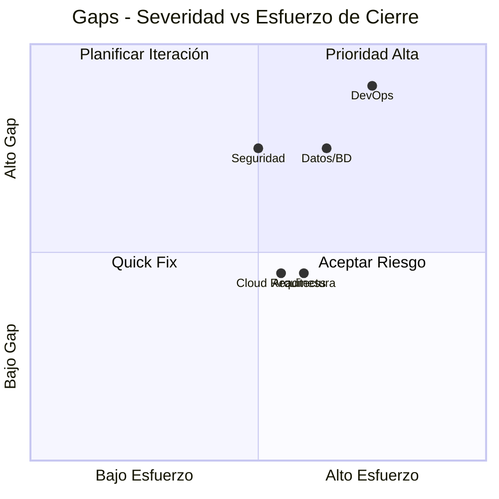
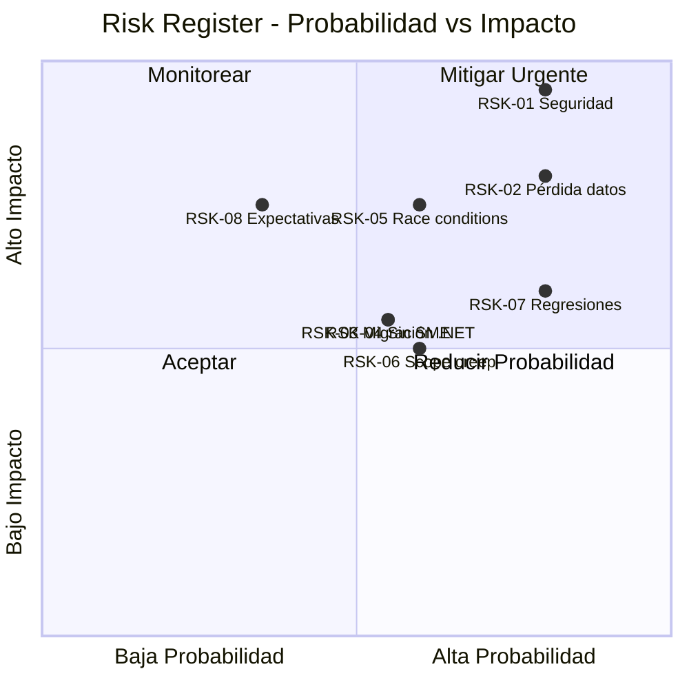
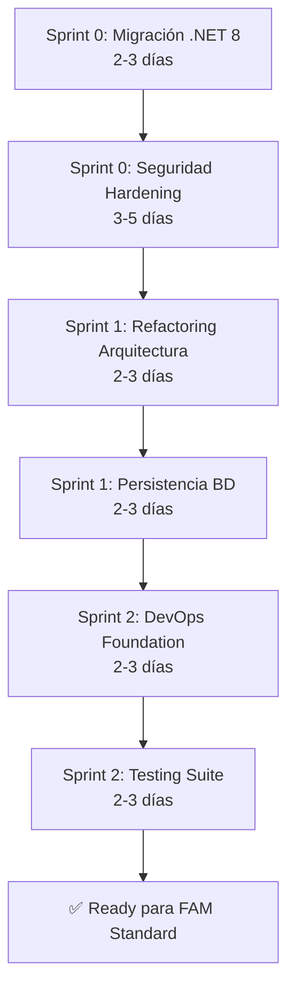

# 01.08 — Gap & Risk Register

## Frontier QuickScan — Bank Score Evaluator

---

## Identificación de Gaps (Dimensiones < 3.25 / 5)

### Gap Register

| ID | Dimensión | Score | Target FAM | Gap | Severidad |
|----|-----------|:-----:|:----------:|:---:|-----------|
| GAP-01 | DevOps y Observabilidad | 1.0 | 3.5 | 2.5 | 🔴 Crítico |
| GAP-02 | Datos y Bases de Datos | 1.5 | 3.5 | 2.0 | 🔴 Crítico |
| GAP-03 | Seguridad y Compliance | 1.5 | 3.5 | 2.0 | 🔴 Crítico |
| GAP-04 | Arquitectura y Acoplamiento | 2.5 | 3.5 | 1.0 | 🟡 Significativo |
| GAP-05 | Cloud Readiness | 2.5 | 3.5 | 1.0 | 🟡 Significativo |

---

## Detalle de Gaps

### GAP-01: DevOps y Observabilidad (Score 1.0 → Target 3.5)

| Brecha Específica | Estado Actual | Estado Requerido |
|-------------------|---------------|------------------|
| CI/CD Pipeline | ❌ Inexistente | Pipeline con build + test + deploy |
| Pruebas automatizadas | ❌ 0% cobertura | Mínimo 60% en lógica core |
| Containerización | ❌ Sin Dockerfile | Dockerfile multi-stage |
| Logging estructurado | ❌ Console.WriteLine | ILogger + sink (CloudWatch/ELK) |
| Health checks | ❌ Inexistente | /health y /ready endpoints |
| Monitoreo | ❌ Inexistente | Métricas básicas + alertas |

**Mitigación propuesta**: Incluir sprint de DevOps Foundation (2-3 días) al inicio del proyecto.

### GAP-02: Datos y Bases de Datos (Score 1.5 → Target 3.5)

| Brecha Específica | Estado Actual | Estado Requerido |
|-------------------|---------------|------------------|
| Persistencia | ❌ Memoria estática | BD relacional (SQL Server/PostgreSQL) |
| ORM | ❌ Inexistente | Entity Framework Core |
| Migraciones | ❌ Inexistente | EF Core Migrations |
| Connection management | ❌ Simulada | Connection pooling + health check |
| Backup/Recovery | ❌ N/A | Estrategia de backup configurada |

**Mitigación propuesta**: Implementar persistencia con EF Core como parte del refactoring (2-3 días).

### GAP-03: Seguridad y Compliance (Score 1.5 → Target 3.5)

| Brecha Específica | Estado Actual | Estado Requerido |
|-------------------|---------------|------------------|
| Autenticación | ❌ Hardcodeada | ASP.NET Core Identity |
| Autorización | ❌ Manual/inconsistente | [Authorize] + políticas |
| Secrets management | ❌ En código fuente | Azure Key Vault / env vars |
| Cifrado passwords | ❌ Texto plano | BCrypt/Argon2 hashing |
| CSRF Protection | ❌ Ausente | [ValidateAntiForgeryToken] |
| Input validation | ❌ Ausente | Data Annotations + FluentValidation |
| Security headers | ❌ Ausente | CSP, X-Frame-Options, etc. |

**Mitigación propuesta**: Sprint de Security Hardening (3-5 días) como prerequisito mandatorio.

### GAP-04: Arquitectura y Acoplamiento (Score 2.5 → Target 3.5)

| Brecha Específica | Estado Actual | Estado Requerido |
|-------------------|---------------|------------------|
| Separación de concerns | ❌ God Object | Servicios independientes |
| Dependency Injection | ❌ Instanciación directa | Constructor injection |
| Interfaces | ❌ Inexistentes | IAuthService, IScoreCalculator, IRepo |
| Thread safety | ❌ Estado estático | Scoped services |

**Mitigación propuesta**: Refactorización estructural incluida en el scope de modernización (2-3 días).

### GAP-05: Cloud Readiness (Score 2.5 → Target 3.5)

| Brecha Específica | Estado Actual | Estado Requerido |
|-------------------|---------------|------------------|
| Runtime | ❌ .NET 5.0 EOL | .NET 8.0 LTS |
| Containerización | ❌ Sin Dockerfile | Dockerfile optimizado |
| Configuración | ❌ Hardcodeada | Environment variables |
| Escalabilidad | ❌ Estado estático | Stateless design |
| Health probes | ❌ Inexistentes | Liveness + Readiness |

**Mitigación propuesta**: Migración a .NET 8 + containerización como primer paso (2-3 días).

---

## Risk Register

| ID | Riesgo | Probabilidad | Impacto | Score (P×I) | Mitigación |
|----|--------|:---:|:---:|:---:|------------|
| RSK-01 | Vulnerabilidades explotadas en producción si se despliega sin remediar | Alta (4) | Crítico (5) | **20** | Sprint de seguridad mandatorio antes de despliegue |
| RSK-02 | Pérdida de datos por ausencia de persistencia | Alta (4) | Alto (4) | **16** | Implementar BD persistente como prerequisito |
| RSK-03 | Incompatibilidad de dependencias al migrar .NET 5→8 | Media (3) | Medio (3) | **9** | POC de migración en Sprint 0 |
| RSK-04 | Ausencia de SME de negocio bancario retrasa validación | Media (3) | Medio (3) | **9** | Identificar SME en Discovery; documentar reglas en Event Storming |
| RSK-05 | Race conditions en producción por estado estático | Media (3) | Alto (4) | **12** | Refactorizar a scoped services antes de go-live |
| RSK-06 | Scope creep al remediar anti-patrones intencionales | Media (3) | Medio (3) | **9** | Definir alcance fijo de remediación; priorizar solo High |
| RSK-07 | Regresiones por 0% de cobertura de pruebas | Alta (4) | Medio (3) | **12** | Crear suite de tests antes de refactorizar |
| RSK-08 | Cliente espera producto listo pero es demo académica | Baja (2) | Alto (4) | **8** | Clarificar naturaleza del proyecto en kick-off |

---

## Condiciones Mandatorias para FAM

| # | Condición | Estado | Acción Requerida |
|---|-----------|:------:|------------------|
| 1 | Código fuente 100% disponible | ✅ Cumple | — |
| 2 | Stack modernizable (.NET/Java/Node) | ✅ Cumple | Migrar de .NET 5 a .NET 8 |
| 3 | Sin dependencias de mainframe | ✅ Cumple | — |
| 4 | SME identificado o identificable | ⚠️ Parcial | Confirmar SME de negocio bancario |
| 5 | Sponsor ejecutivo confirmado | ⚠️ No verificado | [PENDIENTE: Confirmar con cliente] |
| 6 | Seguridad remediable en scope | ✅ Cumple | 12 vulns documentadas, plan claro |
| 7 | Tamaño manejable para paquete | ✅ Cumple | ~1,054 LOC — Frontera S |

---

## Plan de Cierre de Gaps (Prerrequisitos)

**Tiempo total de preparación estimado**: 13–20 días (incluido en paquete Frontera S)

---

*Documento generado por OneClickXRay — Frontier QuickScan Agent*
