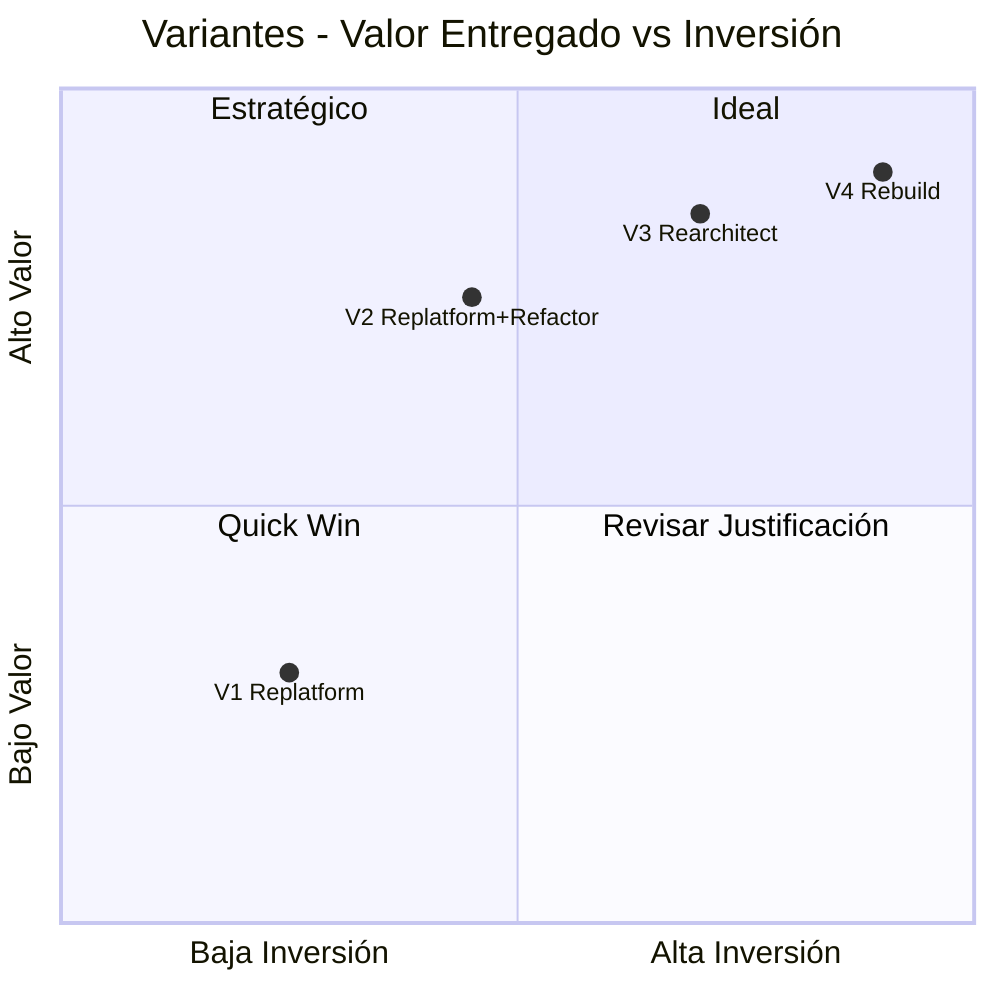

# 01.09 — Variantes de Modernización (7R)

## Frontier QuickScan — Bank Score Evaluator

---

## Estrategias 7R Evaluadas

| # | Estrategia | Aplica | Razón |
|---|-----------|:------:|-------|
| 1 | Retire | ❌ | El dominio (scoring crediticio) tiene valor de negocio |
| 2 | Retain | ❌ | .NET 5.0 EOL hace inviable mantener AS-IS |
| 3 | Rehost (Lift & Shift) | ❌ | Sin containerización ni cloud-readiness mínima |
| 4 | **Replatform** | ✅ | Migrar runtime + containerizar |
| 5 | **Refactor** | ✅ | Reestructurar código manteniendo funcionalidad |
| 6 | **Rearchitect** | ✅ | Rediseñar hacia microservicios/clean architecture |
| 7 | **Rebuild** | ✅ | Reconstruir desde cero con diseño moderno |

---

## Variantes Propuestas

### Variante 1: Replatform (Migración de Runtime)

| Campo | Detalle |
|-------|---------|
| **Estrategia** | Migrar de .NET 5.0 a .NET 8.0 LTS. Actualizar dependencias. Containerizar. Desplegar en AWS (ECS/App Runner). |
| **Alcance** | Runtime + dependencias + Dockerfile. Código funcional sin cambios. |
| **Nivel de esfuerzo** | S (Small) |
| **Créditos Kiro estimados** | 8,000–12,000 |
| **Duración** | 4–6 semanas |
| **Talla de paquete FAM** | Frontera S |

**Ventajas**:
- Menor riesgo — funcionalidad preservada 1:1
- Salida rápida del EOL
- Permite despliegue cloud inmediato
- Menor costo

**Desventajas**:
- Mantiene anti-patrones arquitectónicos (God Object, sin DI)
- Mantiene vulnerabilidades de seguridad (solo se migra runtime)
- No mejora mantenibilidad ni escalabilidad
- Deuda técnica permanece

**Riesgos específicos**:
- Breaking changes mínimos en .NET 5→8 para proyecto simple
- Puede requerir ajustes en Startup.cs → minimal hosting

**Prerrequisitos**:
- Acceso al código fuente ✅
- Ambiente de desarrollo .NET 8 configurado
- Ambiente cloud (AWS) provisionado

---

### Variante 2: Replatform + Refactor (RECOMENDADA)

| Campo | Detalle |
|-------|---------|
| **Estrategia** | Migrar a .NET 8 LTS + remediar seguridad + separar responsabilidades + implementar persistencia real + agregar testing. |
| **Alcance** | Runtime + seguridad + arquitectura interna + persistencia + DevOps básico |
| **Nivel de esfuerzo** | M (Medium) |
| **Créditos Kiro estimados** | 14,000–19,000 |
| **Duración** | 8–10 semanas |
| **Talla de paquete FAM** | Frontera S |

**Ventajas**:
- Elimina toda la deuda técnica High y Medium
- Aplicación production-ready al finalizar
- Mantiene lógica de negocio validada
- Cobertura de pruebas ≥60%
- Pipeline CI/CD funcional
- Relación costo/beneficio óptima

**Desventajas**:
- Mayor duración que Replatform puro
- Requiere validación del motor de score post-refactoring
- Aún mantiene arquitectura monolítica (mejorada pero monolítica)

**Riesgos específicos**:
- Regresiones en motor de score durante refactoring → mitigar con tests primero
- Scope creep al remediar 12 vulnerabilidades → fijar alcance estricto

**Prerrequisitos**:
- Acceso al código fuente ✅
- SME para validar reglas de negocio del score
- Ambiente AWS con RDS/Aurora para persistencia
- Definición de secretos (Key Vault/Secrets Manager)

---

### Variante 3: Rearchitect (Clean Architecture + API)

| Campo | Detalle |
|-------|---------|
| **Estrategia** | Rediseñar como API REST con Clean Architecture. Separar backend (API .NET 8) y frontend (SPA React/Blazor). Domain-driven design. |
| **Alcance** | Arquitectura completa rediseñada + API + frontend moderno + persistencia + seguridad + DevOps |
| **Nivel de esfuerzo** | L (Large) |
| **Créditos Kiro estimados** | 22,000–30,000 |
| **Duración** | 12 semanas |
| **Talla de paquete FAM** | Frontera M |

**Ventajas**:
- Arquitectura enterprise-grade
- API reutilizable por múltiples clientes (web, mobile, integraciones)
- Escalabilidad horizontal real
- Separación total de concerns (Domain, Application, Infrastructure)
- Testabilidad completa
- Extensible para nuevos módulos de scoring

**Desventajas**:
- Mayor inversión y duración
- Overhead arquitectónico para una app de ~1,054 LOC
- Requiere equipo con experiencia en DDD/Clean Architecture
- Mayor complejidad operativa

**Riesgos específicos**:
- Over-engineering para el tamaño actual del proyecto
- Validación de equivalencia funcional más compleja
- Requiere más SME time para definir bounded contexts

**Prerrequisitos**:
- SME de negocio bancario para definir dominio
- Decisión de frontend (Blazor vs React vs Angular)
- Infraestructura cloud completa (API Gateway, ECS, RDS, Cognito)
- Diseño de API contract previo

---

### Variante 4: Rebuild (Reconstrucción Completa)

| Campo | Detalle |
|-------|---------|
| **Estrategia** | Reconstruir desde cero como plataforma de scoring crediticio cloud-native. Microservicios, event-driven, multi-tenant. |
| **Alcance** | Sistema nuevo con funcionalidad expandida. Sin reutilización de código existente. |
| **Nivel de esfuerzo** | L+ |
| **Créditos Kiro estimados** | 35,000–45,000 |
| **Duración** | 14–16 semanas |
| **Talla de paquete FAM** | Frontera L |

**Ventajas**:
- Sin deuda técnica heredada
- Diseño óptimo desde el inicio
- Capacidad de escalar a producto SaaS multi-tenant
- Event sourcing permite auditoría completa de decisiones crediticias
- Puede integrar ML para scoring predictivo

**Desventajas**:
- Mayor costo (35,000–45,000 créditos)
- Mayor tiempo (14–16 semanas)
- Alto riesgo de scope creep
- Desperdicia conocimiento del código existente
- Excesivo para el tamaño actual del problema

**Riesgos específicos**:
- Funcionalidad no equivalente (gold plating)
- Requiere arquitecto senior dedicado
- Complejidad operativa de microservicios no justificada para el volumen actual

**Prerrequisitos**:
- Business case validado para plataforma de scoring
- Sponsor ejecutivo con presupuesto confirmado
- Equipo de 3+ personas (arquitecto + 2 devs)
- Infraestructura completa (EKS/ECS, API Gateway, EventBridge, DynamoDB/Aurora, Cognito)

---

## Comparativa de Variantes

---

## Tabla Resumen

| Variante | Estrategia | Talla | Créditos | Duración | Deuda Residual | Recomendación |
|----------|-----------|:-----:|:--------:|:--------:|:--------------:|:-------------:|
| V1 | Replatform | S | 8K–12K | 4–6 sem | Alta | ⚠️ Solo si presupuesto mínimo |
| **V2** | **Replatform + Refactor** | **S** | **14K–19K** | **8–10 sem** | **Baja** | **✅ RECOMENDADA** |
| V3 | Rearchitect | M | 22K–30K | 12 sem | Ninguna | 🔵 Si hay visión de producto |
| V4 | Rebuild | L | 35K–45K | 14–16 sem | Ninguna | 🔵 Si es plataforma SaaS |

---

## Recomendación

**Variante 2 (Replatform + Refactor)** es la opción óptima para este proyecto porque:

1. **Proporción costo/beneficio**: Elimina el 100% de la deuda High y Medium con inversión moderada
2. **Tamaño adecuado**: ~1,054 LOC no justifica una rearquitectura completa ni un rebuild
3. **Tiempo razonable**: 8–10 semanas dentro del paquete Frontera S (máx 20,000 créditos)
4. **Production-ready**: La app queda lista para producción al finalizar
5. **Extensible**: La base refactorizada permite evolucionar a API/microservicios en el futuro si se necesita

[DECISIÓN AUTÓNOMA: Se recomienda V2 porque maximiza el valor entregado dentro del presupuesto de un Frontera S. Las variantes V3 y V4 son válidas solo si el cliente tiene una visión de producto/plataforma que excede el alcance actual.]

---

*Documento generado por OneClickXRay — Frontier QuickScan Agent*
