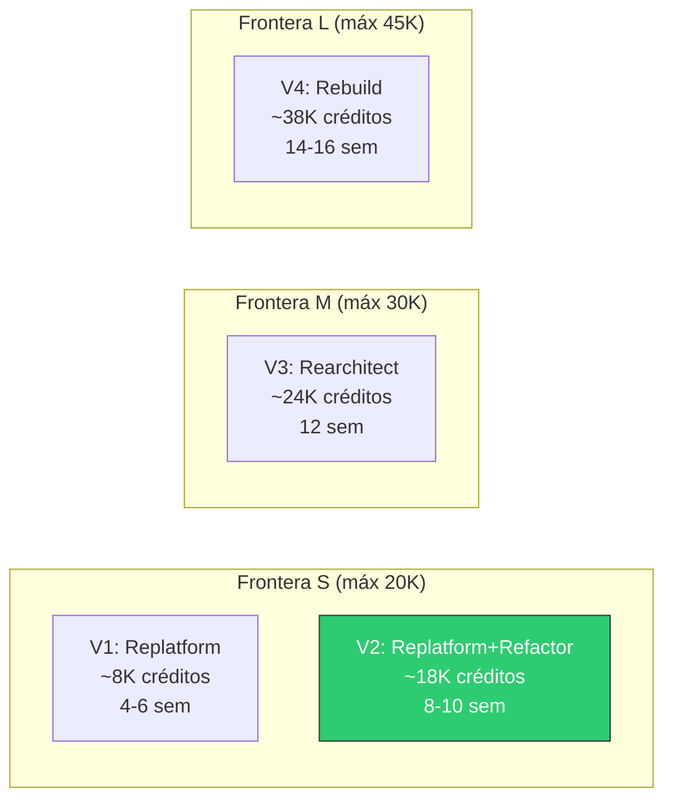

# 01.10 — Sizing y Estimación de Créditos

## Frontier QuickScan — Bank Score Evaluator

---

## Catálogo de Paquetes Frontier FAM

| Paquete | Créditos Máx | Duración | Descripción |
|---------|:------------:|:--------:|-------------|
| Frontera S | 20,000 | 8–10 semanas | Aplicaciones pequeñas/medianas |
| Frontera M | 30,000 | 12 semanas | Aplicaciones medianas/complejas |
| Frontera L | 45,000 | 12–16 semanas | Aplicaciones complejas/enterprise |
| Frontera Wave | Pool continuo | Continuo | Portafolio / programa de modernización |

---

## Fórmula de Estimación de Créditos

```
Créditos = Base × Factor_Complejidad × Factor_Readiness × (1 + Σ Módulos_Adicionales)
```

### Parámetros Base

| Parámetro | Valor | Justificación |
|-----------|-------|---------------|
| **Base** | 5,000 | Aplicación web estándar pequeña (<2,000 LOC) |
| **Factor_Complejidad** | 1.3 | 12 anti-patrones de seguridad + God Object |
| **Factor_Readiness** | 1.4 | Score 58.8/100 (Advisory) → requiere trabajo preparatorio significativo |

### Módulos Adicionales

| Módulo | Aplica | Factor | Justificación |
|--------|:------:|:------:|---------------|
| Migración de Runtime | ✅ | +0.15 | .NET 5.0 → .NET 8.0 |
| Remediación de Seguridad | ✅ | +0.25 | 12 vulnerabilidades High/Medium |
| Refactorización Arquitectónica | ✅ | +0.20 | God Object → servicios separados + DI |
| Implementación de Persistencia | ✅ | +0.15 | In-memory → EF Core + SQL |
| Pipeline CI/CD | ✅ | +0.10 | Desde cero |
| Suite de Pruebas | ✅ | +0.10 | De 0% a ≥60% cobertura |
| Containerización | ✅ | +0.05 | Dockerfile + compose |
| Frontend SPA | — | +0.30 | No aplica en V1/V2 |
| Microservicios | — | +0.40 | No aplica en V1/V2 |
| Event Sourcing | — | +0.35 | No aplica en V1/V2 |

---

## Estimación por Variante

### Variante 1: Replatform

```
Módulos = Runtime(0.15) + Containerización(0.05) = 0.20
Créditos = 5,000 × 1.1 × 1.2 × (1 + 0.20)
Créditos = 5,000 × 1.1 × 1.2 × 1.20
Créditos = 7,920
```

[DECISIÓN AUTÓNOMA: Para V1 se reducen los factores de complejidad (1.1) y readiness (1.2) porque el Replatform puro no aborda anti-patrones ni gaps, solo migra runtime.]

| Campo | Valor |
|-------|-------|
| **Créditos estimados** | **7,920 ~ 8,000–12,000** |
| **Rango con contingencia (±20%)** | 6,300–9,500 |
| **Paquete FAM** | Frontera S (dentro de 20,000 máx) |
| **Utilización del paquete** | 40–60% |

---

### Variante 2: Replatform + Refactor (RECOMENDADA)

```
Módulos = Runtime(0.15) + Seguridad(0.25) + Refactoring(0.20) + Persistencia(0.15) + CI/CD(0.10) + Tests(0.10) + Container(0.05) = 1.00
Créditos = 5,000 × 1.3 × 1.4 × (1 + 1.00)
Créditos = 5,000 × 1.3 × 1.4 × 2.00
Créditos = 18,200
```

| Campo | Valor |
|-------|-------|
| **Créditos estimados** | **18,200 ~ 14,000–19,000** |
| **Rango con contingencia (±15%)** | 15,470–20,000 |
| **Paquete FAM** | Frontera S (dentro de 20,000 máx) |
| **Utilización del paquete** | 77–100% |

---

### Variante 3: Rearchitect (Clean Architecture + API)

```
Módulos = Runtime(0.15) + Seguridad(0.25) + Refactoring(0.20) + Persistencia(0.15) + CI/CD(0.10) + Tests(0.10) + Container(0.05) + Frontend_SPA(0.30) = 1.30
Créditos = 5,000 × 1.5 × 1.4 × (1 + 1.30)
Créditos = 5,000 × 1.5 × 1.4 × 2.30
Créditos = 24,150
```

[DECISIÓN AUTÓNOMA: Factor de complejidad aumenta a 1.5 porque rearchitect implica diseño DDD, API design, y separación frontend/backend.]

| Campo | Valor |
|-------|-------|
| **Créditos estimados** | **24,150 ~ 22,000–30,000** |
| **Rango con contingencia (±20%)** | 19,320–28,980 |
| **Paquete FAM** | Frontera M (dentro de 30,000 máx) |
| **Utilización del paquete** | 73–97% |

---

### Variante 4: Rebuild (Plataforma Cloud-Native)

```
Módulos = Runtime(0.15) + Seguridad(0.25) + Persistencia(0.15) + CI/CD(0.10) + Tests(0.10) + Container(0.05) + Frontend_SPA(0.30) + Microservicios(0.40) + Event_Sourcing(0.35) = 1.85
Créditos = 5,000 × 1.8 × 1.5 × (1 + 1.85)
Créditos = 5,000 × 1.8 × 1.5 × 2.85
Créditos = 38,475
```

[DECISIÓN AUTÓNOMA: Factor de complejidad 1.8 y readiness 1.5 porque rebuild implica diseño desde cero sin reutilización de código, con arquitectura distribuida.]

| Campo | Valor |
|-------|-------|
| **Créditos estimados** | **38,475 ~ 35,000–45,000** |
| **Rango con contingencia (±15%)** | 32,704–44,246 |
| **Paquete FAM** | Frontera L (dentro de 45,000 máx) |
| **Utilización del paquete** | 78–98% |

---

## Resumen Comparativo



---

## Desglose de Créditos — Variante Recomendada (V2)

| Fase | Actividad | Créditos | % del Total |
|------|-----------|:--------:|:-----------:|
| Sprint 0 | Migración .NET 5→8 + actualización NuGet | 2,500 | 14% |
| Sprint 0 | Containerización (Dockerfile + compose) | 1,000 | 5% |
| Sprint 1 | Remediación de seguridad (12 vulns) | 3,500 | 19% |
| Sprint 1 | Refactorización (DI, interfaces, separación) | 3,000 | 16% |
| Sprint 2 | Implementación persistencia (EF Core + SQL) | 2,800 | 15% |
| Sprint 2 | Suite de pruebas (≥60% cobertura core) | 2,400 | 13% |
| Sprint 3 | Pipeline CI/CD (build + test + deploy) | 1,500 | 8% |
| Sprint 3 | Observabilidad (logging + health checks) | 1,000 | 5% |
| Transversal | QA, validación funcional, documentación | 500 | 3% |
| Buffer | Contingencia (10%) | ~500 | 3% |
| **Total** | | **~18,200** | **100%** |

---

## Cronograma Estimado — Variante 2

| Semana | Sprint | Actividades | Hito |
|:------:|:------:|-------------|------|
| 1–2 | Sprint 0 | Migración .NET 8, Dockerfile, setup CI | ✅ App compila en .NET 8 |
| 3–4 | Sprint 1a | Remediación seguridad (P1 items) | ✅ 0 vulns High |
| 5–6 | Sprint 1b | Refactoring DI + interfaces | ✅ God Object eliminado |
| 7–8 | Sprint 2 | Persistencia EF Core + Testing | ✅ BD funcional, ≥60% cobertura |
| 9–10 | Sprint 3 | CI/CD + Observabilidad + QA final | ✅ Production-ready |

---

## Decisión de Paquete

| Criterio | Evaluación |
|----------|-----------|
| Score QuickScan | 58.8/100 (Advisory) |
| LOC total | ~1,054 (Pequeño) |
| Complejidad técnica | Media (12 vulns + God Object + EOL) |
| Variante recomendada | V2: Replatform + Refactor |
| Créditos estimados | 14,000–19,000 |
| **Paquete recomendado** | **Frontera S (20,000 créditos máx, 8–10 semanas)** |

---

*Documento generado por OneClickXRay — Frontier QuickScan Agent*
