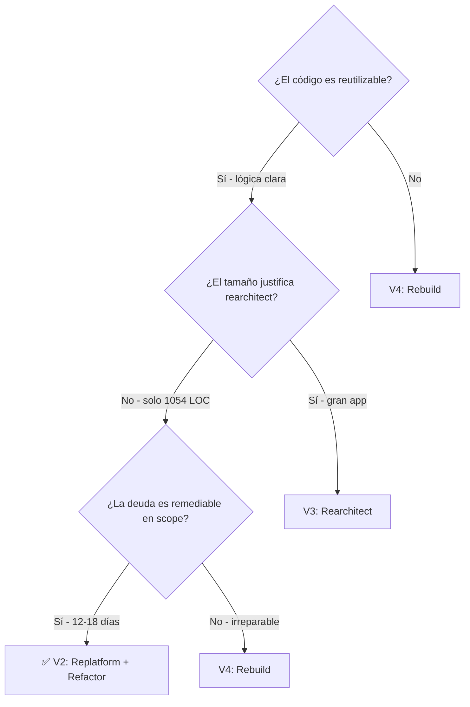
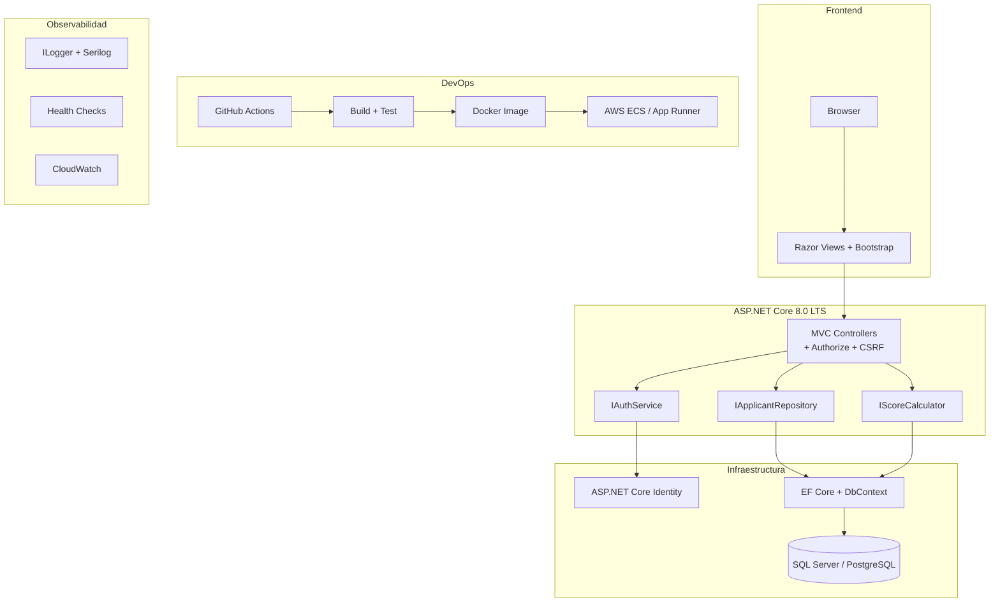
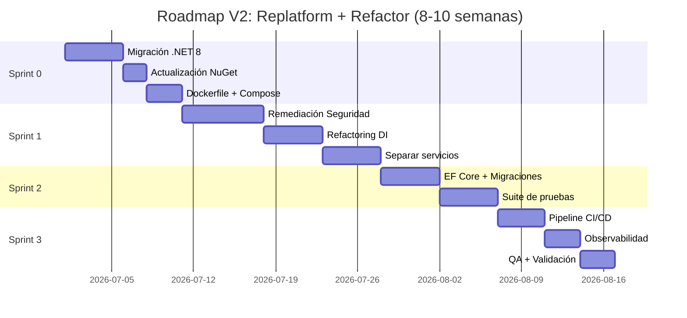

# 01.11 — Recomendación Técnica

## Frontier QuickScan — Bank Score Evaluator

---

## Veredicto Final

| Campo | Valor |
|-------|-------|
| **Score QuickScan** | 58.8 / 100 |
| **Banda** | ⚠️ Advisory (50–64) |
| **Elegibilidad FAM** | ✅ Elegible con prerrequisitos |
| **Variante recomendada** | Replatform + Refactor (V2) |
| **Paquete FAM** | Frontera S |
| **Créditos estimados** | 14,000–19,000 |
| **Duración estimada** | 8–10 semanas |

---

## Justificación de la Recomendación

### ¿Por qué V2 (Replatform + Refactor) y no otra variante?

1. **Código reutilizable**: La lógica de scoring es correcta y bien definida (validada con datos de referencia). No tiene sentido reconstruirla desde cero.

2. **Tamaño no justifica over-engineering**: Con ~1,054 LOC, una arquitectura de microservicios o clean architecture completa sería excesiva. Un monolito bien estructurado con DI y testing es suficiente.

3. **Deuda remediable en scope**: Las 23 items de deuda técnica son todas remediables en 12–18 días de trabajo, que caben dentro de un Frontera S.

4. **ROI óptimo**: V2 entrega una aplicación production-ready por ~18,000 créditos vs. V3 (24,000) o V4 (38,000) que entregan valor incremental marginal para este tamaño de app.

---

## Arquitectura Target (Post-Modernización V2)

---

## Condiciones para Iniciar el Proyecto

### Prerrequisitos Mandatorios

| # | Prerrequisito | Responsable | Estado |
|---|--------------|-------------|--------|
| 1 | Confirmar sponsor ejecutivo | Cliente | [PENDIENTE] |
| 2 | Identificar SME de negocio (reglas de scoring) | Cliente | [PENDIENTE] |
| 3 | Provisionar ambiente AWS (cuenta, VPC, RDS) | SoftwareOne/Cliente | [PENDIENTE] |
| 4 | Acceso al repositorio de código fuente | Cliente | ✅ Disponible |
| 5 | Definir BD target (SQL Server vs PostgreSQL) | Arquitecto FAM | [PENDIENTE] |
| 6 | Confirmar alcance de remediación de seguridad | Arquitecto FAM + Cliente | [PENDIENTE] |

### Condiciones de Éxito (Definition of Done)

| # | Criterio | Métrica |
|---|----------|---------|
| 1 | Runtime actualizado | .NET 8.0 LTS |
| 2 | 0 vulnerabilidades High | Análisis de seguridad limpio |
| 3 | Persistencia funcional | Datos sobreviven reinicio |
| 4 | Cobertura de pruebas | ≥60% en lógica de scoring |
| 5 | Pipeline CI/CD | Build + Test automáticos |
| 6 | Containerizado | Docker image funcional |
| 7 | Desplegable en AWS | ECS/App Runner operativo |
| 8 | Equivalencia funcional | Motor de score produce mismos resultados |

---

## Roadmap de Ejecución

---

## Riesgos Residuales Post-Modernización

| Riesgo | Probabilidad | Mitigación |
|--------|:---:|------------|
| Reglas de scoring incorrectas post-migración | Baja | Suite de tests con datos de referencia validados |
| Performance insuficiente bajo carga | Baja | App pequeña, load testing en Sprint 3 |
| Gaps de seguridad no detectados | Media | Scan de vulnerabilidades post-remediación |
| Desalineación de expectativas del cliente | Media | Kick-off con demo del AS-IS y roadmap claro |

---

## Próximos Pasos Recomendados

| # | Acción | Timeline | Responsable |
|---|--------|----------|-------------|
| 1 | Presentar Reporte Gerencial al cliente | Semana 1 | Preventa SoftwareOne |
| 2 | Confirmar sponsor y presupuesto | Semana 1–2 | Cliente |
| 3 | Workshop de validación de reglas de scoring con SME | Semana 2 | Arquitecto FAM + SME |
| 4 | Firmar SOW con paquete Frontera S | Semana 2–3 | Comercial |
| 5 | Provisionar ambiente AWS | Semana 3 | Cloud Engineer |
| 6 | Kick-off Sprint 0 | Semana 4 | Equipo Centauro |

---

## Resumen Ejecutivo para Arquitecto Líder

> **Bank Score Evaluator** es una aplicación ASP.NET Core 5.0 de ~1,054 LOC con 12 vulnerabilidades intencionales (académica). Score QuickScan: 58.8/100 (Advisory). Gaps principales: DevOps (1.0/5), Datos (1.5/5), Seguridad (1.5/5). Recomendación: **Frontera S con V2 (Replatform + Refactor)** — migrar a .NET 8, remediar seguridad, separar responsabilidades, agregar persistencia y testing. Estimación: 14,000–19,000 créditos, 8–10 semanas. Resultado: aplicación production-ready, escalable, sin deuda técnica High/Medium.

---

*Documento generado por OneClickXRay — Frontier QuickScan Agent*  
*Fecha: 2026-06-04 | Versión: 1.0*
